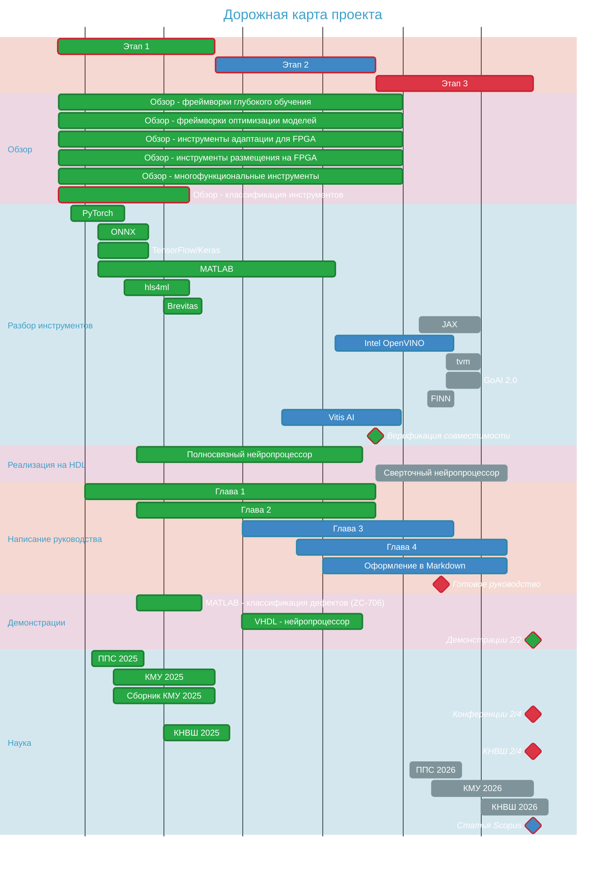

# НИРСИИ - Краевой ИИ на ПЛИС

**Цель проекта:** Разработка инженерного руководства по реализации решений краевого искусственного интеллекта (Edge AI) на программируемых логических интегральных схемах (ПЛИС/FPGA).

## Ключевые результаты

1. **Аналитический обзор:** Систематизированы методы и инструменты для Edge AI на ПЛИС, включая:
    * Фреймворки глубокого обучения (PyTorch, TensorFlow и др.)
    * Инструменты оптимизации и квантизации (Brevitas, Vitis AI, hls4ml и др.)
    * Средства адаптации под ПЛИС (Vitis HLS, Intel HLS Compiler и др.)
    * Платформы размещения (Vivado, Quartus и др.)
    * Многофункциональные решения (MATLAB, Lattice SensAI и др.)
2. **Практические реализации:** Разработаны и протестированы кейсы на различных стеках:
    * **MATLAB (Kintex-7):** Изображения рукописных цифр (MNIST) → CNN (32К параметров) → Квантизация Deep Network Quantizer (int8) → Реализация через MATLAB DL HDL Toolbox (custom board workflow) & Vitis HLS → Vivado → AMD Kintex-7 KC-705. Размещение инференса на FPGA без процессорного ядра.
    * **MATLAB:** Распределения интенсивности акустических эхо-сигналов дефектов стальных деталей (НИЦ СФ, ИТМО) → СNN с inception-блоком (128K параметров) → Deep Network Quantizer (int8) → MATLAB DL HDL Toolbox & Vitis HLS → Vivado → AMD Zynq 7000 ZC-706. **34 инференсов/сек** без потери точности.
    * **hls4ml:** Изображения рукописных цифр (MNIST) → CNN (3K параметров) → Keras → hls4ml → Vitis HLS → Vivado → AMD Zynq 7000 ZC-706. Нехватка ресурсов даже для компактной архитектуры.
    * **PyTorch - VHDL (Cyclone V):** Изображения рукописных цифр (MNIST) → MLP (26K параметров) → PyTorch → Custom VHDL → Quartus Prime → Altera Cyclone V.
3. **Структура руководства:**
    * Актуальность, преимущества/недостатки Edge AI на ПЛИС.
    * Общий процесс разработки (анализ данных, обучение, оптимизация, адаптация, размещение).
    * Инструменты разработки и их взаимную совместимость.
    * Подробное описание практических реализаций, подготовленных в ходе проекта.
4. **Публикации:** Результаты представлены на конференциях (ППС, КМУ), опубликованы тезисы и статья в сборнике КМУ. Публикуется статья в WoS/Scopus (в процессе рецензирования).

## Для кого мы делаем руководство?

Проект предназначен для инженеров и исследователей, работающих над внедрением энергоэффективных и высокопроизводительных решений Edge AI на аппаратуре ПЛИС.

## Текущий статус

Проект находится в активной разработке. Ведется работа над тестированием новых инструментальных цепочек и написанием последующих глав руководства.

## Совместимость инструментов: прогресс освоения

## Читать: [перейти к содержанию руководства](./edge_ai_manual/contents.md)
