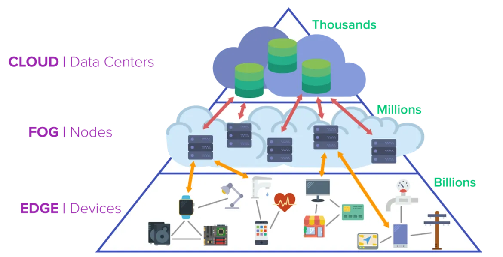
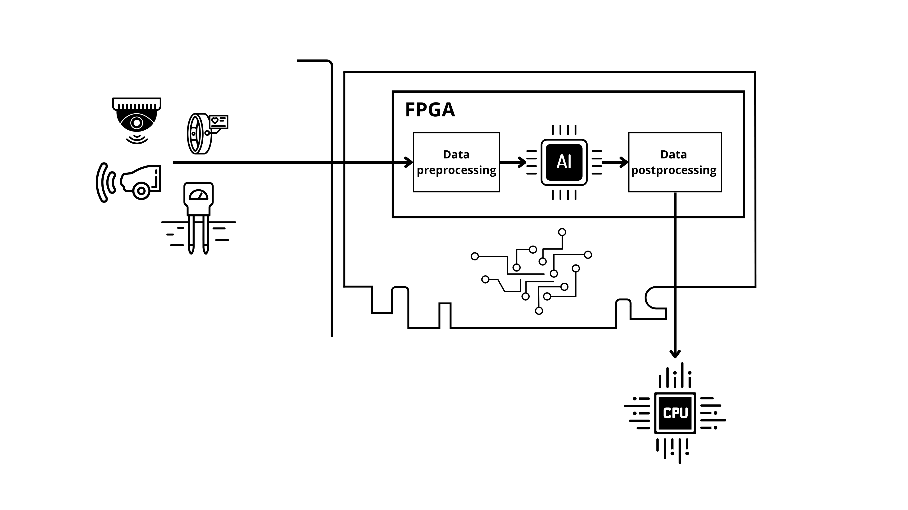
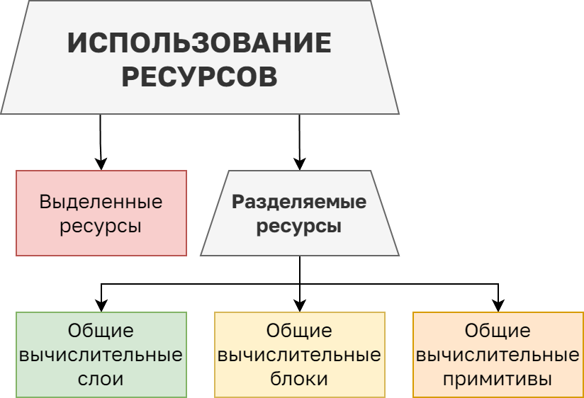
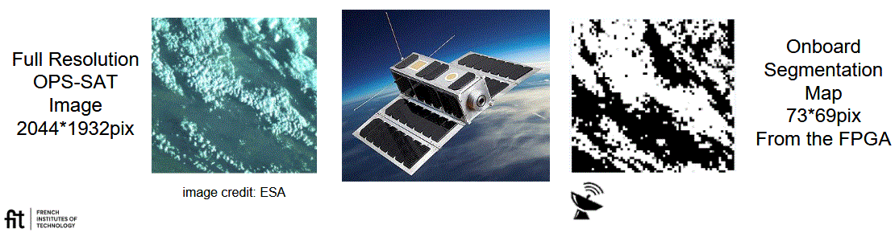
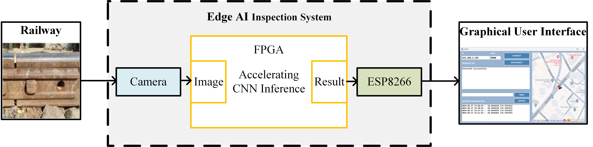
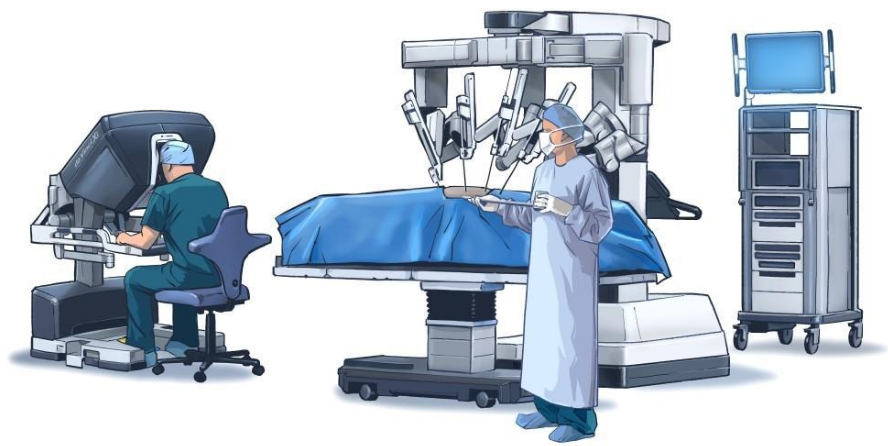

# **1. ПРИМЕНЕНИЕ КРАЕВОГО ИСКУССТВЕННОГО ИНТЕЛЛЕКТА** 

## 1.1 Актуальность краевого искусственного интеллекта в современном мире 

 [Edge AI](glossary.md#edgeai) (краевой искусственный интеллект) — это инновационная технология, которая позволяет выполнять обработку данных и реализовывать алгоритмы машинного обучения непосредственно на периферийных устройствах, минуя необходимость передачи информации в облачные сервисы ([Intel Edge AI](https://www.intel.com/content/www/us/en/learn/edge-ai.html)). Это открывает новые перспективы для бизнеса, промышленности и повседневной жизни, обеспечивая высокую скорость обработки данных, повышенную безопасность и оптимизацию затрат.

<figure>
  
  <figcaption> Рисунок 1.1 – Иерархия ИИ-решений – перенос части алгоритмов ИИ на краевые устройства имеет ряд преимуществ </figcaption>
</figure> 

**Основные преимущества Edge AI:**

* Высокая скорость и минимальные задержки: локальная обработка данных критически важна для приложений, требующих мгновенной реакции, таких как автономные транспортные системы и промышленная автоматизация.  
* Обеспечение конфиденциальности и безопасности: обработка данных на месте исключает возможность утечки чувствительных данных, что особенно важно в таких сферах, как здравоохранение и системы видеонаблюдения.  
* Энергетическая эффективность и оптимизация затрат: снижение нагрузки на облачные серверы и минимизация интернет-трафика позволяют существенно сократить расходы, что особенно актуально для [IoT](glossary.md#iot)-устройств с ограниченной мощностью.  
* Автономная работа в условиях недостаточного покрытия: Edge AI способен функционировать без доступа к интернету, что делает его незаменимым в удалённых и труднодоступных зонах, таких как месторождения, морские платформы и зоны чрезвычайных ситуаций.

Некоторые области применения Edge AI:

* Промышленность: прогнозирование неисправностей оборудования, мониторинг производственных процессов и контроль качества продукции.  
* Умные города: анализ транспортных потоков в реальном времени, автоматическое выявление аварийных ситуаций и оптимизация городской инфраструктуры.  
* Здравоохранение: диагностика заболеваний на основе медицинских изображений, проводимых непосредственно на оборудовании.  
* Розничная торговля: персонализация предложений покупателям с использованием видеоаналитики и машинного обучения.

*Промежуточные выводы:*  
Edge AI представляет собой не просто перспективное направление развития технологий, а уже сегодня является ключевым элементом цифровой трансформации. Внедрение решений на основе этой технологии позволяет компаниям повысить оперативность принятия решений, оптимизировать затраты и обеспечить соответствие строгим требованиям в области защиты данных.  
Для внедрения алгоритмов ИИ в краевые устройства могут применяться различные аппаратные платформы – [CPU](glossary.md#cpu) (процессоры), микроконтроллеры, [DSP](glossary.md#dsp) процессоры, а также специализированные нейропроцессоры, [GPU](glossary.md#gpu) (графические ускорители), TPU (тензорные вычислители), [FPGA](glossary.md#fpga), [SoC](glossary.md#soc) (системы на кристалле), и т.д. В настоящее время присутствует тенденция взаимного влияния парадигм, используемых в этих платформах, в том числе в рамках усовершенствования архитектур/микроархитектур микросхем, на которых будут размещаться алгоритмы ИИ. В нашей работе мы сосредоточились на рассмотрении микросхем FPGA в качестве аппаратной платформы внедрения алгоритмов искусственного интеллекта. 

## 1.2 Преимущества, недостатки и особенности Edge AI на FPGA 

ПЛИС представляет собой тип вычислительного компонента, который может быть перепрограммирован для выполнения разнообразных задач. В отличие от CPU и GPU, FPGA обладает большей универсальностью, поскольку позволяет адаптировать аппаратную конфигурацию под широкий спектр применения. FPGA объединяет в себе высокую производительность, возможность программирования и гибкость, обеспечивая эффективное выполнение задач без необходимости разработки специализированных интегральных схем.  
В сфере искусственного интеллекта FPGA могут применяться в качестве ускорителей для ИИ, которые способствуют обработке данных от периферийных устройств и снижению рабочих нагрузок на облачные системы. Структура взаимосвязей внутри FPGA может напоминать нейронные сети человеческого мозга, что обуславливает их эффективность для реализации нейронных сетей и других алгоритмов ИИ. FPGA часто используются в сочетании с CPU для выполнения специфических задач, критически важных для успешного функционирования ИИ-приложений. [Рис. 1.2](ch1.md#image_1_2) демонстрирует пример положения [Edge AI](glossary.md#edgai) в общей цепи обработки данных.

<figure>
  
  <figcaption> Рисунок 1.2 – Общий вид схемы обработки информации в составе сенсорных систем с применением Edge AI </figcaption>
</figure>  

Разберём **преимущества**, которыми обладает [Edge AI](glossary.md#edgai) на базе FPGA. Одним из основных преимуществ использования FPGA для реализации Edge AI является высокая *энергоэффективность*. FPGA обеспечивают выполнение вычислительных операций с минимальным энергопотреблением за счёт аппаратной реализации только необходимых функций, что исключает избыточные вычисления и снижает тепловыделение. Это особенно актуально для краевых устройств с ограниченными ресурсами, работающих в автономном режиме.  
FPGA характеризуются низкой задержкой обработки данных, что выражается в наносекундных показателях времени отклика. Это значительно превосходит аналогичные показатели традиционных GPU, где задержки могут достигать микросекунд. Такая скорость обработки критична для приложений, требующих функционирования в режиме реального времени, таких как промышленная автоматизация, системы безопасности и автономные транспортные средства. Это в основном достигается за счёт двух ключевых моментов – устранения (полного или частичного) временных затрат на буферизацию переменных в памяти и использования встроенных возможностей элементов ввода-вывода.  
Ещё одним важным преимуществом FPGA является гибкость перепрограммирования. В отличие от интегральных схем специального назначения (application-specific integrated circuit, [ASIC](glossary.md#asic)), FPGA позволяют изменять программное обеспечение непосредственно в условиях эксплуатации, адаптируя модели искусственного интеллекта под новые задачи и оптимизируя алгоритмы без замены аппаратного обеспечения. Это обеспечивает быстрое реагирование на изменяющиеся требования и обновление функционала без значительных затрат.  
Применение [Edge AI](glossary.md#edgai) на базе FPGA также способствует повышению безопасности и конфиденциальности данных. Обработка данных происходит локально, без передачи значительных объёмов информации в облачные сервисы, что снижает риски утечки персональных данных и уменьшает нагрузку на сетевую инфраструктуру.  
Разумеется, у рассматриваемого подхода есть и существенные **недостатки**. Среди недостатков использования FPGA можно выделить сложность разработки и программирования. Для эффективного применения FPGA требуется глубокое понимание архитектуры этих устройств, аппаратного описания языков проектирования и оптимизации моделей искусственного интеллекта с учётом ресурсных ограничений. Это увеличивает временные и финансовые затраты на разработку по сравнению с использованием более традиционных вычислительных платформ, таких как центральные процессоры (ЦП) или графические процессоры (ГП).  
Также стоит отметить, что FPGA традиционно уступают GPU в производительности при выполнении операций с плавающей точкой и сложных матричных вычислений. Хотя современные FPGA поддерживают выполнение низкоразрядных и бинарных нейронных сетей, это может ограничивать точность и универсальность моделей для некоторых задач.  
Данные решения также характеризуются высокой стоимостью начальной интеграции и необходимостью использования специализированного оборудования. Эти сложности могут стать барьером для широкого применения FPGA в некоторых сегментах рынка, особенно при ограниченном бюджете. 

### **1.2.1 Особенности развёртывания и инференса Edge AI на FPGA** 

Для эффективной реализации Edge AI на базе FPGA требуется тщательная подготовка моделей. Подготовка содержит:

* методы оптимизации, в частности, квантование весов, сокращение разрядности данных и упрощение архитектур нейронных сетей. Эти подходы позволяют значительно снизить требования к вычислительным ресурсам и энергопотреблению, сохраняя при этом приемлемый уровень точности моделей. Для этого используются специализированные инструменты и фреймворки, такие как OpenVINO, Vitis AI, TVM и другие.  
* обеспечение процесса конвертации в аппаратно-оптимизированный формат ([HLS](glossary.md#hls), [Verilog](glossary.md#verilog)/[VHDL](glossary.md#vhdl) через High-Level Synthesis, прямое использования языков описания аппаратуры).  
* привязка к конкретной FPGA (например, Intel FPGA, AMD Xilinx, Lattice FPGA, Microsemi, GoWin, Achronix).

[Инференс](glossary.md#inference) (вывод, или исполнение модели) на FPGA часто осуществляется в сочетании с процессорами общего назначения, такими как ARM Cortex, интегрированными в [системы на кристалле](glossary.md#soc) (SoC) FPGA. Это позволяет разделить задачи предобработки, постобработки, хранения данных и вычисления нейронных сетей, что повышает общую производительность системы.  
Отдельно стоит отметить проблемы при развёртывании алгоритмов ИИ на FPGA, а именно ограниченные ресурсы FPGA (главным образом, логические элементы (LEs), DSP-блоки, блоки память [BRAM](glossary.md#bram)), сложность отладки (аппаратные и программные ограничения и ошибки), и необходимость [RTL](glossary.md#rtl)-оптимизации для максимальной производительности. Одной из основных проблем, осложняющих разработку является именно ограничение ресурсов, доступных в составе FPGA. Это порождает несколько подходов к организации использования ресурсов, классификация которых представлена на [рис. 1.3](ch1.md#image_1_3).  

<figure>
  
  <figcaption> Рисунок 1.3 – Классификация подходов к использованию ресурсов при реализации Edge AI на FPGA </figcaption>
</figure>

На текущий момент удается выделить два основных принципа: использование выделенных или разделяемых ресурсов. В случае использования выделенных ресурсов каждая математическая операция, подлежащая выполнению согласно архитектуре размещаемой НС, выполняется на своих отдельно выделенных ресурсах. Данный подход наиболее прямолинеен, так как размещаемая на FPGA электрическая схема является отражением архитектуры НС. Разумеется, такой подход минимизирует время инференса, однако при этом существенно ограничивает размеры нейронной сети, которую возможно разместить на устройстве. Практически неизбежной становится необходимость использования более емких микросхем или даже создания целых вычислительных кластеров из FPGA ([Fang et al., 2025](https://doi.org/10.3390/info16040298), [Johnson et al., 2023](https://doi.org/10.48550/arXiv.2305.18332)).  
Размещение более сложных архитектур может быть осуществлено за счет разделенного использования ресурсов (resource sharing). При таком подходе разные элементы нейронной сети используют одни и те же вычислительные ресурсы. Это позволяет в десятки и сотни раз сократить утилизацию программируемой логики ценой увеличения времени выполнения и уменьшения пропускной способности. Отметим, что параллельное выполнение операций обычно возможно в пределах одного перехода между слоями. В связи с этим, увеличение времени выполнения не соразмерно уменьшению потребления ресурсов. Так в случае организации общих вычислительных слоев, реализующих полную параллелизацию вычислений одного слоя, потеря времени выполнения может отсутствовать, но пропускная способность в любом случае пострадает.  
При реализации общих вычислительных блоков или примитивов возможна параметризация, позволяющая балансировать выигрыш по ресурсам (программируемой логике, памяти), скорость инференса и пропускную способность. Это удобно в случаях, когда целевая архитектура имеет множество слоев разной размерности, а также позволяет реализовывать минималистичные решения: произвести все необходимые операции возможно даже с помощью одиночного вычислительного блока при наличии достаточного количества памяти.  
Таким образом, использование FPGA для реализации Edge AI представляет собой компромисс между высокой энергоэффективностью, низкой задержкой и гибкостью перепрограммирования, с одной стороны, и сложностью разработки, ограничениями по вычислительной точности и высокой стоимостью интеграции, с другой. В условиях быстро меняющихся и специализированных задач, требующих обработки данных в реальном времени и обеспечения автономности, FPGA являются оптимальным выбором. Особенно это актуально для систем, где важна безопасность данных и эффективное использование ресурсов. Однако для стабильных и массовых задач, требующих высокой точности, могут быть предпочтительнее другие аппаратные платформы.

## **1.3 В каких случаях может возникнуть потребность в имплементации Edge AI на FPGA** 
  
С учётом преимуществ FPGA, которые были описаны ранее, можно утверждать, что применение реализация алгоритмов краевого интеллекта на FPGA предпочтительно для задач, где важна низкая, и/или детерминированная задержка, и/или низкое энергопотребление. Также, использование FPGA может быть эффективным для реализации на этапе исследования и макетирования, пока архитектура и даже тип нейронов в сети часто видоизменяются в процессе работы.   
Однако, существуют и другие условия, когда реализация ИИ на FPGA предпочтительна:

* Если без FPGA не обойтись \- задачи, где использование программируемой логики безальтернативно – реализация интерфейсов с высокоскоростными [АЦП](glossary.md#adc) / [ЦАП](glossary.md#dac), управление одновременно большим количеством периферийных модулей. В таком случае часто логично не докупать отдельный ускоритель нейросетевых алгоритмов, а запустить и реализовать внедрение на этой же микросхеме.   
* Если у Вас в Вашем проекте уже стоит FPGA, и Вы хотите добавить “интеллектуальную составляющую” в имеющийся проект, находящийся на высоком уровне готовности. Похожий, но несколько отличающийся случай – в имеющемся проекте стало не хватать функционала, или внедрение ИИ алгоритмов позволит существенно усовершенствовать параметрыа прибора за счёт добавления интеллектуальной составляющей – в этом случае логично попытаться разместить ИИ на программируемой логикой. Особенностью этого случая является частаяо необходимость работы с очень ограниченными ресурсами FPGA.  
* Отдельно важный пример \- работа в экстремальных условиях. При работе в условиях высоких/низких температур (нефтяные вышки, космос); вибраций (железнодорожная автоматика). FPGA выигрывают за счет наличия радиационно-стойких версий микросхем и версий микросхем в космическом, индустриальном и автомобильном исполнениях.

### ** 1.3.1 Примеры реализации Edge AI на FPGA, с указанием конкретных преимуществ** 

Рассмотрим некоторые примеры применения [Edge AI](glossary.md#edgai) на FPGA, с описанием основной функции и преимущества использования FPGA.  

**Пример №1:**  
Показательным примером решения задачи сегментации данных является прикладное исследование ученых из французского Технологического исследовательского института им. Сент-Экзюпери ([исследование ATPI](https://airdrive.eventsair.com/eventsairwesteuprod/production-atpi-public/da195ef548914f34bc97bf80ba72c9c2)).   
Работа посвящена реализации на борту спутника OPS-SAT системы сегментации облаков в режиме реального времени с помощью нейронных сетей, функционирующих на базе FPGA Intel Cyclone V FPGA. В рамках исследования были протестированы три типа компактных нейросетевых моделей, среди которых наиболее высокие показатели точности и скорости обработки продемонстрировала полносверточная архитектура.  

<figure>
  
  <figcaption> Рисунок 1.4 – Слева – начальное изображение, справа – результирующее изображение, получаемое в реальном времени на спутнике </figcaption>
</figure>

Процесс обработки полного изображения занимает менее 156 миллисекунд при энергопотреблении менее 1,8 ватт, что позволяет эффективно фильтровать и оптимизировать передаваемые данные. Представленный проект демонстрирует успешное применение методов глубокого обучения в космической области, а также возможность удаленного обновления моделей. Это открывает новые перспективы для адаптивного анализа спутниковых данных и оптимизации параметров телеметрии.   
*Зачем здесь Edge AI на FPGA – обработка видеосигнала с минимальной задержкой и низким энергопотреблением в реальном времени, малые габариты устройства, удалённое изменение архитектуры нейросети.*  

**Пример №2:**  
Другой пример – статья, посвящённая разработке и реализации системы краевого ИИ для обнаружения дефектов железнодорожных путей на базе FPGA. Система использует камеру для съёмки изображений рельсов, которые затем обрабатываются на FPGA с помощью легковесной сверточной нейронной сети ([CNN](glossary.md#cnn)) для выявления повреждений и дефектов в реальном времени ([Li et. al., 2024](https://arxiv.org/html/2408.15245v1)).   

<figure>
  
  <figcaption> Рисунок 1.5 – Блок-схема архитектуры системы обнаружения неисправностей на железных дорогах </figcaption>
</figure>

Обработка происходит на отладочной плате Xilinx ZCU104 (FPGA семейства Zynq UltraScale+).  
*Зачем здесь Edge AI на FPGA – пример краевого ИИ в промышленности, где важно низкое энергопотребление, работа в условиях реального времени, небольшие габариты и работа в экстремальных условиях, в частности, в условиях широкого диапазона температур.*  

**Пример №3:**  
Другим замечательным примером является роботизированные хирургические системы, и, в частности, система Da Vinci. Процесс проведения операции требует сверхнизких задержек, высокой степени синхронизации и детерминизма при обработке данных. Использование FPGA в данном случае позволяет реализовать критические функции без зависимости от облачных вычислений.  
На FPGA производится обработка видео в реальном времени, и это не только осуществление специализированного (не H.264 или H.265) кодирования – это и аппаратное ускорение свёрточных нейросетей (CNN) для сегментации органов/сосудов (например, выделение опухоли), наложение AR-меток (например, проецирование зон риска).

<figure>
  
  <figcaption> Рисунок 1.6 – Слева направо – модули системы Да Винчи – консоль хирурга, консоль пациента, видеостойка   </figcaption>
</figure>

Также, используется технология тактильной обратной связи (Force Feedback) и технология обработки 3D-моделей тканей ([Zhang et. al, 2016](https://www.frontiersin.org/journals/robotics-and-ai/articles/10.3389/frobt.2016.00051/full)) для реализации алгоритмов обнаружения столкновений и предсказаний движений хирурга. Таким образом воссоздаётся возможность хирургу чувствовать сопротивление тканей (достигается в том числе за счёт анализа данных с тензодатчиков манипуляторов, реализации [LSTM](glossary.md#lstm)-сетей на FPGA для предсказания "жёсткости" ткани, и фильтрации ложных срабатываний (например, дрожания рук)).  
Кроме того, реализуются интеллектуальные алгоритмы предотвращения коллизий манипуляторов, при помощи аппаратной реализации алгоритмов [SLAM](glossary.md#slam) (Simultaneous Localization and Mapping) и прогнозирования траекторий инструментов.
*Зачем здесь Edge AI на FPGA – минимизация и детерминизм задержки, работа с массой датчиков синхронно (объединение данных с [LiDAR](glossary.md#lidar), стереокамер, тензодатчиков и ИК-датчиков)*  

**Пример №4:**  
Необязательно обрабатываться должно видеоизображение. Существует множество задач обработки других типов данных, в частности, акустических данных. Компания Achronix совместно с фирмой Myrtle.ai реализовала систему для многопоточной обработки речи с экстремально низкой задержкой ([Achronix FPGA Speech Recognition](https://www.achronix.com/press-releases/achronix-announces-fpga-powered-accelerated-automatic-speech-recognition-solution)).  
*Зачем здесь Edge AI на FPGA – минимизация и детерминизм задержки, энергоэффективность.*

---

Продолжение: см. [2. ОБЩИЕ СВЕДЕНИЯ О ПРОЦЕССЕ РАЗРАБОТКИ](ch2.md#ch2).

