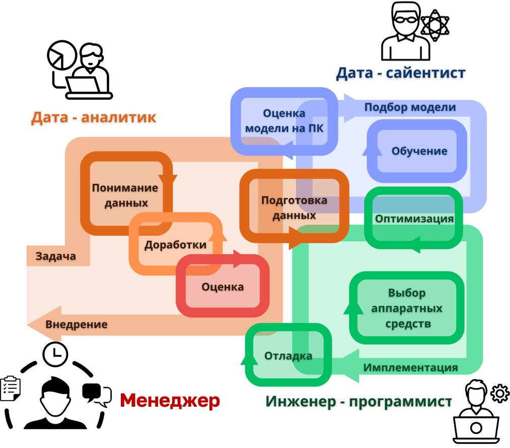

# **2. ОБЩИЕ СВЕДЕНИЯ О ПРОЦЕССЕ РАЗРАБОТКИ** 

## 2.1 Исследование задачи и данных, оценка возможности применения Edge AI 

Краевой искусственный интеллект представляет собой подход, при котором обработка и анализ данных осуществляются непосредственно на конечных устройствах, таких как FPGA, минуя необходимость передачи информации в централизованные серверы или облачные платформы. [Edge AI](glossary.md#edgeai) на FPGA характеризуется рядом значимых преимуществ, таких как минимальные и предсказуемые задержки, высокая производительность в рамках ограниченных аппаратных ресурсов, автономность функционирования системы и обеспечение конфиденциальности обрабатываемых данных ([Zhou et al., 2019](https://doi.org/10.48550/arXiv.1905.10083), [Hua H. et al., 2023](https://doi.org/10.1145/3555802)). Однако, немаловажным является и вопрос выбора и постановки самой задачи для [Edge AI](glossary.md#edgeai).

### 2.1.1 Критерии выбора задач для Edge AI 

Для оценки возможности и целесообразности применения [Edge AI](glossary.md#edgeai) необходимо внимательно проанализировать специфику задачи и характер исходных данных. Задачи, требующие моментального отклика и постоянства задержек, такие как автономное вождение, роботизированные системы или промышленная автоматизация, являются оптимальными кандидатами для реализации с помощью FPGA ([Shi W. et al., 2016](https://doi.org/10.1109/JIOT.2016.2579198)). Минимизация задержек критически важна, поскольку даже незначительное их увеличение может привести к сбоям или аварийным ситуациям.

Автономность системы также является важным критерием, определяющим целесообразность перехода к [Edge AI](glossary.md#edgeai). Системы, работающие в условиях ограниченного или ненадежного подключения к сети, такие как беспилотные летательные аппараты, сенсоры удалённого мониторинга или медицинские устройства, требуют выполнения вычислений локально ([Satyanarayanan M., 2017](https://doi.org/10.1109/MC.2017.9)). FPGA позволяют системам функционировать независимо, обеспечивая надежность работы в отсутствие постоянного соединения с внешними серверами.

Еще одним важным аспектом является конфиденциальность данных. Задачи, связанные с обработкой персональной или чувствительной информации, включая медицинскую диагностику и идентификацию пользователей, предъявляют строгие требования к защите информации ([Yang et al., 2019](https://doi.org/10.1145/3298981)). Использование FPGA в рамках [Edge AI](glossary.md#edgeai) обеспечивает возможность локальной обработки данных, минимизируя риски утечки и нарушения приватности информации.

Ограниченность памяти и вычислительных ресурсов FPGA накладывает дополнительные требования на выбор задач и моделей. В связи с этим наиболее предпочтительны задачи, которые допускают использование компактных нейросетевых архитектур, например, таких как MobileNet или EfficientNet ([Howard et al., 2017](https://doi.org/10.48550/arXiv.1704.04861)). Крупномасштабные модели, например, трансформеры или большие языковые модели (LLM), подходят для реализации на FPGA в меньшей степени из-за ограниченных аппаратных ресурсов.

### 2.1.2 Оценка качества данных 

Качество исходных данных является одним из ключевых факторов, определяющих успешность и эффективность реализации задач с использованием [Edge AI](glossary.md#edgeai). Прежде всего, данные должны быть репрезентативными, то есть адекватно отражать разнообразие и сложность реальных условий, в которых предполагается использование модели. Это особенно важно, поскольку модели машинного обучения, обучаемые на неполных или искаженных данных, могут продемонстрировать низкую точность и неспособность к обобщению в реальных сценариях.

Помимо репрезентативности, необходимо учитывать и объем данных. Для эффективного обучения или дообучения моделей в контексте [Edge AI](glossary.md#edgeai) требуется наличие достаточного объема информации, чтобы можно было выявить скрытые закономерности и сделать обоснованные прогнозы. Недостаточность данных может привести к переобучению модели, когда она слишком сильно адаптируется к ограниченному набору примеров, теряя способность обобщать на новые, ранее не встречавшиеся данные. В ситуациях, когда данные ограничены, применение методов трансферного обучения или аугментации может существенно улучшить результаты ([Tan et al., 2018](https://doi.org/10.48550/arXiv.1808.01974)).

Для оценки качества данных принято использовать несколько ключевых критериев. Во-первых, это точность данных, которая отражает соответствие информации реальным значениям, что критически важно для корректного обучения модели. Во-вторых, важным аспектом является полнота данных, то есть наличие всех необходимых атрибутов и признаков, которые могут оказать влияние на решение задачи. Недостающие данные или пропуски в наборе могут существенно снизить эффективность модели и ее способность к адекватному прогнозированию. Также важно учитывать дисперсию данных — их разнообразие и изменчивость, поскольку чрезмерная однотипность данных может привести к ограниченному обобщению модели, в то время как большое количество шумовых или нерелевантных данных способно затруднить извлечение полезной информации. Наконец, необходимо оценивать согласованность данных, то есть отсутствие противоречий и ошибок в значениях, которые могут исказить результаты обучения и негативно сказаться на производительности модели.

Таким образом, высокое качество исходных данных требует тщательной предварительной обработки, включающей очищение, нормализацию и, в некоторых случаях, даже генерацию синтетических данных, что может быть особенно важно для баланса классов в задачах классификации, так как несбалансированные данные могут привести к ухудшению производительности модели ([Lin et al., 2017](https://doi.org/10.48550/arXiv.1708.02002)).

Реализация алгоритмов искусственного интеллекта (ИИ) на FPGA для Edge-устройств требует более тщательного анализа характеристик данных. FPGA обеспечивают высокую энергоэффективность и детерминированную задержку, но их ресурсы ограничены. В этом разделе рассматриваются типы и параметры данных, оптимальные для обработки на FPGA, технические требования и ограничения платформы.  
Прежде всего, нужно разобраться с самым базовым **форматом представления данных**. Разумеется, FPGA \- тип цифровых микросхем, и все обрабатываемые данные должны быть приведены к цифровому представлению. Однако это далеко не единственное требование.   
Конечно же, рассматриваемые данные должны поддаваться интерпретации нейронными сетями. Понятие **интерпретируемости** весьма сложное ([Zhang et. al., 2012](https://arxiv.org/pdf/2012.14261)), оно зависит от множества факторов, начиная от самой решаемой задачи, и заканчивая наличием в данных конкретных паттернов. Таблицы 1.1-1.3 представляют примеры данных с отражением их интерпретируемости нейронными сетями.
Задачи классификации и сегментации решаются разложением входных данных на признаки и формирование результата на их основе.  
Таблица 1.1 – Интерпретируемые и неинтерпретируемые данные для задач классификации и сегментации

| Вид данных | Тип данных | Интерпретируемые | Неинтерпретируемые |
| ----- | ----- | ----- | ----- |
| Неструктурированные данные | Изображения | - Фотографии с четкими объектами (например, кошки/собаки), где карты визуального внимания выделяют морду, уши или хвост.   - Медицинские снимки (рентген), где модель акцентирует внимание на опухоль или перелом.   - Промышленные изображения для обнаружения дефектов   - Спутниковые изображения с различимыми ландшафтными элементами | - Изображения с крайне низким разрешением, не позволяющим выделить характерные признаки.   - Адверсариальные примеры (изображения с незаметными для человека искажениями, меняющими предсказание).   - Абстрактные текстуры или шум, где модель ошибочно классифицирует случайные паттерны как значимые.   - Изображения с экстремально низким контрастом Фотографии с сильными искажениями или размытием   - Снимки с наложением множества объектов друг на друга   - Изображения в необычных спектральных диапазонах без предварительной адаптации |
|  | Текст, NLP | - Отзывы с явными ключевыми словами (например, "ужасный сервис" для класса "негативный").   - Юридические документы, где выделенные термины (например, "нарушение") определяют категорию. | - Тексты с метафорами или иронией (например, "Этот ресторан — просто шедевр!" в негативном контексте).   - Зашифрованные сообщения или тексты на редких языках, где связи между словами и классом неочевидны. |
|  | Звук | - Аудиозаписи команд ("включи свет", "стоп"), где модель выделяет ключевые слова. Эмоциональная речь: интонации (громкость, высота тона) для определения гнева, радости.   - Жанровая классификация по ритму или инструментам (например, ударные в рок-музыке).   - Аномалии в аудио: скрип двери, разбитие стекла (модель акцентирует резкие изменения амплитуды). | - Зашумленные записи (например, разговор в метро), где модель ошибочно выделяет фоновые шумы.   - Ультразвуковые сигналы (неслышимые для человека), где связь между частотой и классом неочевидна.   - Адверсариальные аудио: незаметные искажения, меняющие предсказание (например, "тихий" шум, превращающий "да" в "нет"). |
|  | Другие | - Резкий скачок температуры тела как признак лихорадки.   - Холодные участки на термограмме для обнаружения воспалений.   - Перегрев двигателя: устойчивое повышение температуры до аварийных значений.   - Резкие падения освещенности как признак выключения света.   - Цикличные паттерны (день/ночь) для классификации времени суток.   - Астрономические данные: спектральные линии, указывающие на состав звезды. | - Данные с датчиков в турбулентной среде (например, хаотичные колебания в ветряных турбинах).   - Микроколебания температуры в серверных стойках без явной причины.   - Шумы от мерцающих ламп (случайные колебания без смысловой нагрузки).   - Данные с датчиков в условиях помех (например, блики от солнца в системе видеонаблюдения).   - Сырые сигналы из гравитационных волн без предварительной обработки.  |
| Структурированные данные |  | - Финансовые данные: параметры вроде "кредитный рейтинг" или "доход" для прогноза одобрения кредита.   - Медицинские данные: уровень глюкозы или возраст для диагностики диабета. Геномные последовательности с известными генами-маркерами (например, BRCA1 для рака груди). | - Кредитные истории с 30% пропущенных значений и случайным шумом.   - Скрытые компоненты, полученные после снижения размерности исходных признаков (например, 100+ финансовых показателей компании сжаты в 10 абстрактных компонент).   - Высокомерные данные с сотнями взаимодействующих признаков (например, генетические маркеры без четкой биологической интерпретации).   - Неизученные эпигенетические взаимодействия, где роль отдельных элементов не ясна. |
|  |  |  |  |

В случае задачи генерации входные данные могут иметь очень разную природу. Чаще всего это текстовые запросы, однако можно встретить и абсолютно обратный принцип работы: генерацию текста с описанием входных данных. Как правило, генерационная нейронная сеть должна интерпретировать как входной тип данных, так и выходной, ведь на вход при обучении поступают оба типа.   
Таблица 1.2 – Интерпретируемые и неинтерпретируемые данные для задачи генерации

| Вид данных | Тип генерируемых данных | Интерпретируемые | Неинтерпретируемые |
| :---- | :---- | :---- | :---- |
| Неструктурированные данные | Изображения | - Набор фотографий лиц для генерации новых портретов (например, CelebA)   - Коллекция картин в стиле импрессионизма для создания новых изображений   - Стандартизированные изображения автомобилей для генерации новых моделей | - Случайные шумовые картинки без структуры Изображения с сильными искажениями и артефактами   - Изображения с наложением множества объектов, неразличимых по форме |
|  | Текст, NLP | - Запрос: "Напиши статью о преимуществах электромобилей" Шаблон договора, на основе которого генерируется персонализированный документ   - Исторические данные для генерации отчётов о продажах | - Запрос с противоречивыми требованиями: "Напиши статью, которая одновременно доказывает и опровергает пользу электромобилей"   - Текст без структуры, состоящий из случайных слов Неполные или противоречивые данные продаж |
|  | Звук | - Записи классической музыки для генерации новых композиций   - Речевые записи с четкой артикуляцией для синтеза речи   - Спектрограммы инструментальных партий для создания новых мелодий | - Аудиозаписи с сильным фоновым шумом и искажениями   - Записи с перебоями, шумами и помехами Аудио с хаотичными и непредсказуемыми звуками |
| Структурированные |  | - Финансовые отчеты с логичными зависимостями (доход ↔ расход).   - Генерация временных рядов спроса на товары. | - Данные после автоэнкодеров/PCA, где признаки не имеют экономического смысла.   - Случайные таблицы с шумом. |

Таблица 1.3 – Интерпретируемые и неинтерпретируемые данные для решения математических задач

| Интерпретируемые | Неинтерпретируемые |
| ----- | ----- |
| - Алгебраические уравнения стандартной формы Задачи оптимизации с четкими параметрами   - Статистические расчеты с полным набором данных | - Нестандартные задачи, требующие творческого подхода   - Задачи с неполными или противоречивыми условиями   - Сложные теоретические доказательства без алгоритмического подхода |

Также, критерием, устанавливающим куда более строгие ограничения, является пригодность данных с точки зрения оптимизации под платформу FPGA. Данный критерий опирается на совокупность параметров самих данных и модели, исполняющей их обработку.
Каждая нейросетевая модель обладает параметрами, характеризующими ее сложность. Основными являются: количество слоев, количество обучаемых параметров, количество операций на один инференс. Рассмотрим в качестве примера одну из первых сверточных нейронных сетей (CNN) для обработки изображений: LeNet-5 ([Lecun et. al, 2002](https://doi.org/10.1109/5.726791)). Она включает в себя 5 слоев с 61,7 тысячами обучаемых параметров, на хранение каждого из которых необходимо по 1 байту памяти (в случае битности int8). Для одного выполнения необходимо рассчитать 3,6 млн математических операций, включая так называемые MAC (multiply-accumulate, более 90% от всех совершаемых операций) операции и расчеты функции активации.
Данные характеризуются размером (в случае LeNet-5 входные данные - монохроматическое изображение размером 32х32х1), а также частотой поступления, зависящей в первую очередь от решаемой задачи. Скажем, в рамках задачи необходимо распознавать 10-значные цифровые коды на документах, едущих по конвейеру со скоростью 2 листа/с. При этом их снимает камера технического зрения с частотой 30 кадров/с и подает кадры на вход LeNet-5.  
В таком случае, нашей системе технического зрения достаточно обработать лишь один из 15 кадров, на которых присутствует распознаваемый цифровой код. В обработку входит выделение нужного участка с кодом и пропускание каждого отдельного символа через нейронную сеть. Для распознавания одного кода понадобится десять раз выполнить пропускание данных через нейронную сеть или, другими словами, совершить десять [инференсов](glossary.md#inference). Таким образом, определяем, что конкретно нейронной сети требуется производить 20 инференсов в секунду. Эта скорость соответствует 7,2 млн операций в секунду.
Представленный расчет возможно повторить для любой архитектуры и любых данных. Необходимо согласовать результирующую скорость с возможностями используемой микросхемы, либо подобрать микросхему под это требование.

**Оценочные значения максимальной пропускной способности для современных устройств:**

- максимальная пропускная способность AI Engine в составе FPGA AMD Versal \[\] (специализированной архитектуры для [Edge AI](glossary.md#edgeai)) составляет 405 триллионов операций в секунду (TOPS) в формате int8);  
- максимальная пропускная способность архитектуры FPGA Agilex 5 составляет 56 TOPS в формате int8;  
- максимальная пропускная способность TPU v6e (Trillium) от Google составляет 1836 TOPS в формате int8. Однако такие вычислители в основном предназначены для серверной установки и вряд ли подойдут для краевых устройств

## 2.2 Обучение и оптимизация нейронных сетей для Edge AI 

Разработка решений с использованием нейронных сетей для периферийных вычислений, особенно с использованием FPGA, требует специализированных подходов к подготовке, обучению и оптимизации моделей. Основная задача заключается в создании компактных, эффективных моделей, способных функционировать в условиях ограниченных вычислительных ресурсов.

### 2.2.1 Обучение нейронных сетей 

Трансферное обучение играет важную роль в разработке нейросетевых решений для [Edge AI](glossary.md#edgeai). Оно позволяет использовать уже обученные модели, которые адаптируются под специфические задачи путём дообучения на целевых данных. Такой подход существенно сокращает объем необходимых вычислений и уменьшает количество требуемых данных для обучения ([Tan C. et al., 2018](https://doi.org/10.48550/arXiv.1808.01974)).

Наряду с трансферным обучением для [Edge AI](glossary.md#edgeai) решений широко используются готовые архитектуры нейронных сетей, специально разработанные для маломощных устройств, такие как MobileNet, EfficientNet, SqueezeNet и ShuffleNet. Эти архитектуры характеризуются небольшим числом параметров и эффективными вычислительными структурами, что делает их особенно привлекательными для аппаратной реализации.

Также важно упомянуть и возможность разработки специализированных архитектур нейросетей, настроенных для решения определённой задачи. Такие решения позволяют максимально использовать доступные аппаратные ресурсы и значительно повысить эффективность выполнения нейросетевых алгоритмов.

### 2.2.2 Методы оптимизации моделей 

Оптимизация нейронных сетей является важным этапом, направленным на снижение вычислительной нагрузки и требуемого объёма памяти. К основным методам оптимизации относятся прунинг, квантизация, дистилляция знаний, сжатие и проецирование.

Прунинг (обрезка) позволяет снизить вычислительную сложность и размер модели путём удаления менее значимых связей и нейронов. Выделяют структурный (structured pruning) и неструктурный (unstructured pruning) подходы, обеспечивающие значительное повышение аппаратной эффективности и производительности модели ([Han et. al., 2016](https://doi.org/10.48550/arXiv.1510.00149)).

Квантизация снижает разрядность параметров модели (например, переход от float32 к INT8 или бинарным форматам), уменьшая объём памяти и увеличивая скорость вычислений на FPGA с минимальными потерями точности. Применяются как квантизация при обучении (Quantization Aware Training – QAT), так и квантизация после обучения (Post-Training Quantization – PTQ) ([Jacob et. al., 2018](https://doi.org/10.1109/CVPR.2018.00286)).

Дистилляция знаний (Knowledge Distillation) предполагает обучение компактной модели на основе результатов работы более крупной и точной модели. Это позволяет сохранять высокую производительность при существенном снижении размера и вычислительных затрат ([Hinton et. al., 2015](https://doi.org/10.48550/arXiv.1503.02531)).

Сжатие (Compression) включает методы уменьшения объема данных, используемых для хранения параметров модели, например Huffman-кодирование и другие техники, направленные на снижение занимаемого пространства и облегчение передачи данных ([Han et. al., 2015](https://doi.org/10.48550/arXiv.1510.00149)).

Проецирование (Projection) основывается на снижении размерности данных и параметров моделей с использованием алгоритмов проекции, таких как PCA (Principal Component Analysis), что дополнительно уменьшает вычислительную нагрузку и потребность в памяти ([Sze et. al., 2017](https://doi.org/10.48550/arXiv.1703.09039)).

Совокупность этих методов позволяет существенно оптимизировать нейронные сети, обеспечивая высокую эффективность при реализации на программируемой логике.

## **2.3 Организация командного взаимодействия** 

Любая разработка, в том числе включающая имплементацию [Edge AI](glossary.md#edgeai), начинается с технического задания. Во время его составления формируются технические требования к системе: тип обрабатываемых данных, количество инференсов в секунду, время отклика, целевая аппаратная платформа, условия эксплуатации и пр. Аналогично на этапе формирования ТЗ определяется положение [Edge AI](glossary.md#edgeai) в технической системе. Например, [Edge AI](glossary.md#edgeai) может применяться как для предобработки данных с последующей их отправкой, так и непосредственно использовать результаты вычислений для генерации управляющих воздействий в цепи обратной связи. При разработке [Edge AI](glossary.md#edgeai) устройств начиная с этапа планирования и формирования ТЗ требуется участие специалистов из трёх основных групп, которые будут имплементировать ИИ: дата-аналитиков, специалистов по машинному обучению (дата-сайентистов) и разработчиков встроенного программного обеспечения (инженеров-программистов). Каждая из этих групп обладает уникальными навыками и фокусируется на разных аспектах единой системы. На этапе планирования, работая совместно с системным архитектором, они участвуют в формировании требований к системе и обосновывают его техническую выполнимость. Дальнейшее их взаимодействие в ходе разработки должно быть основано на четком информационном обмене, который учитывает сформулированные ранее специфику задач, аппаратные ограничения и требования к производительности.

### 2.3.1 Аналитики данных (data analysts) 

Аналитики данных оценивают возможность и необходимость применения [Edge AI](glossary.md#edgeai) для решения конкретной прикладной задачи. Определяют по данным, возможна ли имплементация алгоритмов [Edge AI](glossary.md#edgeai). В их задачи входит установка требований к пропускной способности, времени отклика, ожидаемой точности алгоритма и метрикам качества модели. Они должны уметь поставить задачу для исследователей данных и подготовить данные для обучения нейронной сети (см. п. 2.1.2). После завершении имплементации [Edge AI](glossary.md#edgeai) инженерами-программистами они осуществляют оценку результатов.

### 2.3.2 Исследователи данных (data scientists) 

Исследователи данных (data scientists) занимаются разработкой, обучением и оптимизацией нейронной сети, реализующей необходимый функционал. Они подбирают архитектуру модели, проводят эксперименты и оценивают качество модели на ПК. При работе над архитектурой для задач [Edge AI](glossary.md#edgeai) data scientists значительно ограничены по сложности нейросетевой модели, так как требуется её оптимизация под платформу FPGA. Поэтому для них критически важно получать обратную связь от дата-аналитиков, для того чтобы создать оптимальную архитектуру под конкретную задачу, и от инженеров-программистов, для того чтобы адаптировать модель под ограничения целевого устройства.

### 2.3.3 Инженеры-программисты 

Инженеры-программисты отвечают за перенос и оптимизацию обученной модели нейронной сети на целевое устройство. Начиная с самого раннего этапа разработок они устанавливают ограничения для аналитиков и исследователей данных. Инженеры участвуют при выборе аппаратных средств для реализации [Edge AI](glossary.md#edgeai), поскольку могут оценить требуемые параметры устройства (память, вычислительная мощность, энергопотребление и пр.) для решения конкретной задачи. Также они понимают специфику оптимизации нейронных сетей под FPGA и работают со специализированными фреймворками, осуществляя дальнейшую аппаратно-специфичную оптимизацию нейронных сетей после дата-сайентистов. Для них важна точная спецификация модели, форматы данных, требования к производительности и совместимость с аппаратной платформой.

### 2.3.4 Особенности информационного обмена 

Разработка [Edge AI](glossary.md#edgeai) решений обычно носит итеративный характер.  Дата-аналитики устанавливают требования, дата-сайентисты предоставляют прототип модели, инженеры-программисты реализуют её на устройстве и сообщают о проблемах с производительностью или ресурсами, после чего модель дорабатывается. Все группы плотно взаимодействуют между собой так как при переходе от одной группе к другой могут появляться различные проблемы: невозможность получить достаточную точность модели на основе входных данных, нехватка аппаратных ресурсов для реализации модели, неудовлетворение точностных метрик после аппаратно-специфичных оптимизаций и т.д. Во время создания новой версии устройства или обновления алгоритма расчёта требуется заново осуществлять часть или весь цикл разработки с учётом новых требований. Таким образом правильная организация информационного обмена между участниками команды при имплементации [Edge AI](glossary.md#edgeai) на FPGA является необходимой для успешного процесса разработки.

<figure>
  
  <figcaption> Рисунок 2.1 – Диаграмма взаимодействий специалистов при реализации алгоритмов краевого искусственного интеллекта </figcaption>
</figure>

Основной особенностью имплементации [Edge AI](glossary.md#edgeai) является ограниченность аппаратной платформы по производительности и ресурсам. При этом замена аппаратной платформы на более мощную зачастую невозможна из-за необходимости разработки нового устройства. Помимо этого, выбор FPGA от определённого вендора и линейки чипов определяет то, с каким программным обеспечением может работать инженер-программист. Более того, существующие на рынке решения по переносу нейронных сетей на граничные устройства обладают различным функционалом, что приводит к тому, что, используя одинаковую нейронную сеть на входе, можно получить разные пропускные способности и степень использования аппаратных ресурсов при размещении на ПЛИС. Все эти аспекты низкоуровневой разработки вносят дополнительные сложности для дата-сайентистов, поскольку разработанная ими архитектура может быть неприменима из-за отсутствия необходимых слоёв или активационных функций в инструментах адаптации под целевое устройство, невозможности использования указанного порядка слоёв, недостаточного числа аппаратных ресурсов и т.д.

## 2.4 **Параметризация и оптимизация моделей, оценка потребления ресурсов** 

Реализация нейронных сетей на базе ПЛИС требует проведения аппаратно-специфичных оптимизаций архитектуры модели и её параметров для достижения баланса между производительностью, пропускной способностью и аппаратными ограничениями, при обеспечении необходимой точности вычислений. Для эффективного использования ресурсов ПЛИС необходимо учитывать особенности их архитектуры, в частности наличие специализированных ресурсов (блочной памяти (BRAM) и цифровых сигнальных процессоров (DSP)).

### 2.4.1 Оптимизация под вычислительные блоки FPGA 

Первым путём улучшений итогового решения являются оптимизации под вычислительные блоки ПЛИС. Современные FPGA содержат специализированные DSP-блоки (от англ. Digital Signal Processing), оптимизированные для выполнения операция умножения с накоплением (MAC). Эффективное использование этих блоков требует:

* Векторизации MAC-операций: Группировка умножений с накоплением для параллельной обработки в DSP-блоках (например, 48 операций INT8 за такт для Xilinx UltraScale+)  
* Адаптации разрядности: Использование 18×27-битных DSP-блоков (Stratix V) для фиксированной точки вместо 32-битных операций с плавающей запятой  
* Конвейеризации вычислений: Организация 6-стадийных конвейеров для устранения простоев (увеличение throughput на 58% для ResNet-50)

Помимо этого FPGA обладают блоками встроенной памяти (BRAM), за счёт которых можно избавиться от операций доступа к внешней памяти, тем самым избавившись от основного узкого места GPU-based решений для небольших нейронных сетей. Реализации, использующие блочную память, должны обладать следующими свойствами:

* Пакетирование данных – упаковка весов в памяти оптимальным образом для облегчения доступа к ним   
* Разделение памяти – распределение данных между несколькими BRAM для обеспечения параллельного доступа   
* Кэширование – предварительная загрузка часто используемых (или всех) данных в память

### 2.4.2 Оптимизация форматов данных 

Внутреннее устройство ПЛИС позволяет достигать более гибкой и одновременно более глубокой оптимизации форматов данных, чем в любой другой аппаратной платформе. Во-первых, это обеспечивается за счёт возможности создания пользовательских форматов данных. В случае применения форматов с фиксированной точкой:  

* Адаптивный выбор положения точки  
* Слой-специфичная битность (разная разрядность для разных слоев)  
* Блочное квантование – независимое квантование групп параметров

При квантовании также можно применять аппаратно-ориентированные методы оптимизации:

* Адаптивное квантование обеспечивает произвольную разрядность для различных слоёв, обычно 4 \- 8 бит.  
* Применение экстремальных случаев квантования: бинарных и тернарных нейронных сетей, в которых значения весов и активаций кодируются как {-1, \+1} или {-1, 0, \+1}.

Отрицательным моментом таких оптимизаций является необходимость разработки специализированных архитектур для осуществления расчётов. В частности переход к бинарным и тернарным нейронным сетям приводит к замене операции умножения на битовые операции. При этом фреймворк в котором проводится обучение нейронной сети должен также обеспечивать возможность работы с такими данными.

### 2.4.3 Оптимизация расчетов функций активациих 

Под методами оптимизации функций активации понимается выбор способа расчёта итогового значения. Для расчёта значения функции активации может применяться два основных способа. Первым являются таблицы поиска, внутри которых каждому значению на входе (x) сопоставляется значение на выходе (y), которое с заданной точностью соответствует реальному значению функции. При таком методе результаты функции активации хранятся в памяти и могут быть получены из неё за несколько тактов, однако размер использованной памяти сильно возрастает при повышении битности сигналов. Другим способом является алгоритмический, при котором результат функции активации получается также приближённым, но с помощью некоторого алгоритма расчёта, например CORDIC или рядов Тейлора.

### 2.4.4 Ресурсно-ориентированные оптимизации 

При разработке архитектуры будущего вычислительного блока, с помощью которого будет осуществляться расчёт нейронной сети, можно избирать различные подходы с точки зрения использования ресурсов. В случае если требуется обеспечить максимальную пропускную способность, слои нейронной сети и отдельные нейроны будут реализованы в качестве отдельных структурных единиц, таким образом обеспечивая полный параллелизм вычислений. В противном же случае можно создать несколько вычислительных модулей, которые будут переиспользованы для расчёта различных частей нейронной сети. Данный метод оптимизации можно разделить на методы мультиплексирования вычислительных блоков и аппаратное разделение слоёв.  
Мультиплексирование вычислительных блоков

* Разделение дорогих ресурсов между операциями  
* Динамическая реконфигурация вычислительных блоков  
* Временное разделение ресурсов

Аппаратное разделение слоев

* Физическое разделение разных частей сети  
* Независимая оптимизация каждого субмодуля  
* Гибкое распределение ресурсов между слоями

### 2.4.5 Аппаратно-ориентированные архитектурные оптимизации 

Аппаратно-ориентированные оптимизации представляют собой модификацию архитектуры нейронной сети с учетом специфики FPGA, направленную на максимальное использование аппаратных возможностей при минимальном потреблении ресурсов. Эти оптимизации затрагивают как саму структуру нейронной сети, так и способы реализации ее операций на программируемой логике.

**Специализированные ядра для свёрток**

* **Winograd-преобразования** – уменьшение количества умножений в свёрточных слоях  
* **Частотные свёртки** – выполнение операций в частотной области через FFT  
* **Разделённые свёртки** – оптимизация заимствованная из  мобильных архитектур, подразумевает разделение пространственной и канальной свёрток.

**Потоковая обработка данных (Streaming)**

* **Плиточная обработка (Tiling)** – разбиение больших тензоров на обрабатываемые фрагменты  
* **Двойная буферизация** – разделение памяти на два буфера, при котором один обрабатывается, а другой загружается  
* **Локализация данных** – минимизация обращений к внешней памяти за счёт использования регистровых файлов и обеспечения последовательного доступа к необходимой информации

## 2.5 **Процесс адаптации подготовленной модели и ее размещения на FPGA** 

Процесс размещения нейронной сети на ПЛИС представляет собой последовательность этапов, каждый из которых требует тщательной оптимизации для соответствия аппаратным ограничениям. Этот процесс охватывает разработку или генерацию HDL-кода, интеграцию, симуляцию и финальное программирование ПЛИС. Выбор архитектуры сети, хотя и важен, обычно выполняется на этапе системного проектирования и здесь рассматривается лишь с точки зрения влияния на ресурсы.

## 2.5.1 **Разработка блоков на HDL** 

Перевод модели в язык аппаратного описания (HDL), такой как VHDL или Verilog, может осуществляться несколькими способами:

* Разработка программного обеспечения на HDL вручную: Требует глубоких знаний аппаратного проектирования, но обеспечивает максимальный контроль над оптимизацией. Используется для специфичных задач или недорогих ПЛИС, где ресурсы ограничены.  
* High-Level Synthesis (HLS): Инструменты, такие как Vivado HLS, MATLAB HDL Coder или hls4ml, автоматически генерируют HDL из кода на C/C++, Python или MATLAB. HLS упрощает разработку и ускоряет прототипирование, но может быть менее эффективным по ресурсам (например, на 10–20% больше LE).  
* Готовые IP-ядра: Например, Vitis AI предоставляет оптимизированные блоки для свёрточных операций, которые можно интегрировать в дизайн без написания HDL.  
* Другие пути: Использование фреймворков, таких как FINN, для генерации кода для квантованных сетей или импорт моделей из TensorFlow через инструменты вроде hls4ml.

**Необходимые компоненты включают:**

* Блоки умножения и сложения: Для вычисления взвешенных сумм .Например, умножитель для 16-битной фиксированной точки может использовать 1 DSP или 500 LE без DSP.  
* Функции активации: Реализуются через LUT-таблицы (для ReLU), алгоритм CORDIC (для tanh или sigmoid) или кусочно-линейные аппроксимации. CORDIC минимизирует использование DSP, требуя только LE и 10–20 тактов.  
* Блок управления последовательностью: Координирует поток данных через слои сети, обеспечивая правильную последовательность операций. Например, управляет загрузкой весов из ROM и передачей результатов в RAM.

## 2.5.2 **Интеграция и симуляция** 

После разработки HDL-блоков они интегрируются в единую схему. Варианты интеграции:

* Самостоятельный блок: Нейронная сеть работает как независимый модуль на ПЛИС, принимая входные данные (например, от АЦП) и выдавая результаты (например, классификацию).  
* Сопряжение с SoC: Нейросеть подключается к процессору (например, ARM Cortex в Zynq SoC) через интерфейсы, такие как AXI. Процессор может выполнять предварительную обработку данных или управлять вводом/выводом. SoC необязателен и используется в сложных системах, таких как автомобильные.  
* Гибридная система: Нейросеть взаимодействует с внешними устройствами (например, камерами, гироскопами) через интерфейсы, такие as UART, SPI или I2C. Это подходит для IoT-устройств, где ПЛИС обрабатывает только нейросеть.  
* Поток обработки: Нейросеть интегрируется в конвейер обработки данных, например, для обработки видеопотока в реальном времени.

Для проверки корректности используются симуляторы, такие как ModelSim, Vivado Simulator или Quartus Simulator. Симуляция сравнивает выходные данные аппаратной реализации с результатами программного моделирования, что позволяет выявить ошибки до программирования ПЛИС.

## 2.5.3 **Синтез и программирование** 

**Заключительный этап включает:**

* Синтез: Преобразование HDL-кода в нетлист — описание схемы на уровне логических вентилей. Это определяет, как HDL будет реализован в LE, DSP и BRAM.  
* Размещение: Распределение элементов схемы (LE, DSP, BRAM) по физическим ресурсам ПЛИС с учётом ограничений по таймингу и энергопотреблению. Например, размещение должно минимизировать длину соединений для достижения частоты 100 МГц.  
* Маршрутизация: Создание соединений между элементами с минимальными задержками. Неправильная маршрутизация может привести к нарушению тайминга (например, задержки более 10 нс) и снижению частоты работы (до 50 МГц).

    
**Инструменты:**

* Vivado (Xilinx): Поддерживает синтез, размещение и маршрутизацию для ПЛИС Xilinx. Включает HLS и Vitis AI для AI-оптимизаций.  
* Quartus Prime (Intel): Аналогичный инструмент для ПЛИС Intel, с упором на HDL-дизайн и ручную оптимизацию.  
* GoWin IDE: Для недорогих ПЛИС GoWin, подходит для простых сетей с фиксированной точкой.  
* Lattice Radiant/Propel/Diamond: Для ПЛИС Lattice. Radiant ориентирован на автоматизацию, Propel — на SoC, Diamond — на старые ПЛИС.  
* Efinity (Efinix): Для ПЛИС Efinix, с упором на энергоэффективность и HDL-дизайн.  
* Libero SoC (Microchip): Для ПЛИС Microchip, поддерживает интеграцию с процессорами в SoC.

Эти инструменты выполняют полный цикл от HDL до программирования ПЛИС, но их функциональность различается: Vivado и Quartus Prime предлагают высокую автоматизацию, тогда как GoWin и Efinity больше подходят для бюджетных решений.

Продолжение: см. [3. СРЕДСТВА РАЗРАБОТКИ](ch3.md#ch3).