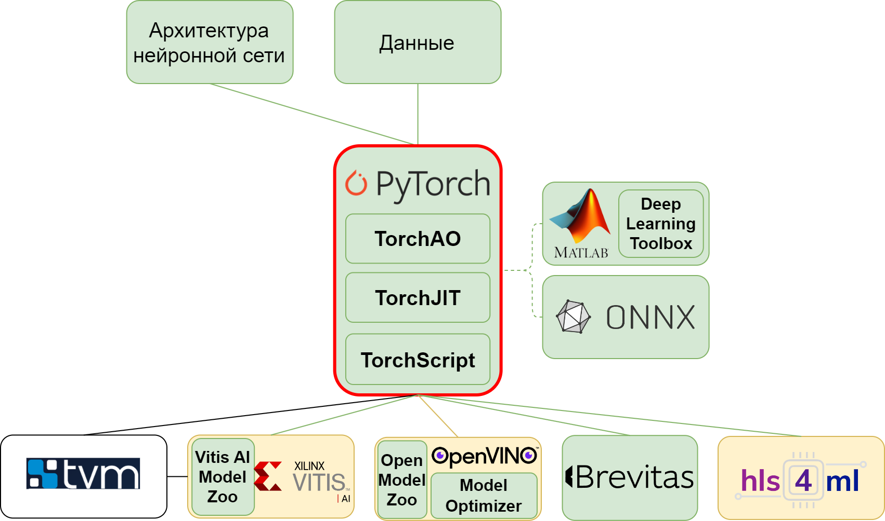

### **3.2.1 PyTorch: исследовательский полигон для Edge AI** <a name="ch3.2.1"></a>

<div style="text-align: justify">

<a name="image_3_2_1_1"></a>
<figure>
  
</figure>

PyTorch представляет собой гибкую и широко применяемую платформу для глубокого обучения, включающую инструменты для построения, обучения, оптимизации и инференса нейронных сетей. Благодаря императивному стилю вычислений (define-by-run), динамическому графу вычислений и удобному Python API, PyTorch позиционируется как идеальный инструмент для исследований и экспериментирования. Это делает его особенно привлекательным для разработки [Edge AI](glossary.md#edgeai) решений, где требуется итеративный процесс оптимизации моделей для различных аппаратных платформ ([FPGA](glossary.md#fpga), [ASIC](glossary.md#asic), [DSP](glossary.md#dsp)).

Исследовательский подход PyTorch позволяет легко экспериментировать с различными архитектурами, методами оптимизации и стратегиями квантования без необходимости переписывания кода. Для задач Edge AI PyTorch предоставляет мощные инструменты уменьшения вычислительных затрат и потребления памяти: модуль `torch.quantization` и современный API `torch.ao.quantization`, поддержку [прунинга](glossary.md#pruning), уплотнение параметров, подготовку оптимизированных графов вычислений. Все эти возможности позволяют исследователю и инженеру оценить компромисс между производительностью и точностью ещё на этапе офлайн-эмуляции, до развёртывания на целевом оборудовании.

**Ключевые особенности PyTorch для Edge AI разработки:**
* **Быстрый итеративный цикл:** динамический граф позволяет мгновенно видеть результаты экспериментов;
* **Гибкость архитектур:** поддержка пользовательских слоёв и операций упрощает прототипирование новых подходов;
* **Встроенная оптимизация:** инструменты [квантизации](glossary.md#quantization), [прунинга](glossary.md#pruning) и дистилляции знаний;
* **Экспортируемость:** возможность экспорта моделей в ONNX, TorchScript и другие форматы для развёртывания.

Цель данного раздела — показать практический процесс разработки, оптимизации и валидации компактной нейросетевой модели в PyTorch на полном цикле: от подготовки данных и исследования архитектур до пост-тренировочной [квантизации](glossary.md#quantization) и оценки потерь точности. В качестве демонстрационного примера рассматривается построение сверточной сети для классификации изображений рукописных цифр (MNIST).

#### Подготовка данных

В PyTorch стандартным способом работы с изображениями является использование классов `Dataset` и `DataLoader`:

```python
import torch
from torch.utils.data import DataLoader
from torchvision import datasets, transforms

transform = transforms.Compose([
    transforms.Resize((28, 28)),
    transforms.Grayscale(),
    transforms.ToTensor(),
    transforms.Normalize(mean=[0.5], std=[0.5])
])

train_ds = datasets.MNIST(root="./data", train=True, download=True, transform=transform)
val_ds   = datasets.MNIST(root="./data", train=False, download=True, transform=transform)
train_loader = DataLoader(train_ds, batch_size=128, shuffle=True)
val_loader   = DataLoader(val_ds,   batch_size=256)
```

Использование `Normalize` с параметрами `mean=0.5, std=0.5` соответствует приближённой стандартизации входов и обеспечивает более устойчивое обучение.

#### Архитектура компактной CNN

Создадим нейросетевую модель полностью аналогичную примеру из раздела MATLAB:

```python
import torch.nn as nn
import torch.nn.functional as F

class SmallCNN(nn.Module):
    def __init__(self):
        super().__init__()
        self.conv1 = nn.Conv2d(1, 8, kernel_size=3, padding=1)
        self.bn1   = nn.BatchNorm2d(8)
        self.conv2 = nn.Conv2d(8, 16, kernel_size=3, padding=1)
        self.bn2   = nn.BatchNorm2d(16)
        self.fc    = nn.Linear(16*14*14, 10)

    def forward(self, x):
        x = F.relu(self.bn1(self.conv1(x)))
        x = F.max_pool2d(x, 2)
        x = F.relu(self.bn2(self.conv2(x)))
        x = x.view(x.size(0), -1)
        x = self.fc(x)
        return F.log_softmax(x, dim=1)
```

Сеть использует две последовательности Conv-[BatchNorm](glossary.md#batchnorm)-[ReLU](glossary.md#relu), затем слой подвыборки (max pooling), за которым следует полносвязный слой. Число каналов 8 и 16 выбрано в пользу компактности, что важно для последующего квантования и аппаратной имплементации.

#### Обучение модели

Обучение в PyTorch позволяет точно контролировать цикл оптимизации и метрики:

```python
device = torch.device("cuda" if torch.cuda.is_available() else "cpu")
model = SmallCNN().to(device)
optimizer = torch.optim.Adam(model.parameters(), lr=1e-3, weight_decay=1e-4)
criterion = nn.NLLLoss()

for epoch in range(10):
    model.train()
    for images, labels in train_loader:
        images, labels = images.to(device), labels.to(device)

        optimizer.zero_grad()
        outputs = model(images)
        loss = criterion(outputs, labels)
        loss.backward()
        optimizer.step()
```

Оптимизатор Adam и L2-регуляризация используются для стабильного обучения и борьбы с переобучением.

#### Оценка точности FP32-модели

```python
def evaluate(model, loader):
    model.eval()
    correct = 0
    total = 0
    with torch.no_grad():
        for images, labels in loader:
            images, labels = images.to(device), labels.to(device)
            outputs = model(images)
            pred = outputs.argmax(1)
            correct += (pred == labels).sum().item()
            total += labels.size(0)
    return correct / total

acc_fp32 = evaluate(model, val_loader)
print(f"Baseline accuracy (FP32): {acc_fp32*100:.2f}%")
```

#### Квантование обученной модели до формата данных int8

Как и в MATLAB, PyTorch позволяет выполнить отображение весов и активаций из формата float32 в int8, что существенно уменьшает требования к вычислительным ресурсам. PyTorch использует модуль `torch.ao.quantization`.

**Подготовка модели к квантованию:**

```python
import torch.ao.quantization as tq

model_fp32 = model.cpu()

model_fp32.qconfig = tq.get_default_qconfig("fbgemm")  # backend для x86/ARM
tq.prepare(model_fp32, inplace=True)
```

На этом этапе происходит вставка наблюдателей, фиксирующих реальные диапазоны активаций для последующей квантизации.

**Калибровка на выборке:**

```python
model_fp32.eval()
with torch.no_grad():
    for images, _ in val_loader:
        model_fp32(images)  # прогон для сбора статистики
```

**Преобразование в int8-модель:**

```python
model_int8 = tq.convert(model_fp32)
```

Теперь веса и часть операций представлены в целочисленном формате, что позволяет существенно уменьшить вычислительную сложность.

**Оценка точности квантованной модели:**

```python
acc_int8 = evaluate(model_int8, val_loader)
print(f"Accuracy after INT8 quantization: {acc_int8*100:.2f}%")
```

Если падение точности выходит за пределы допустимого, разработчик может изменить архитектуру, пересмотреть нормализацию, провести квантование-предобучение (QAT) или использовать смешанную точность слоёв.

**Сохранение модели:**

```python
torch.save(model.state_dict(), "model_fp32.pth")
torch.save(model_int8.state_dict(), "model_int8.pth")
```

Модели могут быть экспортированы в TorchScript для инференса на мобильных устройствах и FPGA/ASIC-компиляторах.

#### Заключение

В данном разделе рассмотрен полный минимальный цикл подготовки компактной нейросетевой модели в PyTorch — от получения данных и проектирования архитектуры до пост-тренировочного [квантования](glossary.md#quantization) и оценки точности. Представленный подход позволяет разработчику эффективно подготавливать модели для Edge AI и аппаратной реализации, контролируя качество модели уже на этапе офлайн-эмуляции.

</div>
