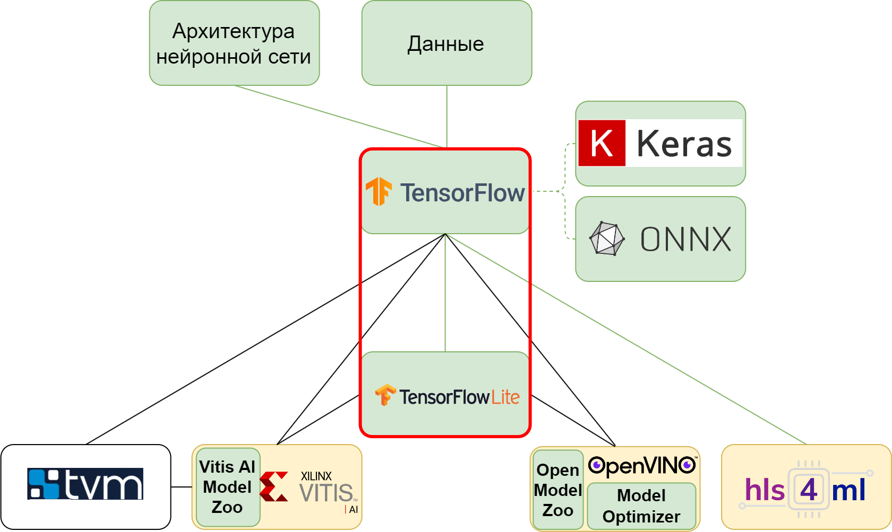

### **3.2.2 TensorFlow: высокооптимизированный фреймворк** <a name="ch3.2.2"></a>

<div style="text-align: justify">

<a name="image_3_2_2_1"></a>
<figure>
  
</figure>

TensorFlow, разработанный Google, представляет собой промышленно-ориентированный фреймворк глубокого обучения, приоритизирующий производительность, масштабируемость и интеграцию в production-решения. В отличие от PyTorch, изначально ориентированного на исследовательский процесс, TensorFlow спроектирован для развёртывания моделей в реальных системах с миллиардами пользователей. Это делает его особенно привлекательным для разработки [Edge AI](glossary.md#edgeai) решений, где требуется стабильность, оптимизация и поддержка разнообразных аппаратных платформ ([FPGA](glossary.md#fpga), мобильные устройства, [TPU](glossary.md#tpu), [ASIC](glossary.md#asic)).

#### Архитектура и возможности TensorFlow

TensorFlow предоставляет слоистую архитектуру абстракций:

* **Низкоуровневый API (TensorFlow Core):** операции с тензорами, графы вычислений, прямой контроль над вычислительным процессом;
* **Высокоуровневый API (Keras):** удобный API для построения моделей с помощью последовательных и функциональных интерфейсов;
* **Специализированные модули:** TensorFlow Lite для мобильных устройств, TensorFlow.js для веб-приложений, TensorFlow Extended (TFX) для production-пайплайнов.

**Ключевые преимущества TensorFlow для Edge AI:**

* **Оптимизированный инференс:** TensorFlow Lite обеспечивает сжатие моделей и их оптимизацию для встраиваемых устройств;
* **Кросс-платформенность:** поддержка [CPU](glossary.md#cpu), [GPU](glossary.md#gpu), [TPU](glossary.md#tpu), FPGA через TensorFlow Compiler (XLA);
* **Встроенная [квантизация](glossary.md#quantization):** post-training quantization (PTQ) и quantization-aware training ([QAT](glossary.md#qat));
* **Экспортируемость:** прямой экспорт в SavedModel, TFLite, ONNX форматы.

#### Полный цикл разработки CNN в TensorFlow/Keras

Рассмотрим практический пример разработки компактной [CNN](glossary.md#cnn) для классификации изображений MNIST.

**Подготовка данных:**

```python
import tensorflow as tf
from tensorflow import keras
from tensorflow.keras import layers
import numpy as np

# Загрузка датасета
(x_train, y_train), (x_test, y_test) = keras.datasets.mnist.load_data()

# Предобработка
x_train = x_train.astype("float32") / 255.0
x_test = x_test.astype("float32") / 255.0
x_train = np.expand_dims(x_train, -1)
x_test = np.expand_dims(x_test, -1)

# Разделение на обучающую и валидационную выборки
x_val = x_train[-10000:]
y_val = y_train[-10000:]
x_train = x_train[:-10000]
y_train = y_train[:-10000]
```

**Построение модели в Keras:**

```python
model = keras.Sequential([
    layers.Input(shape=(28, 28, 1)),
    layers.Conv2D(8, kernel_size=(3, 3), padding="same", activation="relu", name="conv1"),
    layers.BatchNormalization(name="bn1"),
    layers.MaxPooling2D(pool_size=(2, 2), name="pool1"),
    layers.Conv2D(16, kernel_size=(3, 3), padding="same", activation="relu", name="conv2"),
    layers.BatchNormalization(name="bn2"),
    layers.MaxPooling2D(pool_size=(2, 2), name="pool2"),
    layers.Flatten(),
    layers.Dense(10, activation="softmax", name="output")
])
```

Архитектура полностью аналогична примерам из PyTorch и MATLAB: Conv-[BatchNorm](glossary.md#batchnorm)-[ReLU](glossary.md#relu) блоки с операциями подвыборки, завершающиеся полносвязным слоем.

**Конфигурация и обучение:**

```python
model.compile(
    optimizer=keras.optimizers.Adam(learning_rate=1e-3),
    loss=keras.losses.SparseCategoricalCrossentropy(),
    metrics=["accuracy"]
)

history = model.fit(
    x_train, y_train,
    batch_size=128,
    epochs=10,
    validation_data=(x_val, y_val),
    verbose=1
)
```

**Оценка точности FP32-модели:**

```python
test_loss, test_acc = model.evaluate(x_test, y_test, verbose=0)
print(f"Baseline accuracy (FP32): {test_acc*100:.2f}%")
```

#### Post-Training Quantization (PTQ)

TensorFlow предоставляет встроенные инструменты для [квантизации](glossary.md#quantization). Post-training quantization наиболее простой способ получить int8-модель без переобучения.

**Конвертация в TFLite с квантованием:**

```python
# Конвертация в TensorFlow Lite
converter = tf.lite.TFLiteConverter.from_keras_model(model)

# Включение динамического квантования (самое быстрое)
converter.optimizations = [tf.lite.Optimize.DEFAULT]

# Для более агрессивной int8-квантизации требуется калибровочный датасет
def representative_data_gen():
    for i in range(100):
        yield [np.expand_dims(x_val[i:i+1], axis=0).astype(np.float32)]

converter.representative_data_gen = representative_data_gen
converter.target_spec.supported_ops = [
    tf.lite.OpsSet.TFLITE_BUILTINS_INT8
]
converter.inference_input_type = tf.uint8
converter.inference_output_type = tf.uint8

tflite_quant_model = converter.convert()

# Сохранение квантованной модели
with open("model_int8.tflite", "wb") as f:
    f.write(tflite_quant_model)
```

**Оценка точности квантованной модели:**

```python
# Загрузка квантованной модели
interpreter = tf.lite.Interpreter(model_path="model_int8.tflite")
interpreter.allocate_tensors()

input_details = interpreter.get_input_details()
output_details = interpreter.get_output_details()

correct = 0
total = 0

for i in range(len(x_test)):
    # Подготовка входа
    input_data = np.expand_dims(x_test[i:i+1], axis=0).astype(np.uint8)
    
    # Инференс
    interpreter.set_tensor(input_details[0]['index'], input_data)
    interpreter.invoke()
    
    # Получение вывода
    output_data = interpreter.get_tensor(output_details[0]['index'])
    pred = np.argmax(output_data[0])
    
    if pred == y_test[i]:
        correct += 1
    total += 1

acc_int8 = correct / total
print(f"Accuracy after INT8 quantization: {acc_int8*100:.2f}%")
```

#### Quantization-Aware Training (QAT)

Если падение точности при PTQ значительно, применяется QAT — квантование во время обучения.

```python
import tensorflow_model_optimization as tfmot

# Применение квантования при обучении
quantize_model = tfmot.quantization.keras.quantize_model(model)

quantize_model.compile(
    optimizer=keras.optimizers.Adam(learning_rate=1e-4),
    loss=keras.losses.SparseCategoricalCrossentropy(),
    metrics=["accuracy"]
)

# Переобучение с квантованием
quantize_model.fit(
    x_train, y_train,
    batch_size=128,
    epochs=5,
    validation_data=(x_val, y_val),
    verbose=1
)

# Конвертация квантованной модели
converter = tf.lite.TFLiteConverter.from_keras_model(quantize_model)
tflite_qat_model = converter.convert()
```

#### Экспорт и развёртывание

TensorFlow обеспечивает гибкость при экспорте моделей для различных платформ:

**Сохранение в SavedModel формате:**

```python
model.save("model_fp32_saved")  # Сохранение для дальнейшей загрузки
```

**Экспорт в ONNX (для кроссплатформенной совместимости):**

```python
import tf2onnx
import onnx

spec = (tf.TensorSpec((None, 28, 28, 1), tf.float32, name="input"),)
output_path = "model.onnx"

model_proto, _ = tf2onnx.convert.from_keras(model, input_signature=spec, output_path=output_path)
onnx_model = onnx.load(output_path)
```

#### Интеграция с TensorFlow Compiler (XLA)

Для оптимизации моделей под специфические аппаратные платформы используется XLA compiler:

```python
# Компиляция модели XLA для ускорения
@tf.function(jit_compile=True)
def compiled_forward(x):
    return model(x, training=False)

# Использование скомпилированной версии
predictions = compiled_forward(x_test[:10])
```

#### Заключение

TensorFlow демонстрирует высокий уровень оптимизации и готовности к production-развёртыванию Edge AI решений. Встроенные инструменты для [квантизации](glossary.md#quantization), поддержка TensorFlow Lite для мобильных и встраиваемых устройств, а также тесная интеграция с аппаратными ускорителями делают его идеальным выбором для промышленных приложений. Представленный подход показывает полный цикл: от построения архитектуры в Keras до получения оптимизированной и квантованной модели, готовой к развёртыванию на FPGA, мобильных устройствах или облачных сервисах.

**Официальный ресурс:** ([TensorFlow](https://www.tensorflow.org/)).

</div>
