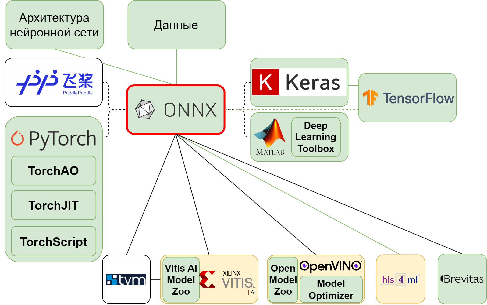

### **3.2.3 ONNX: необходимый клей для фреймворков глубокого обучения** <a name="ch3.2.3"></a>

<div style="text-align: justify">

<a name="image_3_2_3_1"></a>
<figure>
  
</figure>

Open Neural Network eXchange (ONNX) — это открытый стандарт для представления моделей машинного обучения, разработанный совместно Microsoft и Facebook. ONNX решает критическую проблему: модели, разработанные в одном фреймворке (например, PyTorch), часто оказываются "привязаны" к этой экосистеме. ONNX обеспечивает универсальный промежуточный формат, позволяя легко переносить модели между различными фреймворками, оптимизаторами и платформами развёртывания.

#### Роль ONNX в экосистеме Edge AI

Для [Edge AI](glossary.md#edgeai) разработчиков ONNX критически важен, поскольку:

* **Кроссплатформенная совместимость:** модель, оптимизированная в одном инструменте, может быть развёрнута на другой платформе;
* **Поддержка разнообразных фреймворков:** экспорт поддерживают PyTorch, TensorFlow, scikit-learn, XGBoost и многие другие;
* **Оптимизация и квантование:** ONNX Runtime и специализированные компиляторы (например, для [FPGA](glossary.md#fpga)) предоставляют встроенные инструменты оптимизации;
* **Стандартизация:** ONNX Opset (набор операций) определяет единый язык для всех поддерживаемых операций.

#### Работа с ONNX: экспорт и импорт

**Экспорт из PyTorch в ONNX:**

```python
import torch
import onnx

# Загрузка обученной модели
model = torch.load("model_fp32.pth")
model.eval()

# Создание фиктивного входного тензора
dummy_input = torch.randn(1, 1, 28, 28)

# Экспорт в ONNX
torch.onnx.export(
    model,
    dummy_input,
    "model.onnx",
    export_params=True,
    opset_version=12,
    do_constant_folding=True,
    input_names=["input"],
    output_names=["output"],
    dynamic_axes={"input": {0: "batch_size"}, "output": {0: "batch_size"}},
    verbose=False
)

print("Model exported to ONNX successfully!")
```

**Экспорт из TensorFlow в ONNX:**

```python
import tf2onnx
import onnx
import tensorflow as tf

# Загрузка модели Keras
model = tf.keras.models.load_model("model_fp32")

# Конвертация в ONNX
spec = (tf.TensorSpec((None, 28, 28, 1), tf.float32, name="input"),)
output_path = "model.onnx"

model_proto, _ = tf2onnx.convert.from_keras(
    model,
    input_signature=spec,
    output_path=output_path,
    opset=12
)

print(f"Model converted to ONNX: {output_path}")
```

**Загрузка и инференс ONNX модели:**

```python
import onnx
import onnxruntime as rt
import numpy as np

# Загрузка ONNX модели
onnx_model = onnx.load("model.onnx")

# Проверка корректности модели
onnx.checker.check_model(onnx_model)

# Инициализация ONNX Runtime
sess = rt.InferenceSession("model.onnx")

# Получение информации о входах и выходах
input_name = sess.get_inputs()[0].name
output_name = sess.get_outputs()[0].name

# Инференс
test_data = np.random.randn(1, 1, 28, 28).astype(np.float32)
result = sess.run([output_name], {input_name: test_data})

print(f"Inference result shape: {result[0].shape}")
print(f"Predicted class: {np.argmax(result[0])}")
```

#### Оптимизация ONNX моделей

ONNX Runtime предоставляет встроенные инструменты для оптимизации моделей, включая graph optimization и quantization.

**Graph Optimization:**

```python
from onnxruntime.transformers import optimizer

# Оптимизация графа вычислений
optimized_model_path = "model_optimized.onnx"
optimize_model(
    input="model.onnx",
    output_model_path=optimized_model_path,
    opt_level=2,  # 0-2: возрастающий уровень оптимизации
    use_onnxruntime=True
)

print(f"Optimized model saved to {optimized_model_path}")
```

**Квантование ONNX модели:**

```python
from onnxruntime.quantization import quantize_dynamic, QuantType

# Dynamic quantization (без калибровочного датасета)
quantized_model_path = "model_int8_dynamic.onnx"
quantize_dynamic(
    "model.onnx",
    quantized_model_path,
    weight_type=QuantType.QInt8
)

# Static quantization (с калибровкой)
from onnxruntime.quantization import quantize_static, CalibrationDataReader

class DataReader(CalibrationDataReader):
    def __init__(self, calibration_data):
        self.data = calibration_data
        self.index = 0

    def get_next(self):
        if self.index >= len(self.data):
            return None
        batch = self.data[self.index]
        self.index += 1
        return {"input": batch}

# Калибровочные данные
calibration_data = np.random.randn(100, 1, 28, 28).astype(np.float32)
reader = DataReader([calibration_data[i:i+1] for i in range(len(calibration_data))])

quantized_model_path = "model_int8_static.onnx"
quantize_static(
    "model.onnx",
    quantized_model_path,
    reader,
    quant_format="QOperator"
)

print(f"Static quantized model saved to {quantized_model_path}")
```

#### ONNX для развёртывания на FPGA

Современные FPGA-компиляторы, такие как Vitis AI (Xilinx) и OpenVINO (Intel), поддерживают ONNX как входной формат. Это позволяет независимо от исходного фреймворка получить оптимизированное представление модели для синтеза на FPGA.

**Пример: экспорт в Xilinx Vitis AI:**

```python
# После оптимизации и квантования ONNX модели
# Xilinx Vitis AI компилятор может использовать модель напрямую

import os
os.system("vai_c_onnx --model model_int8_static.onnx --output_dir ./compiled --arch /opt/vitis_ai/compiler/arch/DPUCAHX8H/ISA.json")

print("ONNX model compiled for Xilinx FPGA")
```

#### Инструменты для работы с ONNX

Экосистема вокруг ONNX включает множество полезных инструментов:

* **ONNX Runtime:** высокооптимизированная среда выполнения для [CPU](glossary.md#cpu), [GPU](glossary.md#gpu), FPGA;
* **Netron:** визуализация архитектуры ONNX моделей;
* **ONNX Model Zoo:** репозиторий предобученных ONNX моделей;
* **TVM (Tensor Virtual Machine):** компилятор глубокого обучения с поддержкой FPGA, [ASIC](glossary.md#asic), мобильных устройств;
* **OpenVINO Toolkit:** компилятор и инференс-движок Intel с оптимизацией под различные процессоры и ускорители.

#### Демонстрация: полный цикл ONNX

```python
# 1. Обучение в PyTorch
model = create_and_train_model()

# 2. Экспорт в ONNX
torch.onnx.export(model, dummy_input, "model.onnx")

# 3. Оптимизация
optimize_model("model.onnx", "model_optimized.onnx")

# 4. Квантование
quantize_dynamic("model_optimized.onnx", "model_int8.onnx")

# 5. Валидация в ONNX Runtime
sess = rt.InferenceSession("model_int8.onnx")
predictions = sess.run([output_name], {input_name: test_data})

# 6. Компиляция для FPGA (специфично для платформы)
# Используются платформо-специфичные компиляторы
```

#### Заключение

ONNX выступает критически важным звеном в экосистеме Edge AI, обеспечивая совместимость между различными фреймворками, оптимизаторами и платформами развёртывания. Использование ONNX позволяет разработчикам гибко выбирать инструменты на каждом этапе разработки: обучение в привычном фреймворке, оптимизация с помощью специализированных компиляторов, и развёртывание на целевом оборудовании. Это делает ONNX не просто форматом, но необходимым "клеем", скрепляющим всю экосистему Edge AI разработки.

**Официальный ресурс:** ([ONNX](https://onnx.ai/)).

</div>
