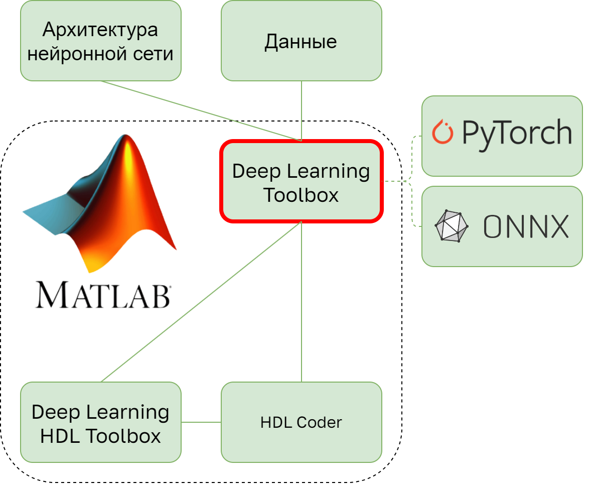

### **3.2.4 MATLAB Deep Learning Toolbox: самодостаточный модуль внутри гигантской экосистемы** <a name="ch3.2.4"></a>

<div style="text-align: justify">

<a name="image_3_2_4_1"></a>
<figure>
  
</figure>

Deep Learning Toolbox (DLTB) в MATLAB – это универсальная платформа для построения, обучения, анализа и оптимизации нейронных сетей, включающая как программный интерфейс, так и визуальные приложения. В рамках данного руководства мы будем рассматривать DLTB с точки зрения разработки алгоритмов ИИ для последующей их имплементации на программируемую логику, что накладывает некоторые ограничения, например, при выборе слоёв при проектировании архитектуры нейросетевой модели, так как не все слои доступны для использования в Deep Learning HDL Toolbox ([Mathworks](https://www.mathworks.com/help/deep-learning-hdl/ug/supported-layers.html)), речь о котором пойдёт в следующих главах.

MATLAB представляет собой широкую экосистему инструментов: средства для сбора и предобработки данных, пакеты визуализации и профилирования, Simulink для модельно-ориентированного проектирования, а также инструменты для генерации кода и интеграции с аппаратурой (HDL, C/C++). В этой экосистеме `Deep Learning Toolbox` играет ключевую роль в рамках задач по работе с нейронными сетями — он обеспечивает единый API для проектирования и обучения сетей и служит связующим звеном между прототипированием и этапами оптимизации/развёртывания (Deep Learning HDL Toolbox, Model Compression Library, HDL Coder и др.).

Как отмечалось ранее, для [Edge AI](glossary.md#edgeai) особенно важны средства уменьшения вычислительной нагрузки и задействованного объема памяти при инференсе модели. В MATLAB для указанных задач используется отдельная библиотека [Model Compression Library](https://www.mathworks.com/help/deeplearning/quantization.html), используемая совместно с DLTB. Встроенные функции позволяют выполнить оптимизацию и провести количественную оценку потерь точности модели ещё на этапе её офлайн-эмуляции до реализации на аппаратной платформе.

Целью данной главы является формирование у читателя базовых представлений о возможностях использования MATLAB для глубокого обучения. В рамках главы будет подробно рассмотрен пример реализации свёрточной нейронной сети посредством использования Deep Learning Toolbox, а также использование Model Compression Library для оптимизации полученной модели. Таким образом, после ознакомления с этим материалом читатель сможет используя свои данные самостоятельно подготовить модель для последующей её имплементации на выбранную аппаратную платформу.

#### Пример реализации и обучения нейросети в MATLAB

Рассмотрим пример скрипта MATLAB, демонстрирующего полный минимальный цикл подготовки компактной нейросетевой модели для последующей её аппаратной реализации. В качестве примера решим известную в ML `“Hello, World!”` задачу классификации изображений рукописных цифр. Данные будем брать из встроенного в MATLAB объекта `DigitDataset`. Выполнив предобработку данных, создадим компактную свёрточную нейронную сеть с двумя блоками формата `«Conv-BatchNormalization-[ReLU](glossary.md#relu)»` и обучим её. После достижения желаемой точности предсказаний нашей модели с использованием чисел с плавающей точкой в формате `float32` выполним пост-тренировочное квантование до 8-битного целочисленного формата `int8`. Последним этапом в нашем примере будет валидация точности полученной оптимизированной нейронной сети.

Первоначально в MATLAB необходимо создать объект `imageDatastore`, в котором будут хранится наш датасет, полученный из встроенного в MATLAB набора `DigitDataset`. На данном этапе также необходимо выполнить предварительную обработку данных, масштабировав изображения к размеру 28×28 пикселей и переведя их в оттенки серого:

```matlab
digitDatasetPath = fullfile(matlabroot,'toolbox','nnet',...
'nndemos','nndatasets','DigitDataset');
imds = imageDatastore(digitDatasetPath,...
'IncludeSubfolders', true, 'LabelSource', 'foldernames');
imds.ReadFcn = @(f) im2gray(imresize(imread(f), [28 28]));
```

Следующим действием необходимо разделить исходный набор данных на несколько подвыборок. В нашем примере ограничимся двумя подвыборками – тренировочной и валидационной.

```matlab
[imdsTrain, imdsVal] = splitEachLabel(imds, 0.8, 'randomized');
```

Разбиение `splitEachLabel(imds, 0.8, 'randomized')` позволяет получить стратифицированные подмножества, сохраняя баланс классов. Имеет смысл подчеркнуть, что выбор долей и стохастической семантики разбиения – параметры определяемые эмпирическим путём. 
На следующем этапе сформируем архитектуру нашей свёрточной нейронной сети:

```matlab
layers = [
   imageInputLayer([28 28 1], "Normalization", "zscore", "Name", "input")
   convolution2dLayer(3, 8, "Padding", "same", "Name", "conv1")
   batchNormalizationLayer("Name", "bn1")
   reluLayer("Name", "relu1")
   maxPooling2dLayer(2, "Stride", 2, "Name", "pool1")
   convolution2dLayer(3, 16, "Padding", "same", "Name", "conv2")
   batchNormalizationLayer("Name", "bn2")
   reluLayer("Name", "relu2")
   fullyConnectedLayer(10, "Name", "fc")
   softmaxLayer("Name", "sm")
   classificationLayer("Name", "output")
];
```

На входном слое `imageInputLayer([28 28 1], "Normalization", "zscore", "Name", "input")` мы выполняем нормализацию данных. После этого входные данные проходят через два блока формата `«Conv-BatchNormalization-ReLU»`, в результате чего мы получаем 8 и 16 фильтров, число которых подбирается исходя из требуемой точности и сложности модели. Слой `maxPooling2dLayer(2, "Stride", 2, "Name", "pool1")` снижает разрешение карт признаков, уменьшая вычислительную нагрузку и позволяя модели захватывать более абстрактные детали. Так называемый «хвост» архитектуры состоит из полносвязного слоя `fullyConnectedLayer(10, "Name", "fc")` с 10 нейронами соответствующем числу классов в нашей задаче, а также из слоёв `softmaxLayer` и `classificationLayer` – являющимися стандартом для многоклассовой классификации.

Важно отметить согласованность входа и предобработки: поскольку ReadFcn формирует тензоры `28×28×1`, входной слой тоже настроен на один канал. Если бы мы использовали цветные входы, то канальность стала бы `3`, а нормировка `«zscore»` учитывала бы многоканальные статистики.

Конфигурация обучения модели задаётся через `"trainingOptions("adam", ..."`. Одним из часто используемых оптимизаторов является `Adam` (adaptive moment estimation), воспользуемся им для обучения нашей модели. В качестве начальной скорости обучения `"InitialLearnRate"` выберем `10^(-3)`, а также добавим `"L2Regularization"` величиной в `10^(-4)` для борьбы с переобучением сети. Число эпох `"MaxEpochs"` и размер `"MiniBatchSize"` подбираются опытным путём – установим их величину на 10 эпох и 128 сэмплов, соответственно. Значение параметра `"Shuffle"`, `"every-epoch"` указывает на перемешивание нашего обучающего набора данных после каждой эпохи. Параметры `"ValidationData"` и `"ValidationFrequency"` указывают на выборку для валидации, а также на частоту этого процесса во время обучения нейронной сети. Параметр `"ExecutionEnvironment"` оставим в значении auto, позволяя MATLAB самостоятельно задействовать доступные [GPU](glossary.md#gpu) для вычислений. `"Verbose"` позволяет увидеть графики функции потерь и точности классификации в процессе обучения модели.

После настройки всех параметров создадим объект `net = trainNetwork(imdsTrain, layers, opts`, передадим в него заданные ранее параметры и запустим процесс обучения нейронной сети. Все описанные выше действия зачастую носят итеративный характер, где от итерации к итерации меняются различные элементы архитектуры сети, их параметры, а также параметры обучения до тех пор, пока модель не будет давать удовлетворительные результаты. 
Оценить точность полученной модели можно путём выполнения предсказаний на определенной выборке и сравнения полученных меток с истинными значениями классов объектов:

```matlab
predVal = classify(net, imdsVal, "MiniBatchSize", 256);
acc_fp32 = mean(predVal == imdsVal.Labels);
fprintf("Baseline accuracy (FP32): %.2f%%\n", 100*acc_fp32);
```

Следующим важным этапом подготовки модели к имплементации на аппаратную платформу является оптимизация полученной нейронной сети. Одним из наиболее распространенных методов является квантизация выполняемая после обучения. Под квантизацией здесь мы будем понимать отображение значений весов и активаций нейронной сети из непрерывного множества значений чисел с плавающей точкой `fp32` в дискретное множество целых чисел `int8`. Изначально выполним разделение валидационной выборки на калибровочную и тестовую подвыборки. Калибровка необходима для измерения реальных динамических диапазонов значений активаций на репрезентативных примерах в нейронной сети.

Вызов `calibrate(q, imdsCal)` позволяет получить таблицу статистических данных, которая затем используется `quantize(q)` для построения int8-эквивалента сети. Параметр `"ExecutionEnvironment", "[FPGA](glossary.md#fpga)"` при создании объекта `q = dlquantizer(net, "ExecutionEnvironment", "FPGA")` задаёт профиль эмуляции, приближая реализацию вычислений к будущей целевой среде. Важно отметить, что это лишь программная имитация вычислений с точной арифметикой целевого формата, позволяющая измерить ожидаемые потери точности до реализации модели непосредственно на аппаратной платформе.

Верификация результатов выполнения квантизация проводится вызовом 
`valResults = validate(q, imdsTest)`. Здесь метрика оценки выбирается автоматически по типу задачи: для многоклассовой классификации – это accuracy. Объект результатов содержит таблицу с разрезом по «реализациям» сети. Таким образом, извлечение `accTbl = valResults.MetricResults.Result`, фильтрация по `accTbl.MetricOutput(impl=="Quantized")` и вывод метрики позволяют нам получить значение, по которому можно сравнить квантованную модель с её исходной реализацией. В случае, если падение точности выходит за допустимые рамки установленные разработчиком, стоит также вернуться к изменениям исходной архитектуры и параметров её обучения или рассмотреть другие методы оптимизации.

Добившись желаемых показателей точности и оптимизации вы можете сохранить модели в формате `.mat` и в дальнейшем сразу импортировать их в новые скрипты в MATLAB. Таким образом, рассмотренный пример иллюстрирует один из вариантов реализации полного цикла подготовки компактной модели для Edge AI решений.

</div>
