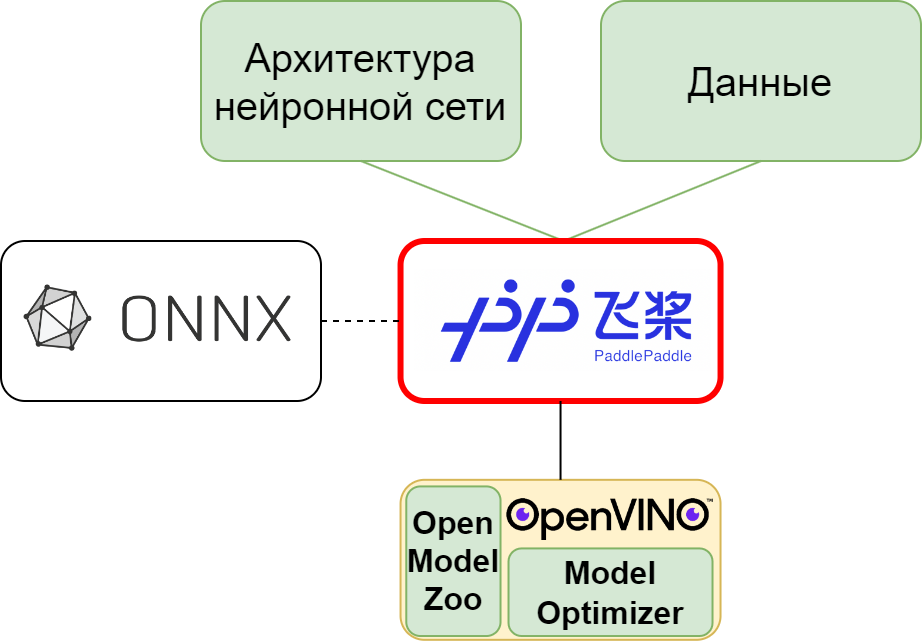

### **3.2.5 PaddlePaddle: простой и удобный фреймворк для решения рядовых задач** <a name="ch3.2.5"></a>

<a name="image_3_2_5_1"></a>
<figure>
  
</figure>

PaddlePaddle (Parallel Distributed Deep LEarning), разработанный компанией Baidu, представляет собой открытый фреймворк глубокого обучения, спроектированный с акцентом на производительность, простоту использования и готовность к production-развёртыванию. В то время как PyTorch ориентирован на исследования, а TensorFlow — на масштабируемость в облаке, PaddlePaddle занимает промежуточную позицию, предоставляя полный и самодостаточный стек инструментов для разработки [Edge AI](glossary.md#edgeai) решений особенно в контексте мобильных устройств и встраиваемых систем.

#### Преимущества PaddlePaddle для Edge AI

**Встроенная поддержка оптимизации:**

* **Прямая поддержка [квантизации](glossary.md#quantization):** встроенные инструменты post-training quantization (PTQ) и quantization-aware training (QAT) без необходимости в отдельных библиотеках;
* **Pruning и knowledge distillation:** встроенные методы [прунинга](glossary.md#pruning) и [дистилляции знаний](glossary.md#distillation) прямо в API;
* **PaddleLite:** облегчённый инференс-движок для мобильных устройств и [FPGA](glossary.md#fpga) с оптимизацией под конкретные процессоры (ARM, x86, мобильные [GPU](glossary.md#gpu)).

**Простота и удобство:**

* **Динамичный и статичный графы:** гибкий выбор между режимом Eager Execution (как в PyTorch) и статичным графом (как в TensorFlow);
* **Полнофункциональный экосистем:** встроенная поддержка для компьютерного зрения, обработки естественного языка, временных рядов;
* **Хорошая документация на русском:** Baidu активно поддерживает сообщество в странах СНГ и Азии.

**Production-готовность:**

* **PaddleServing:** сервер для развёртывания моделей в production;
* **Интеграция с облачными платформами:** совместимость с Kubernetes, облачными сервисами.

#### Полный цикл разработки CNN в PaddlePaddle

Рассмотрим практический пример разработки компактной [CNN](glossary.md#cnn) для классификации MNIST.

**Установка и подготовка:**

```bash
pip install paddlepaddle
pip install paddleslim  # Для оптимизации моделей
```

**Загрузка и предобработка данных:**

```python
import paddle
import paddle.nn as nn
import paddle.nn.functional as F
from paddle.vision.datasets import MNIST
from paddle.io import DataLoader
from paddle.vision import transforms
import numpy as np

# Определение трансформаций
transform = transforms.Compose([
    transforms.Resize((28, 28)),
    transforms.ToTensor(),
    transforms.Normalize(mean=[0.1307], std=[0.3081], to_rgb=False)
])

# Загрузка MNIST датасета
train_dataset = MNIST(mode='train', transform=transform)
test_dataset = MNIST(mode='test', transform=transform)

# Создание DataLoaders
train_loader = DataLoader(train_dataset, batch_size=128, shuffle=True)
test_loader = DataLoader(test_dataset, batch_size=256, shuffle=False)
```

**Построение архитектуры сети:**

```python
class SmallCNN(nn.Layer):
    def __init__(self):
        super(SmallCNN, self).__init__()
        self.conv1 = nn.Conv2D(1, 8, kernel_size=3, padding=1)
        self.bn1 = nn.BatchNorm2D(8)
        self.conv2 = nn.Conv2D(8, 16, kernel_size=3, padding=1)
        self.bn2 = nn.BatchNorm2D(16)
        self.fc = nn.Linear(16 * 7 * 7, 10)

    def forward(self, x):
        x = F.relu(self.bn1(self.conv1(x)))
        x = F.max_pool2d(x, kernel_size=2, stride=2)
        x = F.relu(self.bn2(self.conv2(x)))
        x = F.max_pool2d(x, kernel_size=2, stride=2)
        x = paddle.reshape(x, [x.shape[0], -1])
        x = self.fc(x)
        return F.softmax(x, axis=1)

model = SmallCNN()
```

**Конфигурация и обучение:**

```python
# Определение оптимизатора и функции потерь
optimizer = paddle.optimizer.Adam(learning_rate=1e-3, parameters=model.parameters())
loss_fn = nn.CrossEntropyLoss()

# Функция обучения
def train_epoch(model, train_loader, optimizer, loss_fn):
    model.train()
    total_loss = 0.0
    for batch_id, (images, labels) in enumerate(train_loader):
        # Forward pass
        logits = model(images)
        loss = loss_fn(logits, labels)
        
        # Backward pass
        loss.backward()
        optimizer.step()
        optimizer.clear_grad()
        
        total_loss += loss.numpy()[0]
    
    return total_loss / len(train_loader)

# Функция валидации
def evaluate(model, test_loader):
    model.eval()
    correct = 0
    total = 0
    with paddle.no_grad():
        for images, labels in test_loader:
            logits = model(images)
            predictions = paddle.argmax(logits, axis=1)
            correct += (predictions == labels).sum().numpy()[0]
            total += labels.shape[0]
    return correct / total

# Обучение
for epoch in range(10):
    train_loss = train_epoch(model, train_loader, optimizer, loss_fn)
    test_acc = evaluate(model, test_loader)
    print(f"Epoch {epoch+1}: Train Loss={train_loss:.4f}, Test Acc={test_acc*100:.2f}%")

# Оценка базовой точности
baseline_acc = evaluate(model, test_loader)
print(f"Baseline accuracy (FP32): {baseline_acc*100:.2f}%")
```

#### Квантование в PaddlePaddle

PaddlePaddle предоставляет встроенную поддержку квантования через PaddleSlim.

**Post-Training Quantization (PTQ):**

```python
from paddleslim.quant import quant_post_static
import paddle.dataset.mnist as mnist

# Сохранение модели перед квантованием
paddle.save(model.state_dict(), "model_fp32.pdparams")

# Подготовка калибровочного датасета
def generate_calibration_data(loader, num_samples=100):
    data_list = []
    for images, labels in loader:
        data_list.append(images)
        if len(data_list) >= num_samples:
            break
    return paddle.concat(data_list)

calibration_data = generate_calibration_data(train_loader, num_samples=100)

# Выполнение PTQ
quant_model = quant_post_static(
    model=model,
    quantize_model_type="fp32",  # или "int8"
    image_list=calibration_data,
    save_model_dir="model_int8_ptq"
)
```

**Quantization-Aware Training (QAT):**

```python
from paddleslim.quant import quant_aware

# Применение QAT к модели
quant_model = quant_aware(model, place=paddle.CPUPlace())

# Переобучение с квантованием
for epoch in range(5):
    train_loss = train_epoch(quant_model, train_loader, optimizer, loss_fn)
    test_acc = evaluate(quant_model, test_loader)
    print(f"QAT Epoch {epoch+1}: Train Loss={train_loss:.4f}, Test Acc={test_acc*100:.2f}%")

# Сохранение квантованной модели
paddle.save(quant_model.state_dict(), "model_int8_qat.pdparams")
```

#### Экспорт и развёртывание

**Экспорт в ONNX:**

```python
import paddle2onnx

# Конвертация из PaddlePaddle в ONNX
paddle2onnx.command.c_paddle_to_onnx(
    model_dir="./model_int8_ptq",
    model_filename="model.pdmodel",
    params_filename="model.pdiparams",
    save_file="model.onnx",
    opset_version=12
)
```

**Использование PaddleLite для развёртывания на встраиваемых устройствах:**

```bash
# Конвертация в PaddleLite формат
./lite/bin/model_optimize_tool \
  --model_dir=./model_int8_ptq \
  --model_type=paddle \
  --optimize_out_type=naive_buffer \
  --optimize_out=model_optimized \
  --valid_targets=arm,armv8
```

#### Pruning и Knowledge Distillation

PaddleSlim также предоставляет встроенную поддержку [прунинга](glossary.md#pruning) и [дистилляции знаний](glossary.md#distillation).

**Structural Pruning:**

```python
from paddleslim.prune import Pruner

# Применение структурного прунинга
pruner = Pruner()
pruned_model = pruner.prune(model)
```

**Knowledge Distillation:**

```python
from paddleslim.dist import StudentModel

# Использование большой модели как учителя
teacher_model = load_large_model()

# Создание студента с дистилляцией
student = StudentModel(
    teacher_model=teacher_model,
    student_model=model,
    distillation_loss_weight=0.5
)
```

#### Заключение

PaddlePaddle представляет собой полнофункциональную и удобную платформу для разработки Edge AI решений. Встроенная поддержка [квантизации](glossary.md#quantization), [прунинга](glossary.md#pruning) и [дистилляции знаний](glossary.md#distillation), а также оптимизированный инференс-движок PaddleLite делают его отличным выбором для разработчиков, работающих с мобильными устройствами и встраиваемыми системами. Полный экосистем инструментов, от обучения до production-развёртывания, позволяет быстро и эффективно реализовать Edge AI приложения без необходимости интеграции множества внешних библиотек. Особенно PaddlePaddle привлекателен для разработчиков в Азии и странах СНГ благодаря хорошей поддержке и документации на русском языке.
