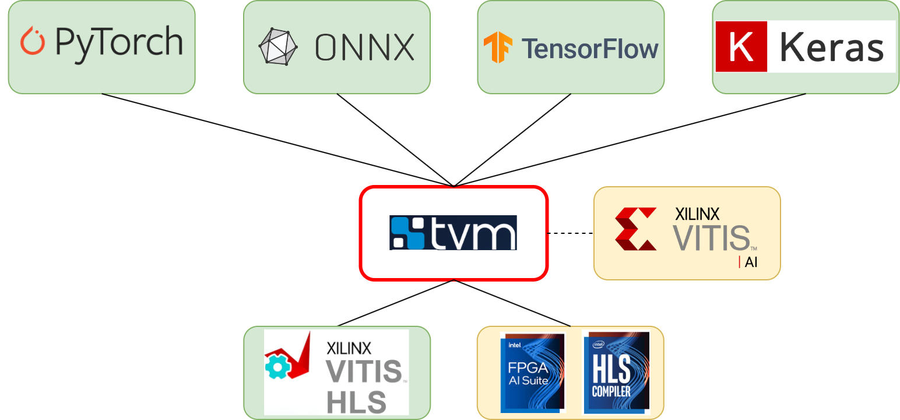

### **3.3.1 Apache TVM: открытый кросс‑платформенный фреймворк для оптимизированного инференса** <a name="ch3.3.1"></a>

<div style="text-align: justify">

<a name="image_3_3_1_1"></a>
<figure>
  
</figure>

**Apache TVM** — это современный компилятор и инфраструктура для оптимизации нейронных сетей, который позволяет автоматически преобразовывать модели из популярных фреймворков (PyTorch, TensorFlow, ONNX) в высокоэффективный код для различных аппаратных платформ: [CPU](glossary.md#cpu), [GPU](glossary.md#gpu), [FPGA](glossary.md#fpga) и специализированных ускорителей. В отличие от ручной оптимизации, TVM берет на себя задачи анализа вычислительного графа, поиска оптимальных параметров вычислений и генерации кода, максимально приближенного к возможностям целевого устройства.

Официальная документация: ([Apache TVM](https://tvm.apache.org/)).

Работа с TVM начинается с экспорта обученной модели в переносимый формат, например, ONNX. Далее модель импортируется в промежуточное представление `Relay`, где происходит автоматический анализ и преобразование графа: объединяются последовательные операции, устраняются избыточные вычисления, подбираются оптимальные структуры данных. Особое внимание уделяется этапу `autotune` — автоматическому подбору параметров компиляции (размеры блоков, степень параллелизма, порядок вычислений), который позволяет добиться максимальной производительности на конкретном железе. Этот процесс требует тщательного выбора набора данных, чтобы результаты autotune были релевантны реальным задачам.

После завершения autotune TVM генерирует исполняемый модуль, который можно интегрировать в приложение или запускать на целевой платформе. Важно сохранять логи autotune и фиксировать версии инструментов: даже небольшие изменения в конфигурации или обновления TVM могут привести к отличиям в производительности. Для FPGA-платформ TVM поддерживает интеграцию с VTA (Versatile Tensor Accelerator) и кастомными генераторами кода, что позволяет использовать преимущества аппаратной специализации.

Ниже приведён пример минимального рабочего цикла: от загрузки ONNX-модели до запуска инференса через TVM. В примере показано, как импортировать модель, скомпилировать её под CPU, выполнить autotune и получить результат инференса. Для других платформ (GPU, FPGA) меняется только таргет и параметры autotune.

```python
import onnx
import tvm
from tvm import relay
from tvm import autotvm

# Загрузка ONNX-модели
model = onnx.load("model.onnx")
shape_dict = {"input": (1, 1, 28, 28)}
mod, params = relay.frontend.from_onnx(model, shape_dict)

target = "llvm"  # для CPU; для GPU используйте "cuda", для FPGA — "c" или кастомный backend

# Autotune (эскиз)
task = autotvm.task.create("conv2d", args=(shape_dict,), target=target)
measure_option = autotvm.measure_option(builder="local", runner=autotvm.LocalRunner(number=10))
autotvm.tuner.XGBTuner(task).tune(n_trial=200, measure_option=measure_option, callbacks=[autotvm.callback.log_to_file('tvm_autotune.log')])

# Применение лучших параметров autotune
with autotvm.apply_history_best('tvm_autotune.log'):
	with tvm.transform.PassContext(opt_level=3):
		lib = relay.build(mod, target=target, params=params)

# Запуск инференса
from tvm.contrib import graph_runtime
import numpy as np
ctx = tvm.cpu()
rt_mod = graph_runtime.GraphModule(lib["default"](ctx))
input_data = np.random.randn(1,1,28,28).astype("float32")
rt_mod.set_input("input", input_data)
rt_mod.run()
out = rt_mod.get_output(0).asnumpy()
print(out.shape)
```

В процессе работы с TVM важно не только добиться высокой производительности, но и обеспечить воспроизводимость результатов. Для этого рекомендуется фиксировать seed autotuner, сохранять все логи и явно указывать версии используемых инструментов. При работе с FPGA заранее оцените ограничения по памяти и вычислительным блокам ([BRAM](glossary.md#bram), [DSP](glossary.md#dsp)), чтобы избежать ошибок на этапе синтеза.

Пример (минимальный workflow с ONNX → TVM):

```python
import onnx
import tvm
from tvm import relay
from tvm import rpc

# Загрузка ONNX-модели
model = onnx.load("model.onnx")

# Конвертация в Relay
shape_dict = {"input": (1, 1, 28, 28)}
mod, params = relay.frontend.from_onnx(model, shape_dict)

# Таргет и конфиг
target = "llvm"  # или "cuda", "c" для [HLS](glossary.md#hls)/VTA - настраивается
with tvm.transform.PassContext(opt_level=3):
    lib = relay.build(mod, target=target, params=params)

# Сохранение runtime-артефакта
lib.export_library("deploy_lib.so")

# Запуск inference (пример для CPU)
from tvm.contrib import graph_runtime
ctx = tvm.cpu()
rt_mod = graph_runtime.GraphModule(lib["default"](ctx))
import numpy as np
input_data = np.random.randn(1,1,28,28).astype("float32")
rt_mod.set_input("input", input_data)
rt_mod.run()
out = rt_mod.get_output(0).asnumpy()
print(out.shape)
```

Пример autotune (AutoTVM):

```python
from tvm import autotvm
task = autotvm.task.create("conv2d", args=(shape_dict,), target=target)
measure_option = autotvm.measure_option(builder="local", runner=autotvm.LocalRunner(number=10))
autotvm.tuner.XGBTuner(task).tune(n_trial=200, measure_option=measure_option, callbacks=[autotvm.callback.log_to_file('tvm_autotune.log')])
```

Как применять результаты autotune:

```python
# прочитать лог и применить лучшую конфигурацию перед сборкой
with autotvm.apply_history_best('tvm_autotune.log'):
    with tvm.transform.PassContext(opt_level=3):
        lib = relay.build(mod, target=target, params=params)
```

</div>
