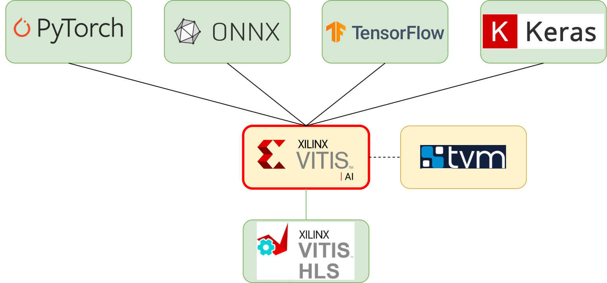

### **3.3.2 Vitis AI: проприетарная экосистема для быстрого развёртывания и настройки AI‑решений** <a name="ch3.3.2"></a>

<div style="text-align: justify">

<a name="image_3_3_2_1"></a>
<figure>
  
</figure>

**Vitis AI** — это комплексная экосистема для оптимизации и развёртывания нейросетевых моделей на [FPGA](glossary.md#fpga) и DPU-платформах Xilinx/AMD. В отличие от универсальных компиляторов, Vitis AI ориентирован на промышленное применение: он позволяет инженеру пройти путь от обученной модели до аппаратного ускорителя с минимальным количеством ручных шагов и высокой степенью автоматизации.

Работа с Vitis AI начинается с подготовки модели в одном из поддерживаемых форматов (ONNX, TensorFlow, PyTorch). После экспорта модель проходит этап калибровки и квантизации: на этом шаге используется небольшой набор репрезентативных данных, чтобы подобрать оптимальные параметры для перехода к int8-формату без существенной потери точности. Если post-training quantization (PTQ) приводит к заметному снижению качества, рекомендуется использовать quantization-aware training ([QAT](glossary.md#qat)) на этапе обучения.

Квантованная модель компилируется с помощью специального компилятора (`vai_c_onnx`), который учитывает архитектуру целевого DPU (описывается в arch.json) и параметры платформы. Полученные бинарные артефакты переносятся на целевое устройство, где проводится профилирование: измеряются задержки, пропускная способность, использование памяти и вычислительных блоков. В случае несоответствия целевым метрикам инженер может скорректировать precision отдельных слоёв, изменить параметры квантизации или разбить модель на несколько частей.

Ниже приведён пример полного цикла работы с Vitis AI: от экспорта и калибровки до компиляции и запуска на плате. В примере используются стандартные команды и псевдокод для Python, чтобы показать основные этапы.

```bash
# Экспорт модели и статическая квантизация (PTQ)
python export_to_onnx.py --input model_fp32.pth --output model.onnx
# Калибровка (PTQ) с помощью инструментов Vitis AI
vai_q_onnx quantize --model model.onnx --calib_data calib_images/ --output_dir quantized
# Компиляция под DPU
vai_c_onnx --model quantized/model_int8.onnx --arch /path/to/arch.json --output_dir ./compiled --net_name my_net
```

Проверка на устройстве:

```bash
scp -r ./compiled root@board:/home/root/compiled
ssh root@board "cd /home/root/compiled && ./run_inference.sh --input test_images --batch 1"
```

В процессе работы важно фиксировать используемые версии инструментов, параметры калибровки и содержимое arch.json. Даже небольшие изменения в этих файлах могут существенно повлиять на производительность и корректность работы модели на целевом устройстве. Для сложных моделей рекомендуется поэтапно профилировать отдельные части и оптимизировать их независимо.

Пример (команды и пример конвертации/компиляции ONNX → DPU):

```bash
# Конвертация/квантование обычно выполняется с помощью Vitis AI конвертеров
# Пример: подготовка модели и статическая PTQ/конвертация в ONNX заранее

# Компиляция ONNX модели для DPU (пример, терминальная команда)
vai_c_onnx --model model_int8.onnx --arch /path/to/arch.json --output_dir ./compiled --net_name my_net

# Результат: директория ./compiled с бинарными артефактами для развёртывания на плате
```

Калибровка / PTQ (python-псевдокод):

```python
# Используйте рекомендованные инструменты Xilinx для калибровки
# Обычно Workflow: подготовка representative dataset → запуск калибровки → export int8
from some_vitis_ai_api import quantizer
quantizer.calibrate(model_path='model.onnx', calib_dataset=calib_loader, out_path='model_int8.onnx')
```

Примечание: точные команды и API зависят от версии Vitis AI; обращайтесь к официальной документации для вашей версии.

Развернутый пример workflow (рекомендуемая последовательность):

1. Подготовьте чистую FP32-модель и выполните локальные unit‑тесты (референсный inference на [CPU](glossary.md#cpu)/[GPU](glossary.md#gpu)).
2. Сформируйте representative calibration dataset (обычно 100–1000 примеров; зависит от задач и вариативности данных).
3. Запустите PTQ‑калибровку с рекомендованными настройками; если потеря точности неприемлема, рассмотрите QAT.
4. Скомпилируйте int8 модель с помощью `vai_c_onnx`, указав `arch.json` для вашей платы и целевой частоты.
5. Запустите профайлинг на эмуляторе или непосредственно на плате, проверьте latency, throughput и использование ресурсов ([BRAM](glossary.md#bram)/[DSP](glossary.md#dsp)/URAM).

Пример проверки на устройстве (псевдокод):

```bash
# Копирование скомпилированных артефактов на целевое устройство и запуск теста
scp -r ./compiled root@board:/home/root/compiled
ssh root@board "cd /home/root/compiled && ./run_inference.sh --input test_images --batch 1"
```

Полезные замечания по reproducibility:

- Фиксируйте используемый `arch.json`, версию Vitis AI и набор calibration data — эти параметры критичны для воспроизводимости производительности и качества;
- Храните логи компиляции и результаты профайлинга; с ними легче диагностировать отклонения при переносе между ревизиями инструментов;
- Для крупных моделей имеет смысл разбивать модель на несколько subnet'ов и компилировать/оптимизировать их по отдельности.

---

#### **Xilinx Versal AI Engine: архитектура и развёртывание через Vitis AI**

Семейство Xilinx Versal представляет собой новое поколение адаптивных процессоров (adaptive [SoC](glossary.md#soc)), которое кардинально отличается от традиционных FPGA архитектур своей гибридной компоновкой. В сердце Versal находится AI Engine — массив специализированных процессорных элементов, разработанных именно для ускорения вычислений, связанных с искусственным интеллектом и обработкой сигналов. Эта архитектура позволяет достичь исключительно высокой производительности при низком энергопотреблении за счёт оптимизации под типичные операции нейросетевых моделей.

Основной смысл AI Engine состоит в том, чтобы предоставить инженеру мощный, но в то же время управляемый инструмент для развёртывания сложных и требовательных к вычислениям приложений без необходимости писать на низком уровне (прямо в [VHDL](glossary.md#vhdl)/[Verilog](glossary.md#verilog)). AI Engine обеспечивает встроенную поддержку операций свёртки, матричного умножения, активаций и других примитивов, характерных для глубокого обучения. При этом программист может полагаться на автоматическую оптимизацию памяти, потока данных и распределения вычислений между ядрами AI Engine.

Versal архитектура интегрирует несколько компонентов: блок управления (Control Processor), ядра ARM (ARM Cores), programmable logic (как в традиционных FPGA), сетевой интерфейс, память с несколькими уровнями иерархии и, конечно, сам AI Engine. Такая комбинация позволяет выстраивать гетерогенные системы, в которых разные части приложения работают на наиболее подходящем для них процессорном ресурсе: например, управление может выполняться на ARM, критичные по производительности вычисления — на AI Engine, а специфичные операции — на программируемой логике.

Работа с Versal через Vitis AI выглядит во многом похожей на работу с обычными DPU-платформами, но с дополнительными возможностями и гибкостью. После подготовки модели (квантизация, экспорт в ONNX) модель компилируется специальным компилятором (например, `vai_c_onnx` с указанием архитектуры Versal). Компилятор автоматически отображает слои нейросети на вычислительные ресурсы AI Engine, учитывая пропускную способность памяти, задержки и параллелизм. Результатом является скомпилированный бинарный образ, который может быть загружен на AI Engine и выполняться с высокой производительностью.

Ниже приведён пример компиляции модели для платформы Versal с помощью Vitis AI:

```bash
# Подготовка модели: экспорт в ONNX и квантизация (int8)
python export_to_onnx.py --model trained_model.pth --output model.onnx
vai_q_onnx quantize --model model.onnx --calib_data calib_images/ --output_dir quantized

# Компиляция для Versal AI Engine (указывается arch.json для Versal)
vai_c_onnx --model quantized/model_int8.onnx \
           --arch /path/to/versal_arch.json \
           --output_dir ./versal_compiled \
           --net_name ai_engine_net

# Результат: скомпилированные артефакты для развёртывания на Versal
```

Одним из ключевых преимуществ Versal и AI Engine является встроенная поддержка операций в смешанной точности (mixed-precision). Это означает, что разные слои или даже разные части одного слоя могут работать с разным уровнем точности: например, некритичные слои могут использовать int8, в то время как более чувствительные — fp16 или даже fp32. Компилятор Vitis AI автоматически определяет оптимальную точность для каждого слоя на основе анализа чувствительности модели к квантизации.

Профилирование и оптимизация на Versal проводятся с помощью встроенных инструментов Vitis, которые позволяют измерить latency, throughput, потребление энергии и использование ресурсов AI Engine. При необходимости инженер может вручную настроить параметры tile-размеров, буферизации и параллелизма, чтобы лучше использовать вычислительные возможности платформы.

```python
# Пример профилирования на Versal (псевдокод с использованием Vitis runtime API)
from vitis_ai import runtime

# Загрузка скомпилированной модели на AI Engine
executor = runtime.load_model('versal_compiled/model.xmodel')

# Запуск inference с профилированием
import time
start = time.time()
result = executor.run(input_data)
elapsed = time.time() - start

print(f"Latency: {elapsed*1000:.2f} ms")
print(f"Throughput: {1/elapsed:.1f} FPS")
```

Практические рекомендации при работе с Versal AI Engine:

1. **Выбор точности**: Используйте смешанную точность для больших моделей. Проводите анализ чувствительности каждого слоя, чтобы минимизировать использование ресурсов при сохранении качества.

2. **Оптимизация памяти**: AI Engine имеет локальную память (scratchpad) на каждом ядре. Компилятор автоматически оптимизирует доступы к памяти, но на этапе проектирования важно понимать, что глубокие конвейерные структуры требуют больше буферизации.

3. **Батчинг и параллелизм**: Versal позволяет эффективно обрабатывать несколько примеров параллельно. Экспериментируйте с размером батча, чтобы найти оптимальный баланс между задержкой и throughput.

4. **Итеративная оптимизация**: Начните с базовой конфигурации компилятора, проведите профилирование, выявите узкие места и постепенно оптимизируйте критичные компоненты.

5. **Воспроизводимость**: Как и в случае с DPU, фиксируйте версии Vitis AI, параметры квантизации, калибровочные данные и arch.json для воспроизводимости результатов.

Xilinx Versal с AI Engine представляет собой мощную платформу для развёртывания AI-приложений, сочетая гибкость программируемой логики с производительностью специализированных вычислительных ресурсов. Использование Vitis AI упрощает этот процесс, позволяя инженерам сосредоточиться на оптимизации моделей и приложений, а не на низкоуровневой архитектуре аппаратного ускорения.

Официальный ресурс: ([Vitis AI](https://www.xilinx.com/products/design-tools/vitis/vitis-ai.html)).

Дополнительно: ([Xilinx Versal AI Engine](https://www.xilinx.com/products/platforms/versal-ai-edge.html)), ([Vitis Unified Software Platform](https://www.xilinx.com/products/design-tools/vitis.html)).

</div>
