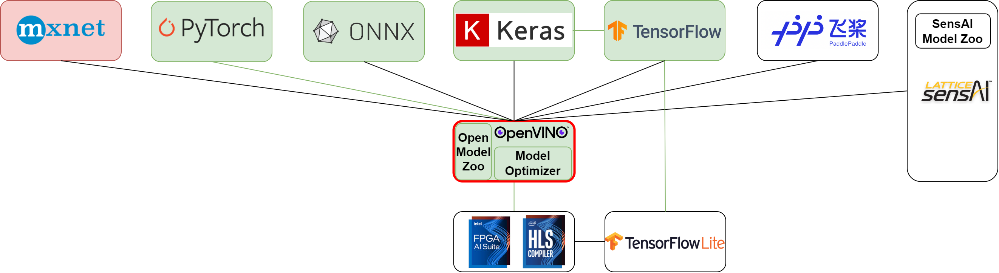

### **3.3.3 Intel OpenVINO: многофункциональный мост к инференсу на различных платформах** <a name="ch3.3.3"></a>

<div style="text-align: justify">

<a name="image_3_3_3_1"></a>
<figure>
  
</figure>

Intel OpenVINO — это универсальный набор инструментов для оптимизации и ускорения инференса нейронных сетей на процессорах Intel, графических ускорителях, VPU и [FPGA](glossary.md#fpga). В отличие от специализированных компиляторов, OpenVINO позволяет быстро адаптировать одну и ту же модель под разные аппаратные платформы, используя промежуточное представление (IR) и аппаратные плагины.

Работа с OpenVINO начинается с преобразования обученной модели в IR-формат с помощью Model Optimizer. Этот этап включает статический анализ графа, оптимизацию структуры вычислений и подготовку модели к дальнейшему ускорению. После этого модель может быть дополнительно оптимизирована с помощью Post-Training Optimization Tool (POT), который позволяет выполнить квантизацию без переобучения, используя небольшой калибровочный датасет.

Для запуска инференса используется Inference Engine, который автоматически выбирает оптимальный плагин для целевого устройства ([CPU](glossary.md#cpu), [GPU](glossary.md#gpu), FPGA). Весь процесс — от конвертации до профилирования — можно автоматизировать с помощью скриптов и конфигурационных файлов, что особенно удобно для промышленного развёртывания и CI/CD.

Пример полного цикла работы с OpenVINO приведён ниже. Сначала модель конвертируется в IR, затем проходит квантизацию с помощью POT, после чего запускается инференс и сравниваются метрики FP32 и INT8.

```bash
# Конвертация модели в IR
python3 <path_to_openvino>/tools/model_optimizer/mo.py --input_model model.onnx --output_dir ./ir_model
# Квантизация с помощью POT
python3 <path_to_openvino>/tools/post_training_optimization_toolkit/quantize.py --config pot_config.json
```

Пример конфигурации POT:

```json
{
	"model": { "model_name": "my_model", "model": "./ir_model/model.xml", "weights": "./ir_model/model.bin" },
	"engine": { "type": "simplified", "device": "CPU" },
	"algorithms": [ { "name": "DefaultQuantization", "params": { "preset": "performance", "stat_subset_size": 300 } } ]
}
```

После квантизации рекомендуется сравнить точность и производительность FP32 и INT8 моделей на репрезентативном датасете. Для FPGA-таргетов используйте соответствующий hardware plugin и проверьте совместимость с вашей платформой. Важно фиксировать версии OpenVINO, Model Optimizer и POT, а также параметры конвертации и квантизации для воспроизводимости результатов.

Официальная документация: ([OpenVINO Documentation](https://docs.openvino.ai/)).

Пример (конвертация и запуск инференса с OpenVINO):

```bash
# Конвертация модели (пример для ONNX/Keras)
python3 <path_to_openvino>/tools/model_optimizer/mo.py --input_model model.onnx --output_dir ./ir_model
```

Пример Python-инференса с OpenVINO (Runtime API):

```python
from openvino.runtime import Core
import numpy as np

ie = Core()
model = ie.read_model(model="./ir_model/model.xml")
compiled = ie.compile_model(model=model, device_name="CPU")
input_layer = compiled.input(0)
output_layer = compiled.output(0)

data = np.random.randn(1,1,28,28).astype('float32')
res = compiled([data])[output_layer]
print(res.shape)
```

OpenVINO также поддерживает квантизацию и profile-guided оптимизации; используйте Model Optimizer flags и плагинные параметры для целевой платформы.

Пример Post-Training Quantization с использованием POT (Post-Training Optimization Tool):

```bash
# Подготовьте конфигурационный JSON для POT, затем запустите
python3 <path_to_openvino>/tools/post_training_optimization_toolkit/quantize.py --config pot_config.json
```

Пример конфигурации POT (упрощённый):

```json
{
	"model": { "model_name": "my_model", "model": "./ir_model/model.xml", "weights": "./ir_model/model.bin" },
	"engine": { "type": "simplified", "device": "CPU" },
	"algorithms": [ { "name": "DefaultQuantization", "params": { "preset": "performance", "stat_subset_size": 300 } } ]
}
```

После квантования выполните сравнение метрик (FP32 vs INT8) и профиль на целевой платформе. Для развёртывания на FPGA используйте соответствующий FPGA-плагин и проверьте совместимость с hardware образами.

Замечание по верификации: всегда сравнивайте предсказания на репрезентативном датасете и фиксируйте версии OpenVINO/Model Optimizer/POT.

</div>