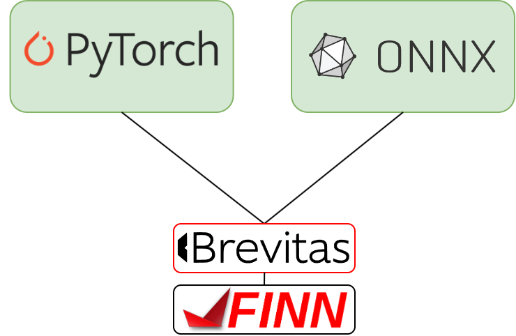

### **3.3.4 Brevitas: исследовательский инструмент с упором на гибкую квантизацию** <a name="ch3.3.4"></a>

<div style="text-align: justify">

<a name="image_3_3_4_1"></a>
<figure>
  
</figure>


Brevitas — это библиотека для PyTorch, предназначенная для исследования и проектирования низкоразрядных нейронных сетей. Она позволяет гибко аннотировать слои и параметры, задавать разрядность весов и активаций, а также интегрироваться с пайплайнами аппаратной генерации (например, FINN). Такой подход особенно полезен для задач, где критичны задержки и энергопотребление, а ресурсы [FPGA](glossary.md#fpga) ограничены.

Обычный рабочий процесс с Brevitas начинается с проектирования и аннотирования модели: разработчик явно указывает битность для каждого слоя, что позволяет контролировать компромисс между точностью и аппаратными затратами. После этого модель обучается с учётом квантизации ([QAT](glossary.md#qat)), что обеспечивает устойчивость к снижению разрядности. По завершении обучения модель переводится в режим eval и экспортируется в ONNX, при этом сохраняются все необходимые метаданные для дальнейшей аппаратной компиляции.

Ниже приведён пример создания и экспорта низкоразрядной модели в Brevitas. В примере показано, как задать битность весов и активаций, провести QAT и подготовить модель к экспорту для дальнейшей интеграции с FINN.

```python
import torch
import brevitas.nn as bnn
import torch.nn as nn

class QuantConvNet(nn.Module):
	def __init__(self):
		super().__init__()
		self.conv1 = bnn.QuantConv2d(1, 8, kernel_size=3, weight_bit_width=8, bias=False)
		self.relu = nn.[ReLU](glossary.md#relu)()
		self.fc = bnn.QuantLinear(8*26*26, 10, weight_bit_width=8)

	def forward(self, x):
		x = self.conv1(x)
		x = self.relu(x)
		x = x.view(x.size(0), -1)
		return self.fc(x)

model = QuantConvNet()

# Простой цикл обучения (QAT-подход):
optimizer = torch.optim.Adam(model.parameters(), lr=1e-3, weight_decay=1e-4)
loss_fn = nn.CrossEntropyLoss()

for epoch in range(5):
	model.train()
	total_loss = 0.0
	for images, labels in train_loader:  # предполагается подготовленный DataLoader
		optimizer.zero_grad()
		logits = model(images)
		loss = loss_fn(logits, labels)
		loss.backward()
		optimizer.step()
		total_loss += loss.item()
	print(f"Epoch {epoch+1}: loss={total_loss/len(train_loader):.4f}")

# Перевод в режим eval и экспорт в ONNX
model.eval()
dummy_input = torch.randn(1,1,28,28)
torch.onnx.export(model, dummy_input, 'model_brevitas.onnx', opset_version=11)
```

Для успешной интеграции с аппаратными пайплайнами (например, FINN) важно убедиться, что все параметры битности и аннотации корректно экспортированы. Рекомендуется фиксировать версии Brevitas и FINN, а также сохранять все конфигурационные файлы и логи обучения для воспроизводимости результатов.

Репозиторий и документация: ([Brevitas](https://github.com/Xilinx/brevitas)).

Пример аннотации и QAT в Brevitas (PyTorch):

```python
import torch
import brevitas.nn as bnn
import torch.nn as nn

class QuantConvNet(nn.Module):
	def __init__(self):
		super().__init__()
		self.conv1 = bnn.QuantConv2d(1, 8, kernel_size=3, weight_bit_width=8, bias=False)
		self.relu = nn.ReLU()
		self.fc = bnn.QuantLinear(8*26*26, 10, weight_bit_width=8)

	def forward(self, x):
		x = self.conv1(x)
		x = self.relu(x)
		x = x.view(x.size(0), -1)
		return self.fc(x)

# QAT: обычный training loop с использованием quant-annotated слоёв
model = QuantConvNet()
# standard training applies — brevitas handles quant tensors internally
```

Экспорт для downstream (ONNX) и дальнейшей обработки FINN/[HLS](glossary.md#hls) — в документации Brevitas есть рекомендации по экспорту метаданных и сохранению информации о битности.

Расширенный пример: экспорт после QAT (рекомендуемый порядок):

```python
# После QAT: перевести модель в eval() и выполнить экспорт в ONNX
model.eval()
dummy_input = torch.randn(1,1,28,28)
torch.onnx.export(model, dummy_input, 'model_brevitas.onnx', opset_version=11)

# Внимание: для корректной работы downstream-пайплайнов (FINN) требуется сохранить метаданные о битности и аннотациях.
# Руководство Brevitas описывает рекомендуемые шаги по сохранению дополнительных атрибутов и использованию экспорта для FINN.
```

Практические замечания:

- Проверяйте соответствие типов и ожидаемой разрядности после экспорта (инструменты FINN предъявляют строгие требования к ONNX-файлу);
- При интеграции с FINN используйте совместимые версии Brevitas/FINN и фиксируйте их в документации проекта.

</div>
