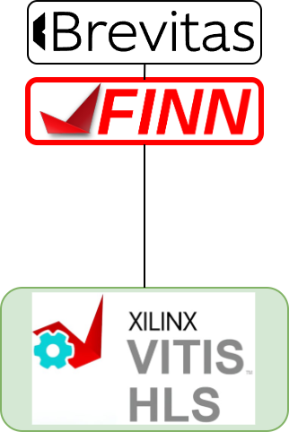

### **3.3.5 FINN: промежуточный компилятор для квантованных моделей** <a name="ch3.3.5"></a>

<div style="text-align: justify">

<a name="image_3_3_5_1"></a>
<figure>
  
</figure>

FINN — это исследовательский фреймворк, разработанный Xilinx Research для автоматизации компиляции низкоразрядных нейронных сетей в аппаратные реализации на [FPGA](glossary.md#fpga). В связке с Brevitas он позволяет пройти путь от аннотированной PyTorch-модели до [HLS](glossary.md#hls)/[RTL](glossary.md#rtl)-описания, пригодного для синтеза и развёртывания на реальном оборудовании.

Процесс работы с FINN начинается с экспорта модели из Brevitas в ONNX, где все параметры битности и структура сети уже определены. Далее модель импортируется в FINN, где проходит серию трансформаций и оптимизаций, направленных на адаптацию под особенности FPGA: устраняются неподдерживаемые операции, оптимизируется структура графа, подбираются параметры folding и precision. После этого генерируется HLS-проект, который можно симулировать и синтезировать с помощью Vivado HLS.

Ниже приведён пример пайплайна: от экспорта модели до генерации HLS-проекта и анализа использования ресурсов. Важно на каждом этапе проверять корректность работы модели на representative dataset и фиксировать версии инструментов.

```bash
# Экспорт из Brevitas в ONNX
python export_to_onnx.py --model model_brevitas.pth --out model.onnx
# Импорт и подготовка в FINN (python API)
from finn.core.modelwrapper import ModelWrapper
from finn.transformation.fpgadataflow import PrepareDFG
m = ModelWrapper('model.onnx')
m = m.transform(PrepareDFG())
m.save('model_finn_ready.onnx')
# Генерация HLS-проекта и запуск симуляции
python -c "from finn import compile; compile('model_finn_ready.onnx', target='fpgadataflow', out_dir='./finn_out')"
```

После генерации HLS/RTL-артефактов рекомендуется провести симуляцию и анализ отчётов по использованию ресурсов (LUT, [BRAM](glossary.md#bram), [DSP](glossary.md#dsp)). Если проект превышает ограничения платформы, возвращайтесь к этапу оптимизации модели: уменьшайте разрядность, меняйте структуру или параметры folding. Вся цепочка должна быть воспроизводимой: фиксируйте версии Brevitas, FINN, Vivado и сохраняйте все промежуточные артефакты.

Ресурсы: ([FINN](https://github.com/Xilinx/finn)).

Пример (эскиз пайплайна: Brevitas → ONNX → FINN):

```bash
# Экспорт модели из PyTorch/Brevitas в ONNX
python export_to_onnx.py --model model_brevitas.pth --out model.onnx

# Пример обращения к FINN-командам (pseudocode):
python -c "from finn import compile; compile('model.onnx', target='fpgadataflow', out_dir='./finn_out')"
```

Python-псевдокод (импорт и преобразование внутри FINN):

```python
from finn.core.modelwrapper import ModelWrapper
from finn.transformation import transformations

finn_model = ModelWrapper('model.onnx')
# apply FINN passes
finn_model = finn_model.transform(transformations.FoldConstants())
finn_model = finn_model.transform(transformations.SomethingForHW())
finn_model.save('model_finn.onnx')
```

Далее FINN генерирует HLS/RTL артефакты; см. документацию FINN для полного пайплайна и требований к аннотациям Brevitas.

Подробный шаг за шагом (рекомендации для успешной компиляции):

1. Убедитесь, что ONNX содержит статические размеры входов/выходов и что все операции поддерживаются FINN;
2. Запустите FINN-проходы трансформации для устранения лишних операторов и подготовки под fpgadataflow target;
3. Сгенерируйте HLS-проект и выполните локальную симуляцию (C/HLS cosimulation) для проверки корректности;
4. Выполните синтез в Vivado HLS и проверьте utilisation report (LUT/FF/BRAM/DSP);
5. При превышении ресурсов — вернитесь к фазе оптимизаций (снижение precision, изменение folding, реструктуризация модели).

Пример вызова FINN-пайплайна (python API, эскиз):

```python
from finn.core.modelwrapper import ModelWrapper
from finn.transformation.fpgadataflow import PrepareDFG

m = ModelWrapper('model.onnx')
m = m.transform(PrepareDFG())
m.save('model_finn_ready.onnx')
```

Обязательно тестируйте финальные артефакты на representative dataset и фиксируйте версии инструментов.

**Официальный ресурс:** ([FINN](https://github.com/Xilinx/finn)).

</div>


