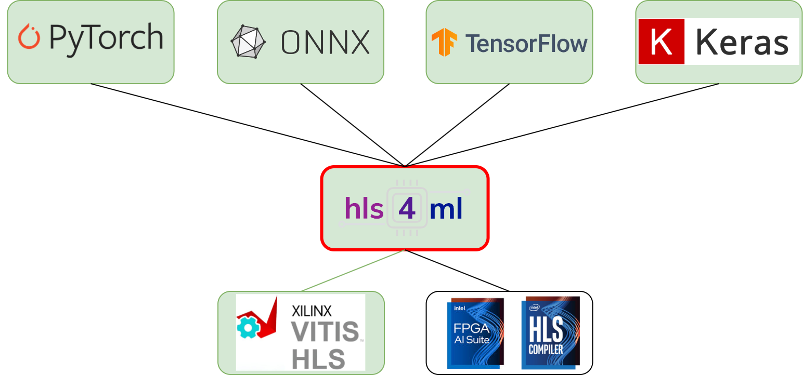

### **3.3.6 hls4ml: мощный инструмент для реализации сверхбыстрого инференса на FPGA** <a name="ch3.3.6"></a>

<div style="text-align: justify">

<a name="image_3_3_6_1"></a>
<figure>
  
</figure>

hls4ml — это инструмент, который позволяет быстро преобразовать компактную нейросетевую модель, созданную в Keras или ONNX, в проект на языке высокого уровня (C/C++), пригодный для синтеза в [VHDL](glossary.md#vhdl)/[Verilog](glossary.md#verilog) и последующего развёртывания на [FPGA](glossary.md#fpga). Такой подход особенно востребован в научных и встроенных приложениях, где важны минимальные задержки и ограниченное потребление ресурсов.

Работа с hls4ml начинается с экспорта обученной модели из Keras или ONNX. Затем с помощью утилит hls4ml модель автоматически преобразуется в [HLS](glossary.md#hls)-проект, где можно гибко настроить precision, степень параллелизма и параметры folding для каждого слоя. После генерации проекта выполняется C-симуляция, которая позволяет убедиться в корректности работы преобразованной модели. Далее проект синтезируется с помощью Vivado HLS, и инженер анализирует отчёты по использованию ресурсов (LUT, [BRAM](glossary.md#bram), [DSP](glossary.md#dsp)) и задержкам.

Ниже приведён пример полного цикла: от Keras-модели до генерации HLS-проекта и анализа отчётов. В примере показано, как задать precision и reuse factor для слоя, выполнить сборку и проверить результаты симуляции.

```python
from tensorflow import keras
import hls4ml

# Создание простой Keras-модели
model = keras.Sequential([
	keras.layers.InputLayer(input_shape=(28,28,1)),
	keras.layers.Conv2D(8, 3, activation='relu'),
	keras.layers.Flatten(),
	keras.layers.Dense(10, activation='softmax')
])

# Конфигурирование hls4ml
config = hls4ml.utils.config_from_keras_model(model, granularity='model')
config['Model']['Strategy'] = 'Latency'
config['LayerName']['conv2d_1'] = { 'Precision': 'ap_fixed<16,6>', 'ReuseFactor': 1 }

hls_model = hls4ml.converters.convert_from_keras_model(model, hls_config=config, output_dir='hls4ml_prj')
hls_model.build(csim=True)
print('C-simulation OK; check synthesis reports in hls4ml_prj')
```

После сборки проекта рекомендуется открыть отчёты синтеза и проанализировать использование ресурсов. Если проект не укладывается в ограничения платформы, можно изменить precision или параметры folding, а затем повторить сборку. Для встраиваемых систем важно не только достичь минимальной задержки, но и обеспечить энергоэффективность — hls4ml предоставляет средства профилирования для этих метрик. Все изменения конфигурации и версии инструментов рекомендуется фиксировать для воспроизводимости.

Документация: ([hls4ml](https://hls4ml.github.io/)).

Пример конверсии Keras → hls4ml (минимальный пример):

```python
from tensorflow import keras
import hls4ml

# Простая Keras-модель
model = keras.Sequential([
	keras.layers.InputLayer(input_shape=(28,28,1)),
	keras.layers.Conv2D(8, 3, activation='relu'),
	keras.layers.Flatten(),
	keras.layers.Dense(10, activation='softmax')
])

config = hls4ml.utils.config_from_keras_model(model, granularity='model')
config['Model']['Strategy'] = 'Latency'

hls_model = hls4ml.converters.convert_from_keras_model(model, hls_config=config, output_dir='hls4ml_prj')
hls_model.build()

# Сгенерированный HLS проект в hls4ml_prj готов к синтезу через Vivado HLS
```

hls4ml предоставляет механизмы регулирования precision, folding и параллелизма; используйте их для подстройки под ограничения BRAM/DSP.

Расширенный пример конфигурации и контроль precision/folding:

```python
# Получаем конфигурацию и явным образом задаём precision
config = hls4ml.utils.config_from_keras_model(model, granularity='model')
config['Model']['Strategy'] = 'Latency'
config['LayerName']['conv2d_1'] = { 'Precision': 'ap_fixed<16,6>', 'ReuseFactor': 1 }

hls_model = hls4ml.converters.convert_from_keras_model(model, hls_config=config, output_dir='hls4ml_prj')
# Построение и генерация отчётов
hls_model.build(csim=True)
print('C-simulation OK; check synthesis reports in hls4ml_prj')
```

Проверка отчёта синтеза и выбор параметров:

- После `hls_model.build()` откройте `hls4ml_prj/synth/report` и изучите использование LUT/FF/BRAM/DSP;
- Изменяйте `ReuseFactor` и `Precision` для снижения ресурсов или увеличения производительности; фиксируйте изменения для воспроизводимости.

Рекомендации по верификации:

- Всегда выполняйте C-simulation и, при возможности, co-simulation (C/[RTL](glossary.md#rtl)) перед синтезом;
- Для встраиваемых систем оценивайте не только latency, но и энергоэффективность и footprint; hls4ml предоставляет профайлинг для этих метрик.

</div>
