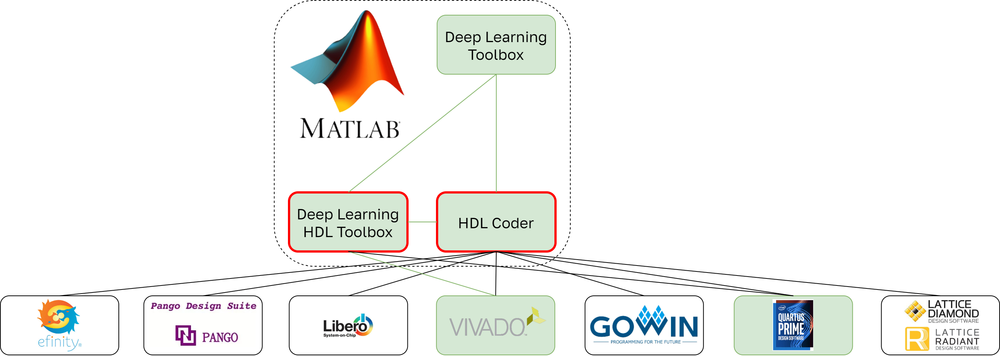

### **3.4.1 MATLAB Deep Learning HDL Toolbox и HDL Coder: связка инструментов с удобной оптимизацией и профилированием** <a name="ch3.4.1"></a>

<div style="text-align: justify">

<a name="image_3_4_1_1"></a>
<figure>
  
</figure>

MATLAB Deep Learning HDL Toolbox и HDL Coder предоставляют полный путь от проектирования и обучения нейросетей в MATLAB или Simulink до генерации синтезируемого HDL-кода для [FPGA](glossary.md#fpga) или [ASIC](glossary.md#asic). Такой подход особенно востребован в задачах, где требуется ускорение инференса с помощью программируемой логики и важна воспроизводимость результатов.

Работа начинается с разработки и обучения модели в Deep Learning Toolbox. Для повышения эффективности аппаратной реализации применяются методы оптимизации, такие как квантизация и pruning, с помощью Model Compression Library. Это позволяет уменьшить размер модели и адаптировать её под ограничения HDL-генерации. На этом этапе важно избегать слоёв и операций, которые не поддерживаются HDL Coder, либо переписывать их в эквивалентные конструкции.

После подготовки модели она конвертируется в HDL-совместимый формат, и с помощью HDL Coder автоматически генерируется [VHDL](glossary.md#vhdl) или [Verilog](glossary.md#verilog) код. Интеграция с Simulink и поддержка модельно-ориентированного проектирования позволяют проводить симуляцию и верификацию работы модели на тестовых наборах непосредственно в MATLAB. Для оценки latency и использования ресурсов можно использовать встроенные средства анализа отчётов после синтеза.

Ниже приведён пример полного цикла: от загрузки обученной сети до генерации HDL-кода и симуляции.

```matlab
% Загрузка обученной сети
net = load('trainedConvNet.mat').net;

% [Квантизация](glossary.md#quantization) и pruning (опционально)
dlquantObj = dlquantizer(net, 'ExecutionEnvironment', 'FPGA');
calData = rand(28,28,1,100,'single');
calibrate(dlquantObj, calData);

% Генерация HDL-кода
hdlcfg = coder.config('hdl');
hdlcfg.TargetLanguage = 'VHDL';
codegen -config hdlcfg myPredictFcn -args {ones(28,28,1,'single')}
```

После генерации кода рекомендуется провести симуляцию и верификацию, используя Model Advisor и встроенные проверки, чтобы убедиться в корректности работы модели на аппаратном уровне. Все этапы workflow поддерживают автоматизацию, а фиксация версий MATLAB/Toolbox и параметров квантизации обеспечивает воспроизводимость результатов.

Ресурсы: ([Deep Learning HDL Toolbox](https://www.mathworks.com/help/deep-learning-hdl/)).

</div>