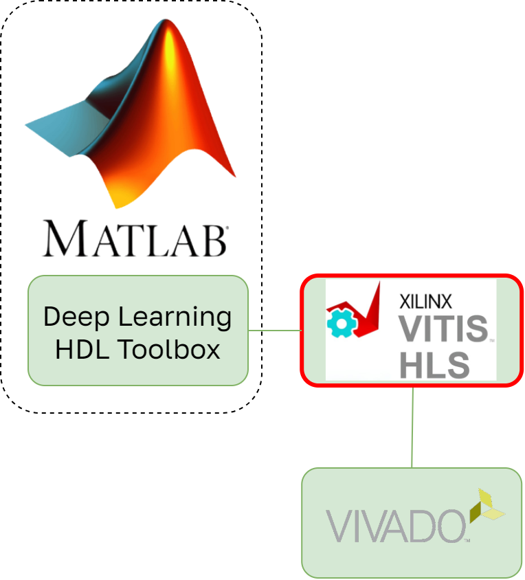

### **3.4.2 Vitis HLS: поток оптимизации на уровне высокоуровневого синтеза** <a name="ch3.4.2"></a>

<div style="text-align: justify">

<a name="image_3_4_2_1"></a>
<figure>
  
</figure>


Vitis [HLS](glossary.md#hls) (ранее Xilinx Vivado HLS) предоставляет инструментарий для преобразования алгоритмов, описанных на C/C++/OpenCL, в синтезируемый [RTL](glossary.md#rtl)-код, пригодный для реализации на [FPGA](glossary.md#fpga) Xilinx. Vitis HLS оптимизирован для интеграции в экосистему Xilinx/Vitis, включая Vitis AI, и позволяет инженерам быстро прототипировать аппаратные ускорители, затем профилировать и оптимизировать их под целевую платформу.

Работа начинается с описания вычислительного ядра на C/C++ или OpenCL и определения интерфейсов и ограничений (pragma/directives). Vitis HLS поддерживает набор директив для управления параллелизмом, разворачиванием циклов, объединением памяти и т.д. После синтеза HLS генерирует RTL-модуль, который можно интегрировать в проект Vivado или Vitis для дальнейшего синтеза и размещения.

Особенности:

- Поддержка pragmas для fine-grained оптимizations (pipeline, unroll, dataflow).
- Профилирование производительности на уровне циклов и оценки использования ресурсов (LUT, FF, [BRAM](glossary.md#bram), [DSP](glossary.md#dsp)).
- Плотная интеграция с Vitis Accelerated Libraries и платформой Vitis для создания аппаратных акселераторов.

Пример простейшего kernel-файла и директивы:

```cpp
#include <hls_stream.h>

void vec_add(const float *a, const float *b, float *c, int n) {
#pragma HLS INTERFACE m_axi port=a offset=slave bundle=gmem
#pragma HLS INTERFACE m_axi port=b offset=slave bundle=gmem
#pragma HLS INTERFACE m_axi port=c offset=slave bundle=gmem
#pragma HLS INTERFACE s_axilite port=n
#pragma HLS INTERFACE s_axilite port=return

#pragma HLS PIPELINE II=1
    for (int i = 0; i < n; ++i) {
        c[i] = a[i] + b[i];
    }
}
```

Фреймворки глубокого обучения и оптимизации позволяют генерировать сложные конфигурации kernel'а для реализации нейронных сетей. Однако их функционал ограничен. Было выпущено значительное количество работ, посвященных реализации трансформеров на Vitis HLS и оценке перспектив их ускорения на FPGA, например: [1](https://ieeexplore.ieee.org/abstract/document/11310944/?casa_token=TOnWw3t4bh4AAAAA:SCdSK1v5EtLv36FQRNyOUhgTpelMeoIOWT4SmafllySzv_Kbp8s6JiyrK4AtjAxqRmXPiywQiQ0z), [2](https://ieeexplore.ieee.org/abstract/document/11310944/?casa_token=TOnWw3t4bh4AAAAA:SCdSK1v5EtLv36FQRNyOUhgTpelMeoIOWT4SmafllySzv_Kbp8s6JiyrK4AtjAxqRmXPiywQiQ0z), [3](https://aaltodoc.aalto.fi/items/1fbd2ccc-73ea-438f-aa21-af5c2b81c1bf).

После разработки kernel-а используйте `vitis_hls` для запуска синтеза и получения отчётов по ресурсам и задержкам. Далее интегрируйте с проектом Vitis/Vivado для Place & Route и генерации bitstream.

**Официальный ресурс:** ([Vitis HLS](https://www.xilinx.com/products/design-tools/vitis/vitis-hls.html)).

</div>
