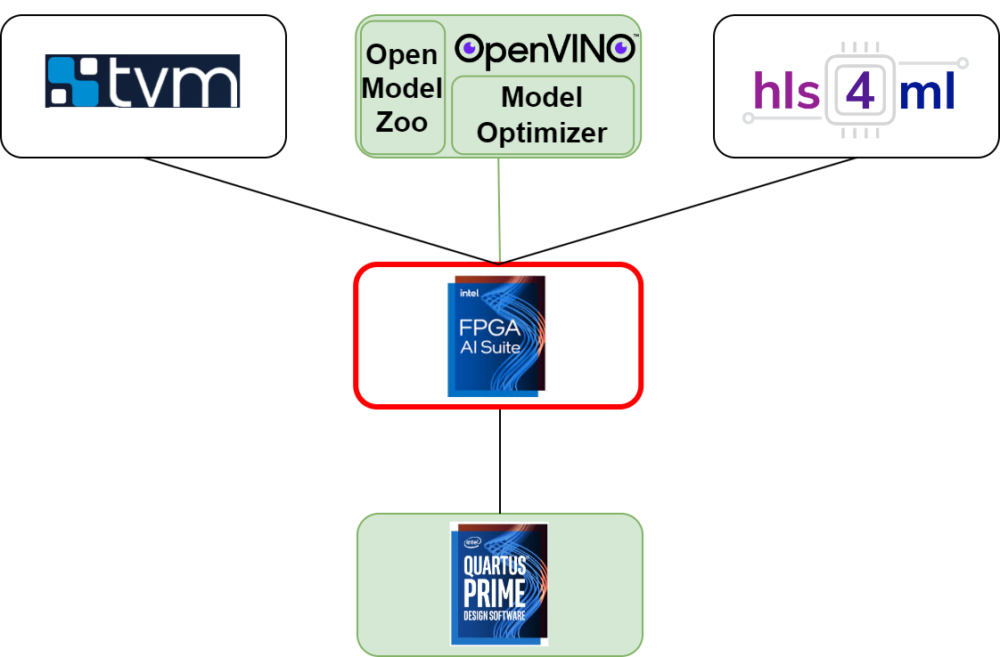

### **3.4.3 FPGA AI Suite: фреймворк для организации нейронных вычислителей на микросхемах Intel/Altera** <a name="ch3.4.3"></a>

<div style="text-align: justify">

<a name="image_3_4_3_1"></a>
<figure>
  
</figure>

FPGA AI Suite — это набор методик и инструментов для проектирования аппаратных нейронных вычислителей на платформах Intel/Altera. Цель набора — сократить время перехода от описания алгоритма (на C/C++ или SystemC) к рабочему аппаратному модулю, обеспечив при этом управляемую оптимизацию по производительности, ресурсам и задержке.

## Ключевые концепции

- **HLS-модуль**: функционально эквивалентная запись аппаратной подсистемы на C/C++/SystemC, пригодная для синтеза в RTL.
- **Пулинг, свёртка, MAC**: стандартные операции нейронных сетей; в HLS обычно реализуются в виде вложенных циклов с использованием `#pragma` для управления интерфейсом и расписанием.
- **Параллелизм и конвейеризация**: реализуются через директивы `pipeline`, `unroll`, `array_partition` и т.д.

(См. определения в словаре: [edge_ai_manual/assets/glossary.md](edge_ai_manual/assets/glossary.md)).

## Рабочий процесс интеграции

1. Экспорт весов и топологии из фреймворка обучения (например, PyTorch/TensorFlow).
2. Квантование и подготовка параметров (`fixed-point`, `integer`) для минимизации потребления ресурсов.
3. Создание HLS-ядра: описание вычислений в C/C++ с аннотациями для синтеза.
4. Локальная верификация (C/C++ unit tests) и функциональное тестирование с тестовыми векторами инференса.
5. Синтез HLS → RTL, анализ отчётов по ресурсам и временным ограничениям, итеративная оптимизация директив.
6. Интеграция с системной частью (AXI-интерфейсы, DMA, управляющий процессор) и связывание с остальной частью FPGA AI Suite.

## Практический пример: простая MAC-функция для свёртки

Ниже — компактный пример HLS-функции для умножения-накопления (`MAC`) с базовыми директивами оптимизации. Код иллюстрирует стиль, удобный для дальнейшей трансформации в свёрточный слой.

```cpp
// mac_hls.cpp
#include <ap_int.h>
#include <hls_stream.h>

// Тип данных: фиксированная точка, уточнения в glossary
typedef ap_int<16> data_t;

void mac_kernel(const data_t input[64], const data_t weight[64], data_t &out) {
  #pragma HLS INTERFACE mode=s_axilite port=return
  #pragma HLS INTERFACE mode=m_axi     port=input  offset=slave depth=64
  #pragma HLS INTERFACE mode=m_axi     port=weight offset=slave depth=64

  data_t acc = 0;
  MAC_LOOP: for (int i = 0; i < 64; ++i) {
    #pragma HLS PIPELINE II=1
    acc += input[i] * weight[i];
  }
  out = acc;
}
```

Пояснения:

- `#pragma HLS INTERFACE` — задаёт тип интерфейса для модуля (AXI-lite для управления, AXI-master/memory-mapped для данных).
- `#pragma HLS PIPELINE II=1` — просит компилятор добиться начальной производительности конвейера (initiation interval) равной 1, если это возможно при данных ресурсах.

## Пример: свёрточный слой с развёртыванием цикла

Ниже — упрощённый пример реализации 1D-свёртки с развёртыванием внутреннего цикла для частичного параллелизма.

```cpp
void conv1d(const data_t in[128], const data_t kernel[16], data_t out[113]) {
  CONV_OUT: for (int o = 0; o < 113; ++o) {
    data_t acc = 0;
    CONV_K: for (int k = 0; k < 16; ++k) {
      #pragma HLS UNROLL factor=4
      acc += in[o + k] * kernel[k];
    }
    out[o] = acc;
  }
}
```

Здесь директива `UNROLL` увеличивает аппаратный параллелизм, но растит расход LUT/FF/BRAM; оптимизацию следует подбирать эмпирически в зависимости от целевой платы.

## Интеграция в FPGA AI Suite

В составе FPGA AI Suite HLS-ядра обычно упаковываются в блоки с установленными интерфейсами (AXI-Stream/AXI-MM), после чего они подключаются к контроллеру DMA и менеджеру памяти. Важные шаги интеграции:

- Согласовать форматы данных (см. `fixed-point` в [edge_ai_manual/assets/glossary.md](edge_ai_manual/assets/glossary.md)).
- Настроить буферизацию и пропускную способность DMA для доступа к входным/выходным тензорам.
- Провести тесты пропускной способности и стресс-тесты для оценки устойчивости при реальном потоке данных.

## Совет по оптимизации

- Начинайте с корректной функциональной реализации и простого теста; только затем добавляйте директивы для производительности.
- Используйте `array_partition` для устранения узких мест при обращении к BRAM.
- Мониторьте отчёты HLS (latency, II, resource usage) и итеративно меняйте `unroll`/`pipeline`/`partition`.

## Где читать дальше

Официальный ресурс: ([FPGA AI Suite](https://docs.altera.com/r/docs/863373/2026.1.1/fpga-ai-suite-handbook/fpga-ai-suite-handbook))

</div>
