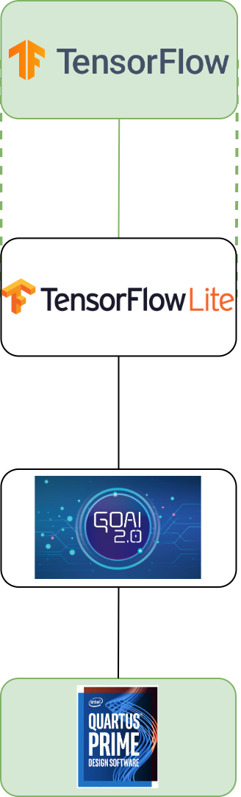

### **3.4.4 GoAI 2.0: мелкомасштабный фреймворк для мелкомасштабных вычислений** <a name="ch3.4.4"></a>

<div style="text-align: justify">

<a name="image_3_4_4_1"></a>
<figure>
  
</figure>

GoAI 2.0 — легковесная и модульная платформа, ориентированная на развёртывание компактных нейронных моделей в ресурсно-ограниченных системах: микроконтроллерах, маломощных [SoC](glossary.md#soc) и компактных [FPGA](glossary.md#fpga). Основная задача GoAI — обеспечить надежный и предсказуемый inference с минимальными накладными расходами по памяти и вычислениям, сохранив при этом простые механизмы интеграции с классическими ML‑pipeline (экспорт из PyTorch/ONNX/TensorFlow).

Ключевые особенности

- Небольшой runtime (обычно < 200 KB бинарника для минимальной сборки).
- Поддержка форматов ONNX и упрощённых кастомных слоёв GoAI для оптимизированного исполнения.
- Встроенные инструменты PTQ и [QAT](glossary.md#qat)‑совместимые оптимизации (int8, int4, бинарные сети) и примитивы для прунинга.
- Генерация переносимых артефактов: статические библиотеки для ARM Cortex‑M, малые Linux‑runtime, а также HDL‑шаблоны для интеграции с [HLS](glossary.md#hls)/[RTL](glossary.md#rtl) (для компактных FPGA).
- Простая C API и опциональная Python‑CLI для конвертации и калибровки моделей.
- Набор runtime‑тестов и профайлеров для оценки latency, memory footprint и energy на целевой платформе.

Когда использовать GoAI

- Когда целевая платформа имеет жёсткие ограничения по памяти и энергопотреблению (TinyML, датчики, edge‑устройства).
- Для быстрого прототипирования малых моделей (TinyCNN, MobileNet‑варианты, простые [RNN](glossary.md#rnn)/1D‑сигналы).
- В связке с distillation/pruning/quantization‑пайплайнами для снижения требований к аппаратуре.

Простейший workflow (экспорт → калибровка → сборка для target)

1. Экспортируйте модель в ONNX из PyTorch/TensorFlow.
2. Запустите конвертер GoAI для приведения слоёв к поддерживаемому подмножеству и калибровки: representative dataset → calib cache.
3. Выполните PTQ (или QAT, если необходима минимальная потеря качества).
4. Сгенерируйте target‑артефакт: `libgoai.a` для ARM или `goai_hls.tgz` для последующей интеграции в HLS.

Пример команд (CLI)

```bash
# Установка (пример)
pip install goai-toolchain

# Конвертация ONNX в GoAI format и калибровка
goai-convert --input model.onnx --output model.goai --calib ./calib_images --format int8

# Сборка runtime для ARM Cortex-M (пример)
goai-build --model model.goai --target cortex-m4 --out build/
```

Пример использования C API (инициализация и инференс)

```c
#include "goai_runtime.h"

int main() {
    goai_model_t *m = goai_load_model("model.goai");
    float input[INPUT_SIZE]; // подготовьте данные
    float output[OUTPUT_SIZE];
    goai_infer(m, input, output);
    goai_free_model(m);
    return 0;
}
```

Интеграция с FPGA и HLS

GoAI 2.0 предоставляет опциональный экспорт в облегчённый HLS‑каркас: упрощённые операции свёртки и матричных умножений кодируются в виде C/C++ kernel‑ов с минимальным набором зависимостей. Эти ядра можно затем доработать директивами HLS (pipeline/unroll) и вставить в поток Vitis HLS / Intel HLS → Vivado/Quartus.

Ограничения и рекомендации

- GoAI заточен под малые модели: для крупных сетей с высокой пропускной способностью предпочтительнее использовать Vitis AI, TVM или специализированные runtime.
- Для критичных по точности задач проводите QAT и профильные тесты на реальных данных; PTQ может приводить к деградации качества.
- При интеграции в FPGA внимательно оцените требования к памяти ([BRAM](glossary.md#bram)/URAM) и [DSP](glossary.md#dsp)-ресурсам; оптимизируйте топологии для минимального количества буферных копий.

Ресурсы и ссылки

- Документация GoAI 2.0 (локальная): edge_ai_manual/chapters/goai/README.md
- Примеры и тесты: edge_ai_manual/chapters/goai/examples/

</div>