### **3.6.1 OneWare: экосистема для ускоренной разарботки Edge AI на FPGA** 

<figure>
  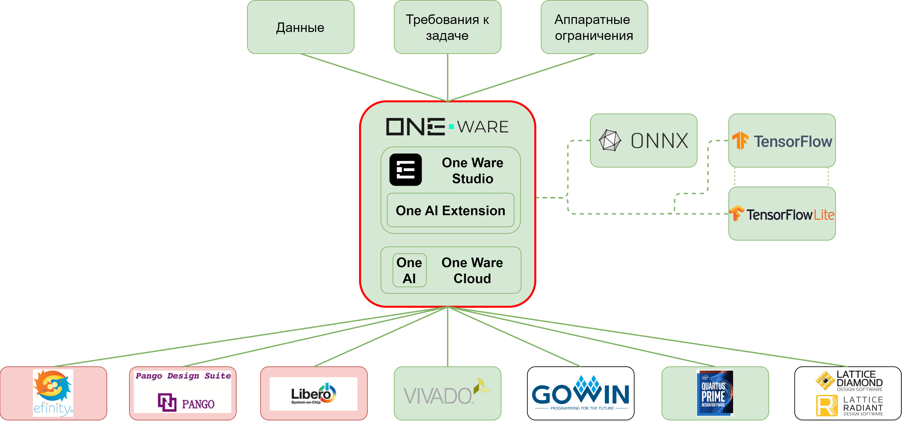
</figure>

**OneWare** представляет собой экосистему инструментов для быстрой разработки и имплементации **Edge AI** решений преимущественно для задач технического зрения (**Vision AI**) на встраиваемых устройствах, включая FPGA. В отличие от традиционных AI-фреймворков, которые позволяют инженеру вручную подбирать архитектуру, проводить эксперименты с разными моделями, обучать и оптимизировать нейронную сеть, в **OneWare** данный функционал полностью автоматизирован с помощью инструмента **One AI**. Сердцем **One AI** является **алгоритм автоматического поиска оптимальной архитектуры нейронной сети**, входными данными для которого являются размеченные данные, требования к задаче и ограничения целевой платформы. 

**OneWare** ориентируется на задачи **Vision AI**: *классификации* изображений, *обнаружении объектов* на изображении, *сегментации*, анализе видеопотока и других приложениях компьютерного зрения. При работе с  аудио-данными или данными временных рядов, их предварительно требуется преобразовать в спектрограммы, для чего представлен инструмент **Spectrogram Generator**. Инструмент представляет пользователью  возможность икусственно увеличить размер набора данных выборки путём применения случайных преобразований к изображениям. Такие преобразования называются **Augmentations** и по сути являются методами технического зрения. За счёт них можно целеноправленно имитировать возможные изменения конкретных условий, которые могут возникнуть при эксплуатации, например изменение углов поворота объектов или условию освещения. 

При этом **OneWare** не привязан к конкретному вендору ПЛИС: система поддерживает экспорт платформонезависимого RTL-описания на языке **VHDL**, а также промежуточных форматах описания нейронных сетей, **ONNX**, **TensorFlow** и **TensorFlow Lite**, для интеграции с другими тулчейнами.

По сути разработка представляет собой попытку создать максимально упрощенный инструмент, снижающий требования к AI-экспертизе, пониманию аппаратных ограничений и возможностей оптимизации. За счёт автоматизации процесса инженер теряет часть контроля над процессом разработки, но при этом время вывода решения в промышленность сокращается. Согласно утверждениям разработчиков, цикл внедрения может быть снижен с нескольких месяцев до дней.

#### Полный цикл разработки в OneWare
##### Введение
Документация OneWare достаточно хорошо проработана, а запуск демонстрационных проектов не вызывает каких-либо проблем. Поэтому в рамках данного мануала мы в большей степени уделим внимание особенностям инструмента, а не на последовательности действий.
Основой проекта является приложение на ПК, ONE WARE Studio, в котором можно осуществлять подготовку датасета, выбирать алгоритмы предобработки и постобработки данных, а также настраивать желаемые настройки параметров для инференса. Обучение можно осуществлять либо локально, либо на сервере разработчика (платно). Различие между путями разработки представлено ниже.

Вариант А - **обучение в облаке**:

<figure>
  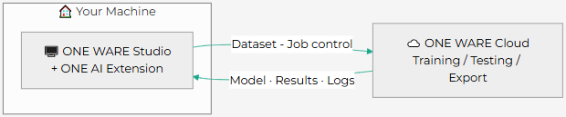
</figure>

Вариант Б - **локальное обучение**:

<figure>
  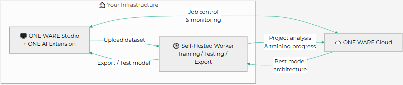
</figure>

Поскольку разработчик из Германии обучение на сервере можно осуществлять только через VPN, который при этом требуется и для нормального функционирования приложения **One Ware Studio**. В противном случае доступ ко всем ключевым функциям будет ограничен:

<figure>
  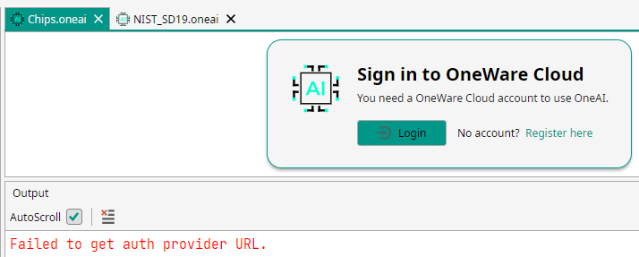
</figure>

Возможность использования функции локального обучения ("Self-Hosted") также несколько затруднительна, поскольку для этого необходимо связаться с производителем и получить от него доступ к функционалу.

##### Dataset (Работа с данными)
При открытии демонстрастрационного проекта вас встретит главное рабочее окно, где представлен список всех настроек для проекта. В разделе **Dataset** выбирается тип задачи (**Objects**, **Classes**, **Segmentation**), а также осуществляется работа с набором данных (создание или импорт данных, разметка данных, разделение набора на обучающую, тестовую и валидационную выборки).

<figure>
  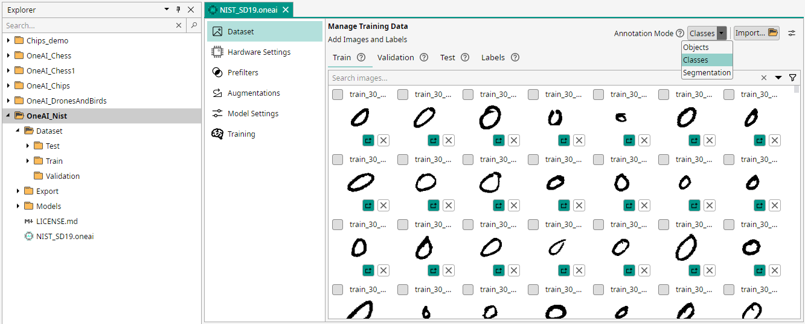
</figure>

Режим маркировки и все последующие операции сильно зависят от выбора типа задачи:
|    Режим    |                    Аннотация                     |                           Вариант использования                           |
| :---------: | :----------------------------------------------: | :-----------------------------------------------------------------------: |
|   Классы    |  Одна или несколько меток класса на изображение  |                  Контроль качества, сортировка, подсчет                   |
|   Объекты   |      Ограничивающие рамки с метками классов      |              Обнаружение и идентификация нескольких объектов              |
| Сегментация | Маски с точностью до пикселя для каждого объекта | Дефекты поверхности, медицинская визуализация, точное определение области |

Причём **OneWare** поддерживает **импорт предаврительно аннотированных датасетов** в одном из 5 форматов:

<figure>
  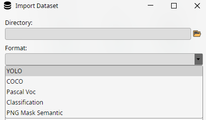
</figure>

##### Hardware Settings (Выбор аппаратной платформы)
В настройках **Hardware Settings** необходимо указать целевое оборудование, на котором будет развернута ваша модель. Сейчас из опций для ПЛИС можно либо выбрать один из кристаллов из трёх семейств ПЛИС Altera (**Agilex3**, **Agilex5** и **MAX10**), либо выбрать конфигурацию "**FPGA**" и затем настроить параметры вручную.

<figure>
  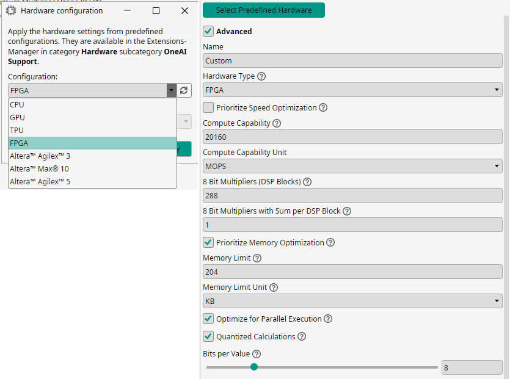
</figure>

Требуется сделать следующие замечания:
- Значение весов предполагается хранить только во **встроенной памяти** (internal SRAM) без использования **DDR**. При этом никто не запрещает хранить оригинал изображения в DDR и сохранять туда результаты расчётов, но это выходит за рамки генерируемого кода;
- Разрядность квантования задаётся одинаковой для всех слоёв нейронной сети (в отличие, например, от Brevitas);
- Вычислительную способность нужно расчитывать самостоятельно на основании информации о вашей ПЛИС.

В конце нужно задать, сколько ресурсов вы готовы отдать под нужды нейросети и какая должна быть тактовая частота дизайна:

<figure>
  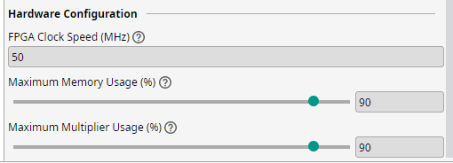
</figure>

##### Prefilters (Фильтры пред- и постобработки)
Раздел **Prefilters** позволяет добавить набор фильтров обработки изображений перед и после примения аугментаций (**Augmentations**, которые увеличивают разнообразие выборки). Цель данного раздела состоит в устаранении шума и выделения характеристик обнаруживаемых объектов. За счёт этого обобщающая способность нейросети повысится и точность прогнозов будет увеличена.

<figure>
  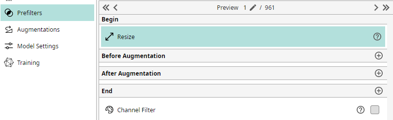
</figure>

Все фильтры являются **синтезируемыми** и могут быть включены в состав генерируемого IP-ядра. Хотя нужно сделать оговорку, что изменение разрешения изображения рекомендуется не включать в IP-ядро. Это связано с тем, что передача данных на вход осуществляется попиксельно и, поэтому мы снизим пропускную способность пропорционально выбранному коэффициенту.

<figure>
  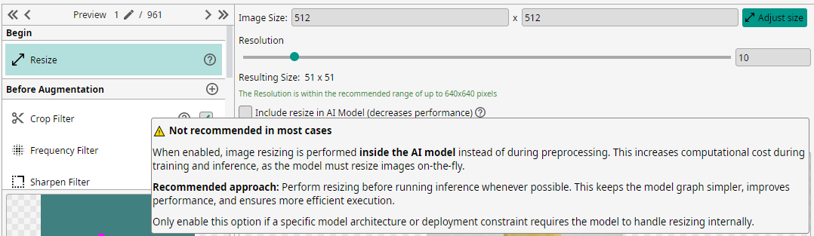
</figure>

Изображение можно **обрезать** до заданной области интереса, применить **фильтр нижних частот**, чтоб удалить перепады на краях или наоборот выделить их **фильтром верхних частот**. Изменить яркость, контраст, насыщенность и пр. в **Color Filter**. Наиболее наглядным будет изменение параметров фильтров для набора данных из демо-проектов. Перечень доступных фильтров представлен ниже: 

<figure style="margin: 0; flex-shrink: 0;">
  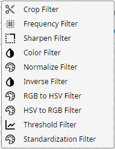
</figure>

##### Augmentations (Расширение обучающей выборки)
В разделе **Augmentations** можно выбрать преобразования, которые будут случайным образом применяться к обучающим изображениям. Это позволяет увеличивать разнообразие набор данных, что улучшает обобщающую способность модели и устойчивость к вариациям реального мира. Однако применять их нужно осмысленно. Например, применение "Mosaic Augmentation", объединяющего 4 изображения из набора в одно, бессмысленно для задачи классификации, так как задача НС - определить тип объекта, а вместо этого мы можем получить два объекта из разных классов на одном изображении. В программе можно выбрать один из заготовленных шаблонов аугментаций в зависимости от природы данных:

<figure style="margin: 0; flex-shrink: 0;">
  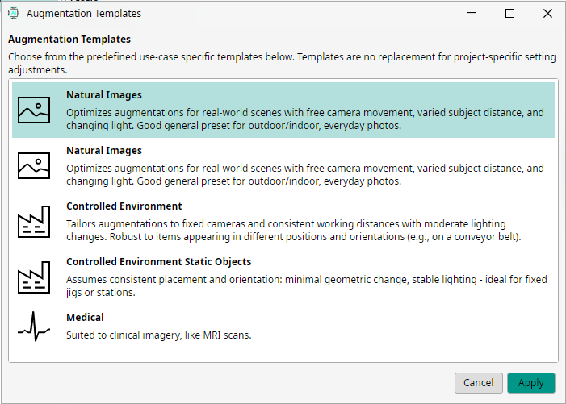
</figure>

Аугментации бывают двух типов: **статические** применяются первыми и их порядок является неизменным, **динамические** указываются пользователем и могут быть применены многократно. В целом смысл аугментаций достаточно понятен из названий:

<figure>
  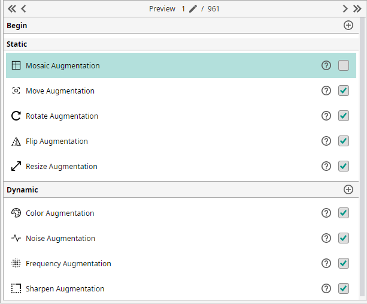
</figure>

На практике для любой аугментации будет дано поле для настроек и пример результата преобразования изображения. На рисунке приведён пример доступных настроек для Color Augmentation:

<figure>
  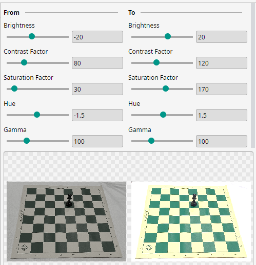
</figure>

##### Model Settings (настройки модели)

Раздел настройки модели является по сути единственным местом, где у разработчика будет возможность описать задачу с точки зрения данных. Можно указать, какие параметры необходимо прогнозировать, требуемую точность и скорость работы модели. Например, если размер объектов известен, можно указать ONE AI прогнозировать только позиции объектов для экономии ресурсы. Для достижения наилучших результатов вам также необходимо сделать некоторые оценки вашей задачи, например, указать ожидаемый размер объектов или общую сложность задачи.

В зависимости от выбранного ранее типа задачи будет представлен разный функционал. Если решается задача классификация, то на выбор даётся: **одноклассовая** или **многоклассовая** классификация, проверка наличия **по крайней мере одного класса** на изображении или **регрессия**, при которой названия меток интерпретируются как непрерывные значения.

<figure>
  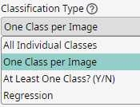
</figure>

Большинство настроек, с помощью которых осуществляется адаптация к нашему конкретному случаю представлено в виде относительных значений в диапазоне от 0 до 100 %. Например настройка Background Difference (%) подразумевает оценку того, насколько сильно меняется фон **после** применения **предварительных фильтров**. 0% для однородного фона, 15% для незначительных изменений (один и тот же конвейер), 100% для совершенно разных мест.

<figure>
  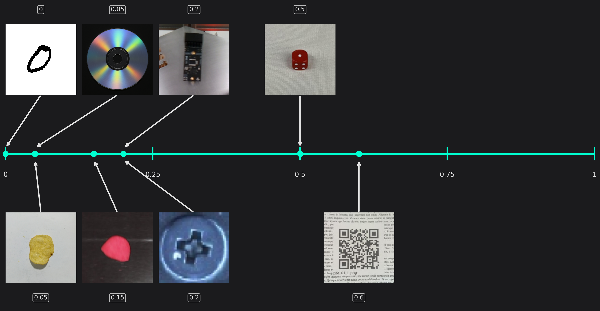
</figure>

После задания всех настроек можно запустить этап обучения, на выходе которого мы получим в консоли краткую сводку о результатах поиска архитектуры и свойствах IP-ядра:

<figure>
  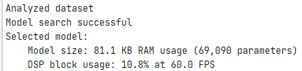
</figure>

##### Экспорт содержимого проекта

Обученную модель можно выгрузить в виде IP-ядра на VHDL. Причём можно отказаться от включения фильтров, если планировалось осуществить их отдельно.

<figure>
  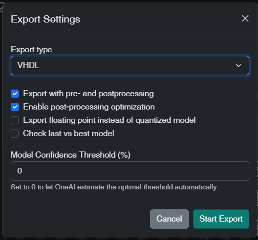
</figure>

Экспорт в формате VHDL создает папку со следующим содержимым:

- Core - Содержит вспомогательные модули, касающиеся архитектуры сверточных нейронных сетей.
- Filters - Содержит вспомогательные модули для предварительной обработки данных.
- Quartus_IP - IP-ядро One Ware для **Quartus** (например, для подключения сверточной нейронной сети к центральному процессору). На входе имеет интерфейс **Avalon-MM Master** для чтения из памяти изображения заданного формата, на выходе интерфейс **Avalon-MM Slave** для выдачи результата. TCL скрипт создаётся для qsys 25.1
- ONEAI_Confic_Package.vhd - Настройки конфигурации.
- ONEAI_Data_Package.vhd - Весовые коэффициенты модели.
- ONEAI_Simulation.vhd- VHDL-файл, который можно использовать для моделирования (Test_Data_Package.vhd - входные данные для тестбенча).
- ONEAI_Top.vhd - Основной элемент дизайна, который необходимо интегрировать в ваш проект.
Test_Data_Package.vhdТестовые данные для моделирования.

<figure>
  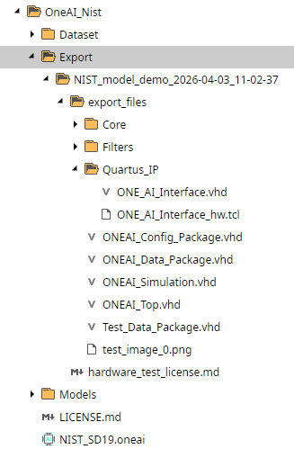
</figure>

Все модули OneAI используют единый *интерфейс* **потоковой передачи**. Он используется как для передачи в свёрточную нейронную сеть (CNN) и из неё, так и между внутренними блоками.
Сам интерфейс можно разделить на две канала. Один для передачи непосредственно данных (CNN_Values_T), а второй для передачи остальной значимой информации (CNN_Stream_T). Определение типов данных для интерфейса осуществляется файле ONEAI_Confic_Package.vhd. Канал "stream" содержит следующие сигналы:
- Data_CLK - сигнал тактовой частоты дизайна
- Data_Valid - Сигнал "валидности" данных
- Column - Номер столбца текущего пикселя
- Row - Номер строки текущего пикселя
- Filter - Номер текущего фильтра (актуально для свертки, где ядер свёртки (фильтров) несколько. Для входных данных верхнего уровня сверточной нейронной сети обычно оставляйте его значение равным 0).
Канал "data" связан с каналом "stream" (использует тот же тактовый сигнал clk и сигнал валидности данных valid) и представлен n-мерным сигналом, зависящим от количества цветовых каналов изображения. Каждый канал представляет собой 7-битный беззнаковый сигнал, кодирующий соответствующее значение пикселя в диапазоне 0...127.

В случае наличия нескольких входных каналов "data" (например, при анализе нескольких изображений) все data-каналы должны соответствовать одному и тому же входному интерфейсу потоковой передачи, то есть они должны использовать общие сигналы тактирования, сигналы "валидности", столбцов, строк и фильтра.

<figure>
  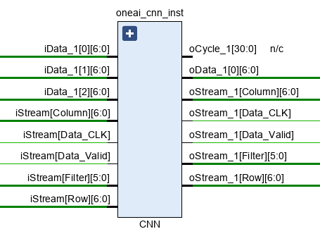
</figure>

По итогу будет собрана полностью архитектура из последовательных и независимых друг от друга слоёв. Информация о весах для каждого из слоёв хранится в отдельной памяти для слоя:

<figure>
  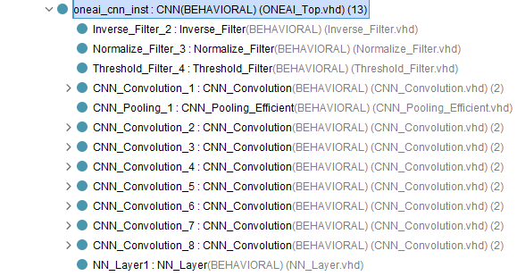
</figure>

Часть внутренней архитектуры сгенерированного IP-ядра при анализе Schematic в Vivado. Как следует из рисунка, расчёт отдельных слоёв осуществляется последовательно

<figure>
  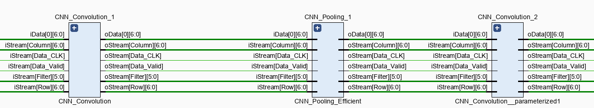
</figure>

#### Вывод и размышления об ограничениях
- Программа пока находится в стадии активной разработки, поэтому некоторые версии могут отличаться нестабильностью. В частности версия 1.0.15 в какой-то момент потеряла работоспособность, что потребовало переустановки. Функционал постепенно пополняется и видоизменяется.
- Инструмент предназначен для преимущественно задач **Vision AI**, результатом синтеза всегда является свёрточная нейронная сеть, CNN. Для задач анализа обработки данных без пространственных зависимостей может быть избыточен, а для задач анализа временных рядов недостаточен в связи с отсутствием поддержки обратной связи (**RNN**, **LTSM**). 
- Код является платформонезависимым, но вопрос о полноте использования возможностей DSP-блоков в разных семействах ПЛИС от одного вендора и ПЛИС от разных вендоров остаётся открытым. Разработчики в большей степени ориентируются на взаимодействие с **Altera**, поэтому, например, использование **AI Engines** в **AMD Versal** остаётся "серой областью" (для авторов мануала тоже, поскольку такого анализа не проводилось).
- Интерфейс, по которому осуществляется взаимодействие с IP-ядром, не является стандартным (AXI, Avalon, Wishbone и пр.), но при этом дан пример конвертера интерфейсов в виде файла Quartus_IP.
- Библиотека компонентов, используемых при генерации IP-ядра OneAI_CNN лежит в открытом доступе (без фильтров). Поэтому теоретически возможно осуществить синтез требуемой архитектуры самостоятельно, собрав необходимое количество слоёв, указав их настройки и передав веса в виде набора констант

