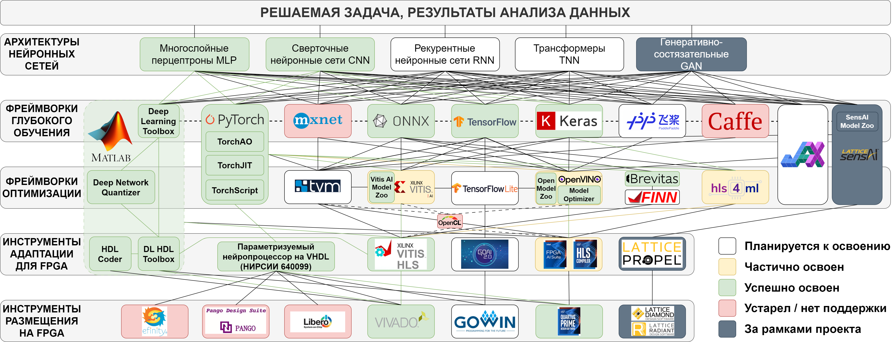
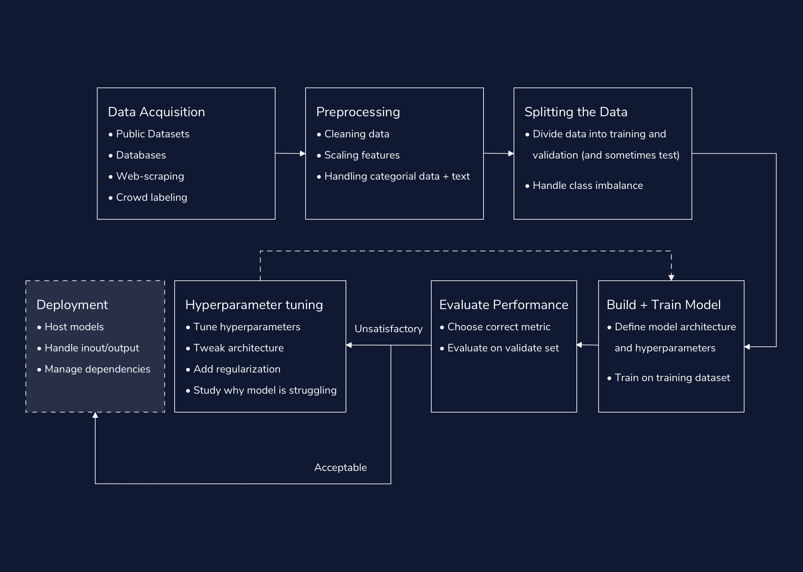
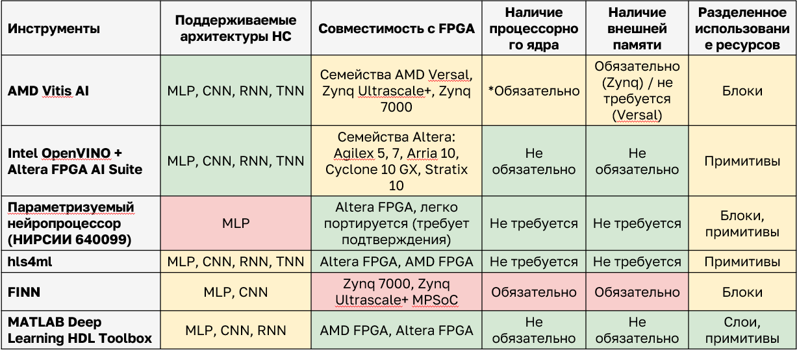

# **3. ПРОЦЕСС И СРЕДСТВА РАЗРАБОТКИ** 

Автоматизация проектирования технических решений на текущий момент занимает важное место в средствах достижения технического процесса. [Edge AI](glossary.md#edgeai) не является исключением: для каждого этапа имплементации, описанного в главе 2, существует множество специализированных программных инструментов.

## **3.1 Классификация программных инструментов** 

В данном руководстве мы предлагаем собственную классификацию, представленную на рис. 3.1.

<figure>
  
  <figcaption> Рисунок 3.1 – Классификация инструментов имплементации Edgei AI на [FPGA](glossary.md#fpga)</figcaption>
</figure>

## **3.2 Фреймворки глубокого обучения** 

В связи с необъятным количеством материала, в данном руководстве описан порядок работы только с наиболее распространенными фреймворками каждого уровня иерархии. На уровне фреймворков глубокого обучения следует выделить следующие:
* **PyTorch** ([Meta AI](https://pytorch.org/)):  наиболее популярный фреймворк для проведения исследований в области ИИ ([cmarix](https://www.cmarix.com/blog/pytorch-vs-tensorflow/)). Предлагает гибкий функционал для разработки, а также возможности для размещения и дальнейшей поддержки нейросетевых решений (TorchScript, LibTorch TorchServe). Обеспечивает возможность реализации крупных решений и масштабирования (PyTorch Lightning).
* **TensorFlow** ([Google](https://www.tensorflow.org/)): Tensorflow это промышленно-ориентированный фреймворк глубокого обучения, приоритизирующий производительность и простоту интеграции в индустриальные решения. Предлагает высокоуровневый API (application programming interface, интерфейс программирования приложений) Keras, получивший большую популярность среди разработчиков за счет простоты использования.
* **JAX** ([Google](https://github.com/jax-ml/jax)): открытый фреймворк глубокого обучения, специализированный для обеспечения высокой производительности при размещении инференса на различных аппаратных ускорителях.
* **ONNX** ([Open Neural Network eXchange](https://github.com/onnx/onnx)): фреймворк глубокого обучения, первым приоритетом создания которого являлось обеспечение совместимости и переносимости моделей между существующими фреймворками. 
* **PaddlePaddle** ([Baidu](https://www.paddlepaddle.org.cn/)): открытый фреймворк глубокого обучения, разработанный компанией Baidu, с акцентом на производительность и простоту использования. Предлагает полный стек инструментов для разработки, от подготовки данных до развёртывания моделей, включая встроенную поддержку квантования и оптимизации для различных аппаратных платформ. Особенно популярен в Азии и активно используется для production-решений благодаря надёжности и эффективности.

Также следует отметить немаловажные фреймворки MXNet ([Apache, Amazon](https://mxnet.apache.org/versions/1.9.1/)) и Caffe ([Berkeley AI Research](https://github.com/BVLC/caffe)), оказавшие существенное влияние на назвитие ИИ в целом, но не обновляемые на текущий момент.
Отметим, что фреймворки глубокого обучения прошли значительный путь развития, который привел их к значительной степени конвергенции. Так, когда-то ключевое различие между PyTorch и Tensorflow, заключавшееся в использовании динамических графов в PyTorch и статических графов в Tensorflow, с обновлениями исчезло (TorchScript, Tensorflow eager execution). В современном развитии фреймворков глубокого обучения можно выделить три основных тренда: функционал, оптимизация и удобство использования. 
Все перечисленные инструменты стремятся к добавлению поддержки всех возможных функций. При этом во всех случаях разработчики избирают модульную стратегию расширения. В основе такого подхода лежит добавление отдельных модулей для реализации новых функций при меньшем количестве модификаций центральной основы фреймворка. Модификации основы, в свою очередь, направлены преимущественно на улучшение оптимизации вычислений, столь важной в эпоху больших языковых моделей (БЯМ, от англ. large language model, LLM), и на внедрение поддержки нового математического аппарата. Развитие удобства пользования фреймворками глубокого обучения также приводит к появлению дополнительных модулей. Это в первую очередь касается высокоуровневых надстроек (PyTorch Lightning, Keras и т.п.), предназначенных для реализации крупных масштабируемых программных решений.
Большинство фреймворков глубокого обучения используют [Python](http://www.python.org) как основной язык программирования, с помощью которого осуществляется использование их функционала. Общая схема рабочего процесса глубокого обучения представлена на [рисунке 3.2](ch3.md#image_3_2) ([Code Academy](https://www.codecademy.com/article/deep-learning-workflow)).

<figure>
  
  <figcaption> Рисунок 3.2 – Схема рабочего процесса глубокого обучения </figcaption>
</figure>

Любая задача в сфере обработки данных начинается со сбора данных из различных источников. На сегодняшний день существует огромное количество готовых датасетов (от англ. dataset, набор данных) пригодных для реализации глубокого обучения. Существуют даже поисковые системы для датасетов, такие как [Google Dataset Search](https://datasetsearch.research.google.com/), [Kaggle](https://www.kaggle.com/datasets), [UCI Machine Learning Repository](https://archive.ics.uci.edu/). Помимо поисковых систем есть также крупные базы данных: [Data.gov](http://data.gov/), [Earth Data](https://www.earthdata.nasa.gov/), [CERN Open Data Portal](https://opendata.cern.ch/) и многие другие. Стоит также упомянуть наборы изображений от MNIST (Modified National Institute of Standards and Technology), на сегодняшний день используемые практически в любом учебном курсе по машинному обучению. Обычно процесс загрузки данных из датасетов требует особых навыков по работе с базами данных и интерпретации файлов специализированных форматов (CSV, TFRecord, HDF5). Иногда датасеты представляют собой структурированные директории, например, содержащие изображения различных классов.
Данные, поступающие на вход нейронной сети, практически всегда нуждаются в предварительной обработке. Всегда следует включать в предобработку нормализацию или стандартизацию, заключающиеся в приведении числовых признаков к единому масштабу – это ускоряет сходимость алгоритмов оптимизации, применяемых в ходе обучения. Также к данным может применяться аугментация, заключающаяся в искусственном увеличении количества данных за счет случайных преобразований (повороты, отражения, сдвиги, замена слов, частичное удаление, замена). Аугментация данных позволяет уменьшить влияние переобучения (от англ. overfitting) – слишком точной подстройки модели под обучающие данные, при которой модель запоминает даже шумы и незначительные детали. Финальным этапом предварительной обработки обычно является разбиение датасета на выборки для обучения, валидации и тестирования.

Более подробная информация по фреймворкам глубокого обучения доступна в следующих разделах:

* [3.2.1 PyTorch и TorchAO.Quantization: исследовательский полигон для Edge AI](ch3.2.1.md#ch3.2.1)
* [3.2.2 Tensorflow и TensorflowLite: высокооптимизированный фреймворк](ch3.2.2.md#ch3.2.2)
* [3.2.3 ONNX: необходимый клей для фреймворков глубокого обучения](ch3.2.3.md#ch3.2.3)
* [3.2.4 MATLAB Deep Learning Toolbox: самодостаточный модуль внутри гигантской экосистемы](ch3.2.4.md#ch3.2.4)
* [3.2.5 PaddlePaddle: простой и удобный фреймворк для решения рядовых задач](ch3.2.5.md#ch3.2.5)

Следует заметить, что разделы [3.2.1](ch3.2.1.md#ch3.2.1), [3.2.2](ch3.2.2.md#ch3.2.2) и [3.2.4](ch3.2.1.md#ch3.2.4) посвящены фреймворкам, которые помимо непосредственного построения и обучения нейронных сетей позволяют осуществлять их оптимизацию. В данных разделах также приводится описание работы со средствами оптимизации в их составе. [Следующий раздел](ch3.md#ch3.3) повествует о фреймворках, предназначенных исключительно для оптимизации нейронных сетей.

## **3.3 Фреймворки оптимизации нейронных сетей** 

Параллельно с развитием фреймворков для обучения появилась отдельная категория инструментов — фреймворки и компиляторы, фокусированные на оптимизации, преобразовании и целевом кодогенерировании нейронных сетей. Эти инструменты выступают на стыке программного и аппаратного обеспечения: они анализируют граф вычислений, заменяют и упрощают операции, проводят квантизацию и связывают модель с конкретным бэкэндом. Для задач Edge AI такие фреймворки критичны, поскольку позволяют перейти от прототипа к эффективно исполняемой модели с контролируемыми задержками и требованиями к ресурсам.

Ключевые цели фреймворков оптимизации:

* Преобразование и оптимизация графа вычислений для уменьшения числа операций и памяти;
* Поддержка различных стратегий [квантизации](glossary.md#quantization) (PTQ, QAT) и оптимизированных примитивов для целевых платформ;
* Генерация промежуточных представлений (ONNX, Relay) и целевых бинарников/библиотек для компиляторов аппаратных ускорителей;
* Автоматизация пайплайна от обученной модели до артефактов, готовых к синтезу/развёртыванию.

Наиболее примечательны следующие фреймворки оптимизации:

* **Apache TVM** ([Apache TVM](https://tvm.apache.org/)): открытый компилятор для ускорения моделей машинного обучения на различных платформах (в т.ч. FPGA). TVM часто используется как связующее звено между фреймворком и низкоуровневыми backend-компиляторами.
* **Vitis AI (Xilinx)** ([Xilinx](https://www.xilinx.com/products/design-tools/vitis/vitis-ai.html)): коммерческий набор инструментов и компилятор для Xilinx/AMD FPGA; включает преобразование моделей (ONNX/TensorFlow/PyTorch), оптимизации, инструменты калибровки и статической/динамической квантизации, а также компиляцию для DPU (Deep Processing Unit).
* **Intel OpenVINO** ([Intel](https://docs.openvino.ai/)): набор инструментов Intel для оптимизации и ускорения инференса на [CPU](glossary.md#cpu), [GPU](glossary.md#gpu), VPU и FPGA; позволяет реализовать преобразование моделей в промежуточное представление (от англ. intermediate representation), статическую оптимизацию графа, квантование и интеграцию с аппаратными движками Intel.
* **Brevitas + FINN** ([Brevitas](https://github.com/Xilinx/brevitas), [FINN](https://github.com/Xilinx/finn)): связка инструментов для исследований в области низкоразрядных сетей; `Brevitas` — PyTorch-библиотека для аннотирования и подготовки моделей к квантованию, `FINN` — фреймворк для компиляции низкоразрядных моделей в аппаратные реализации ([HLS](glossary.md#hls)/[RTL](glossary.md#rtl)) с упором на FPGA.
* **hls4ml** ([hls4ml](https://hls4ml.github.io/)): инструмент, упрощающий преобразование небольших нейросетевых моделей в HLS-описания (C/C++ для синтеза в [VHDL](glossary.md#vhdl)/[Verilog](glossary.md#verilog)); широко используется в научных и встроенных приложениях с ограниченными ресурсами.

На [рис. 3.3](ch3.md#image_3_3) приводится сводка особенностей и ограничений фреймворков, используемых на этапе оптимизации нейросетевой модели. Подробнее о разделенном использовании ресурсов можно прочитать в [главе 2](ch2.md#image_2_2).

<figure>
  
  <figcaption> Рисунок 3.3 – Ограничения и особенности инструментов </figcaption>
</figure>

Все перечисленные инструменты дополняют друг друга: часть фреймворков ориентирована на исследовательские и кроссплатформенные сценарии (Apache TVM, Brevitas/FINN), другие — на промышленное развёртывание и тесную интеграцию с конкретными платформами (Vitis AI, OpenVINO, hls4ml). В следующих разделах будут приведены практические рекомендации по использованию каждого из инструментов при подготовке моделей для FPGA-развёртывания и Edge-инференса.

* [3.3.1 Apache TVM: открытый кросс-платформенный фреймворк для оптимизированного инференса](ch3.3.1.md#ch3.3.1)
* [3.3.2 Vitis AI: проприетарная экосистема для быстрого развертывания и настройки AI-решений](ch3.3.2.md#ch3.3.2)
* [3.3.3 Intel OpenVINO: многофункциональный мост к инференсу на различных платформах](ch3.3.3.md#ch3.3.3)
* [3.3.4 Brevitas: исследовательский инструмент с упором на гибкую квантизацию](ch3.3.4.md#ch3.3.4)
* [3.3.5 FINN: промежуточный компилятор для квантованных моделей](ch3.3.5.md#ch3.3.5)
* [3.3.6 hls4ml: мощный и требовательный инструмент для реализации сверхбыстрого инференса на FPGA](ch3.3.6.md#ch3.3.6)

## **3.4 Фреймворки адаптации нейронных сетей для размещения на FPGA** 

* [3.4.1 MATLAB Deep Learning HDL Toolbox: гибкий исследовательский фреймворк для ускорения инференса с помощью программируемой логики](ch3.4.1.md#ch3.4.1)
* [3.4.2 Vitis HLS: универсальный инструмент высокоуровневого синтеза для AMD FPGA](ch3.4.2.md#ch3.4.2)
* [3.4.3 FPGA AI Suite и Intel HLS Compiler: простая компиляция нейронных вычислителей для размещения на FPGA](ch3.4.3.md#ch3.4.3)
* [3.4.4 GoAI 2.0: мелкомасштабный фреймворк для мелкомасштабных вычислений](ch3.4.4.md#ch3.4.4)

## **3.5 Фреймворки размещения нейронных сетей на FPGA** 

Продолжение: см. [4. ПРИМЕРЫ РЕАЛИЗАЦИИ](ch4.md#ch4).