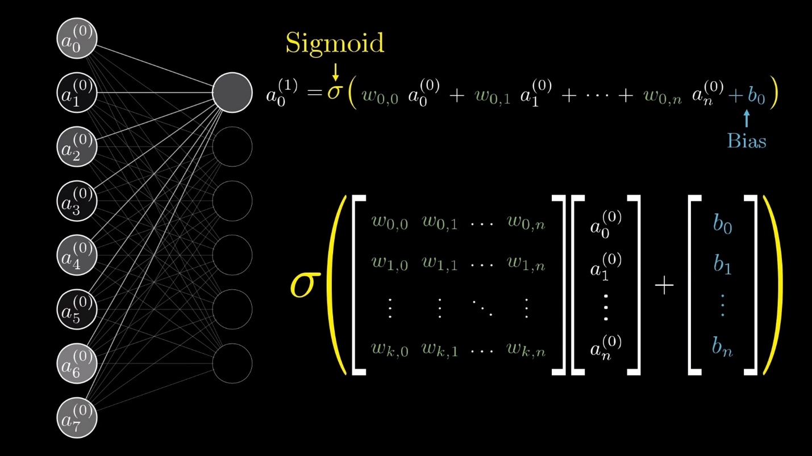
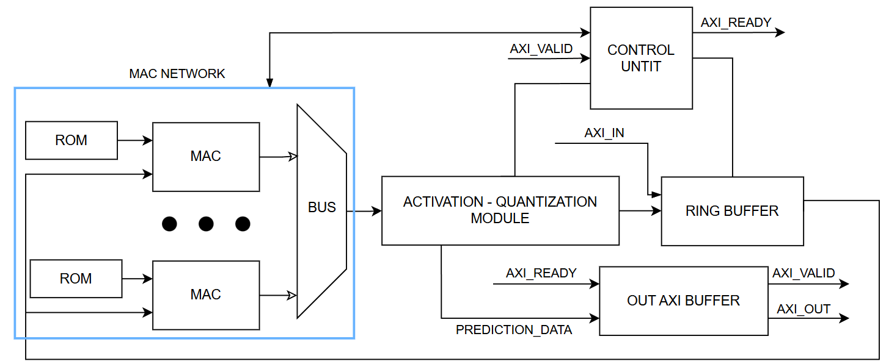
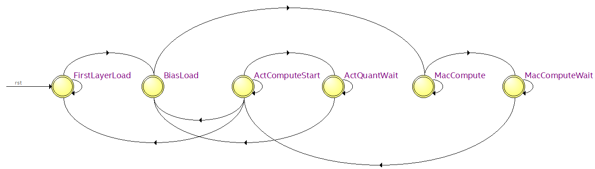
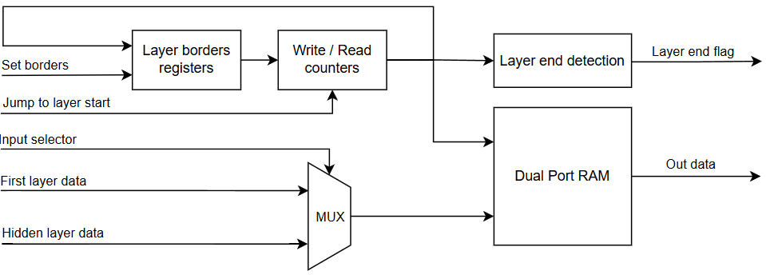
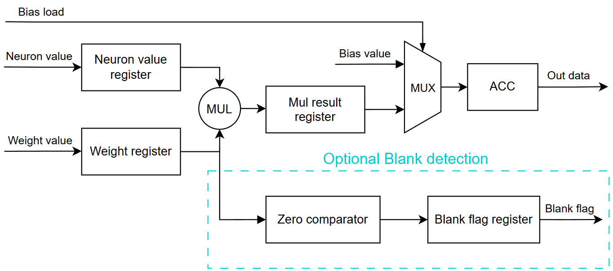
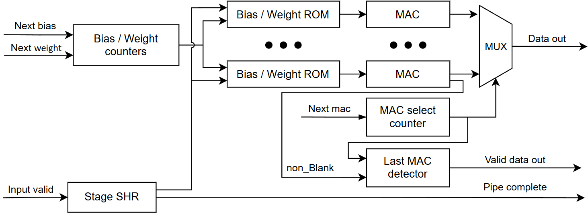
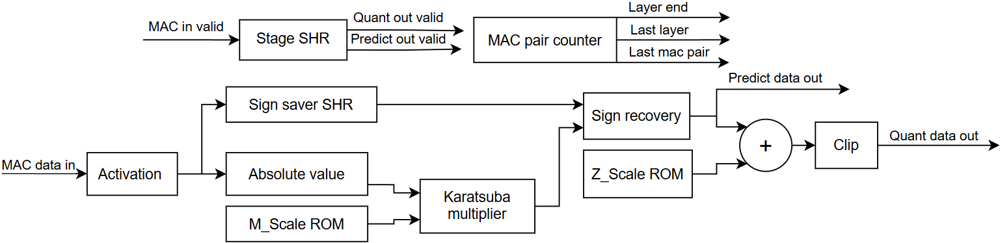
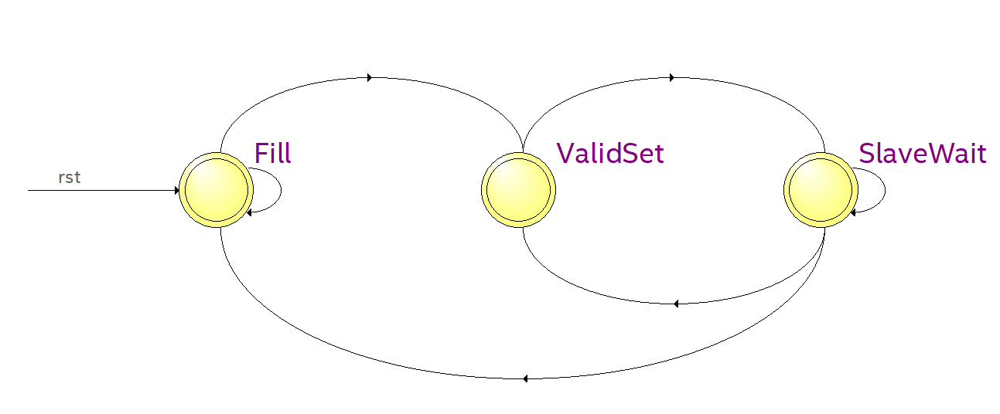

## **4.1 Нейропроцессор на HDL: от концепции к параметризуемой архитектуре** <a name="ch4.1"></a>

<div style="text-align: justify">
Данный проект изначально задумывался с ориентацией на использование недорогих ПЛИС, что предопределило подход к проектированию. Ключевой целью стала максимальная экономия ресурсов кристалла, где основным методом ее достижения был избран resource sharing, то есть совместное использование вычислительных блоков различными задачами. Такой подход призван обеспечить успешный синтез и функционирование проекта на ПЛИС со сравнительно небольшим количеством логических элементов (до 100 тыc). Следовательно, это позволило бы размещать нейронные вычислители на маломощных и недорогих устройствах.

Однако в процессе работы закономерно возник вопрос: если мощные ПЛИС предлагают значительно больше логических элементов и памяти, то почему бы не использовать этот потенциал по максимуму? Это соображение привело к выводу, что архитектура не должна быть статичной. Чтобы быть гибкой и универсальной, она обязана быть параметризуемой. Таким образом, была принята концепция вычислительного ядра, способного динамически подстраивать свою производительность и количество занимаемых ресурсов не только под конкретную задачу, но и под целевую ПЛИС. Это позволило бы осуществлять внедрение посредством единого программно-аппаратного решения для всего спектра устройств от маломощных до высокопроизводительных.

В рамках данного проекта работа с памятью была организована с использованием встроенной блочной памяти ([BRAM](glossary.md#bram)) ПЛИС. Это решение эффективно для сетей, параметры и промежуточные данные которых полностью помещаются в этот ресурс. Однако ключевым вызовом становится масштабирование. Для больших сетей, чей объем превосходит доступную блочную память, единственным решением является переход на использование внешней DDR-памяти. Это позволяет работать с нейросетями с огромным количеством параметров, но требует реализации специальных механизмов для эффективного управления данными и минимизации задержек.

В качестве реализуемой модели была выбрана квантованная полносвязная нейронная сеть (MLP). Этот тип сетей обладает наиболее простой структурой, что делает её идеальным полигоном для отладки всех ключевых компонентов программного решения и уменьшает затраты ресурсов ПЛИС. Успешная реализация подтвердит корректность работы базовых механизмов решения и жизнеспособность параметризуемой основы для последующего развития, в том числе для поддержки сложных структур (например, свёрточных нейронных сетей).

### 4.1.1 Разработка архитектуры параметризуемого нейропроцессора <a name="ch4.1.1"></a>

Разработка архитектуры параметризуемого нейропроцессора началась с анализа математической модели полносвязного слоя. Для вычисления выходного значения нейрона используется представленный на [рисунке 4.1.1](ch4.1.md#image_4_1_1) [алгоритм](https://youtu.be/aircAruvnKk?si=HBE_y4kLMfjg-DnU), где выходное значение вычисляется как функция активации от суммы смещения (bias) и произведений значений нейронов предыдущего слоя на соответствующие значения весов.

<a name="image_4_1_1"></a>
<figure>
  
  <figcaption> Рисунок 4.1.1 – Алгоритм вычисления нейрона</figcaption>
</figure>

В ходе анализа были подмечены следующие закономерности, определившие дальнейший подход:

1. Смещение как начальное значение. Было отмечено, что смещение можно рассматривать не как отдельное слагаемое, а как начальное значение для аккумулятора суммы, с которого начинается процесс вычислений.
2. Локальность данных. Для расчета слоя n требуются только данные слоя n-1. Информация о более ранних слоях к этому моменту становится не нужна. Это указывает на возможности по минимизации количества единовременно хранимых данных.
3. Возможность параллелизма. Порядок вычислений для разных нейронов в пределах одного слоя идентичен и не зависит от результатов расчетов для других нейронов этого же слоя. Это обуславливает возможность эффективной параллелизации вычислений при размещении на программируемой логике.
4. Особенности квантованных вычислений.
Архитектура нейропроцессора разработана для квантованных нейросетей, это накладывает дополнительные требования к реализации по сравнению со стандартной архитектурой полносвязного перцептрона. В частности, требуется модуль квантования, работающий последовательно после функцией активации, а также дополнительные ПЗУ-памяти (ROM) для хранения масштабных коэффициентов квантования (scales) результатов вычисления активации.
5. Организация памяти. Поскольку основной упор делается на компактность решение должно эффективно использовать ограниченные ресурсы встроенной блочной памяти путем грамотной организации хранилищ для параметров сети и промежуточных данных.

С учетом всех этих факторов была разработана *блочная структура параметризуемого нейропроцессора* представленная на [рисунке 4.1.2](ch4.1.md#image_4_1_2).

<a name="image_4_1_2"></a>
<figure>
  
  <figcaption> Рисунок 4.1.2 – Блок-схема нейропроцессора></figcaption>
</figure>

Вычислительные [MAC](glossary.md#mac)-блоки (от англ. MAC – multiply-accumulate, умножение с накоплением) реализуют операции умножения значений текущего слоя a на соответствующие веса `ω` и их сложение со значениями смещений `b`. Результаты вычислений поступают на модуль вычисления активационной функции.

Организация хранения весов и смещений для MAC-блоков является важной задачей для обеспечения оптимальной производительности и ресурсоэффективности всей системы. В рамках проекта были проанализированы два базовых подхода:

* ***Централизованная память** (Shared ROM): единый банк данных с общей шиной для всех вычислительных блоков. **Централизованная память** минимизирует фрагментацию ресурсов памяти ПЛИС. Под фрагментацией в данном контексте понимается неэффективное использование блоков статической памяти (BRAM), когда из-за небольшого размера или нестандартной ширины множества распределённых банков, часть ёмкости каждого BRAM остаётся незадействованной. Единый большой банк памяти использует BRAM практически на 100% своей доступной глубины. Однако этот подход создаёт узкое место производительности - необходимость в высокоразрядной мультиплексируемой шине данных, которая сложна в маршрутизации, создаёт длинные линии задержек и ограничивает частоту работы системы. Более того, максимальная разрядность шины данных для BRAM на целевой платформе (например, 72 бита на блок в архитектуре Xilinx UltraScale+) становится жёстким архитектурным ограничением для масштабирования.
* **Распределённая память** (Local ROM): небольшие индивидуальные банки данных, расположенные вплотную к соответствующим MAC-блокам. **Распределённая память** устраняет проблему шины: доступ к данным становится локальным, что существенно снижает задержки и упрощает маршрутизацию, позволяя системе работать на более высокой тактовой частоте. Недостатком является потенциальное снижение эффективности утилизации BRAM, когда для хранения небольшого массива весов может быть выделен целый блок памяти, часть ёмкости которого не используется. Это приводит к росту общего потребления ресурсов BRAM при большом количестве нейронов.

Анализ и синтез для целевой платформы показали, что ограничение по максимальной ширине шины данных BRAM делает реализацию централизованного подхода неприемлемой из-за невозможности обеспечить требуемую параллельную подачу данных на все MAC-блоки. Таким образом, несмотря на потенциально менее оптимальное использование ёмкости каждого BRAM, вариант с индивидуальными ROM для каждого MAC-блока был выбран как наилучший для достижения целевой производительности. Вопрос оптимизации утилизации распределённых BRAM для минимизации фрагментации является отдельной задачей параметризированного синтеза и может решаться на этапе генерации проекта.

Все MAC-блоки и их индивидуальные ROM памяти интегрированы в модуль Mac Network. Этот модуль представляет собой совокупность вычислительных узлов и управляющей логики для их координации. Данные из ROM поступают на входы MAC-блоков, количество которых в текущей реализации задается пользователем. Внутри модуля присутствуют управляющие сигналы для выбора операции: загрузки начального значения смещения в аккумулятор или выполнения MAC операции. Дополнительные сигналы через мультиплексор выбирают, результат какого MAC блока будет направлен на вычисление функции активации.

Блок `Activation-Quantization module` выполняет вычисление нелинейного преобразования и последующая квантизация результата. В текущей реализации в качестве функции активации используется `[ReLU](glossary.md#relu)`. После этого рассчитанное значение нейрона сохраняется для последующего использования.

Для хранения выходных данных используется Кольцевой буфер (`[Ring Buffer](glossary.md#ringbuffer)`). Это позволяет эффективно управлять памятью, перезаписывая данные, которые больше не потребуются на будущих шагах вычислений, что критически важно для работы в условиях ограниченных ресурсов встроенной памяти ПЛИС. Пока в него записываются новые результаты, параллельно производится чтение значений, вычисленных на предыдущем слое для вычислений в MAC-блоках.

Центральным управляющим элементом всей системы является управляющий модуль (`Control Unit`). Его работа заключается в управления вычислительным конвейером, он напрямую отвечает за организацию обмена данными с внешней памятью через AXI интерфейс, контролируя процесс загрузки значений первого слоя.

За выгрузку отвечает модуль `Axi Out Buffer`, который организует выгрузку выходных данных по AXI интерфейсу независимо от [FSM](glossary.md#fsm).

### 4.1.2 Детальное описание реализации архитектурных модулей на языке описания аппаратуры VHDL <a name="ch4.1.2"></a>

Данный раздел посвящён непосредственному переводу разработанной архитектуры нейропроцессора в синтезируемый [VHDL](glossary.md#vhdl)-код. Программную реализацию разработанной архитектуры нейропроцессора было решено именовать `NPU` (от англ. Neural Processing Unit). Здесь подробно рассматриваются ключевые модули, их интерфейсы (порты), внутренняя структура и управляющие автоматы. Особое внимание уделено механизму параметризации, обеспечивающему гибкую настройку разрядности данных, количества нейронов, слоёв и MAC-блоков.

#### 4.1.2.1 Файл конфигурации (NN_package)** <a name="ch4.1.2.1"></a>

Основой параметризации NPU является библиотека проекта - файл конфигурации, реализованный на VHDL как пакет (package). В нём собраны все задаваемые константы, специализированные типы данных и вспомогательные функции, обеспечивающие передачу параметров к каждому экземпляру (Instance) NPU и вычисление размеров вычислительных блоков и памяти.
Данный файл является единственным, требующим модификации пользователем, если проект рассматривается как «чёрный ящик» или IP-ядро. То есть, пользователь может изменять только значения параметров конфигурации, не затрагивая внутреннюю архитектуру для настройки реализации NPU.

**Основные параметры**

Ключевыми элементами системы параметризации являются следующие константы:

* `NN_CNT` - количество экземпляров NPU, подлежащих синтезу. Этот параметр также задаёт размеры трёх ключевых массивов конфигурации (`NN_CONFIG`, `LAYERS_MAP`, `MIF_MAP`), которые служат для независимой параметризации каждого экземпляра: в них хранятся архитектурные параметры сетей, размерности слоёв и пути к файлам инициализации весов и коэффициентов соответственно.
* `NN_CONFIG` — массив структур, в котором задаются параметры каждого экземпляра NPU: количество MAC-блоков, число слоёв, ширины шин данных и т.д.
* `LAYERS_MAP` — двумерный массив, определяющий количество нейронов в каждом слое для каждого экземпляра NPU.
* `MIF_MAP` — массив, содержащий пути к MIF-файлам (от англ. memory initialization file) для весов, смещений и коэффициентов квантования.

Каждый MAC-блок имеет собственные MIF-файлы с весами и смещениями, поскольку он использует собственную блочную память при синтезе ROM.
Файлы масштабных коэффициентов являются общими, так как модуль функции активации и квантования единый для всех нейронов. Это реализуемо благодаря последовательной обработке результатов MAC-блоков их данные поступают в модуль поочерёдно, что позволяет последовательно считывать соответствующие коэффициенты из единых блоков памяти, где они заранее размещены в соответствующем порядке.

Важно строго соблюдать порядок файлов, указанный в индексных константах:

* `Z_FILE_INX` – индекс файла нулевого смещения.
* `M_FILE_INX` – индекс файла масштабных коэффициентов.
* `W_FILE_INX` – индекс файла весов для первого MAC-блока.

В файлы смещений располагаются всегда после весов, причем их положение в файле в явном виде не задается. Индекс файла смещений для первого MAC-блока определяется как сумма между индексом первого файла весов (`W_FILE_INX`) и кол-ва MAC-блоков (`Mac_Cnt`) в текущем экземпляре.

При необходимости изменения порядка подключения файлов пользователь обязан соответствующим образом изменить данные константы.

Пример заполнения всех перечисленных массивов для конфигурации двух экземпляров NPU выглядит следующим образом:

```vhdl
--  ------------------------------
 -- | USER INSTANCE CONFIGURATIONS |
 --  ------------------------------
 -- Number of instances of NPU
 constant NN_CNT    : natural                        := 2;
 constant NN_CONFIG : configs_arr(0 to (NN_CNT - 1)) := (
   0 => (
   Mac_Cnt       => 4,
   Layers_Cnt    => 3,
   Weight_Width  => 8,
   Bias_Width    => 32,
   Z_Scale_Width => 32,
   M_Scale_Width => 32,
   Acc_Width     => 32,
   Neuron_Width  => 8
  ),
   1 => (
   Mac_Cnt       => 666,
   Layers_Cnt    => 4,
   Weight_Width  => 8,
   Bias_Width    => 32,
   Z_Scale_Width => 32,
   M_Scale_Width => 32,
   Acc_Width     => 32,
   Neuron_Width  => 8
  )
  );
 -- Map of layers for each instance
 constant LAYERS_MAP : natural_2D_arr(0 to (NN_CNT - 1)) := (
   0 => (784, 128, 10),
   1 => (876, 512, 127, 117)
  );
 -- Map of mif files for each instance
 constant Z_FILE_INX    : natural                          := 0; --  Z_Scale mif index is 1 
 constant M_FILE_INX    : natural                          := 1; --  M_Scale mif index is 2 
 constant W_FILE_OFFSET : natural                          := 2; -- First weight mif index is 3 
 constant MIF_MAP       : string_2D_arr(0 to (NN_CNT - 1)) := (
   0 => (
   "Zs.mif",
   "Ms.mif",
   "W0.mif", "W1.mif", "W2.mif", "W3.mif",
   "B0.mif", "B1.mif", "B2.mif", "B3.mif"
  ),
   1 => (
   "Zscale_1.mif",
   "Mscale_1.mif",
   "Weight_1_0.mif", "Weight_1_1.mif", "Weight_1_2.mif", "Weight_1_3.mif",
   "Bias_1_0.mif", "Bias_1_1.mif", "Bias_1_2.mif", "Bias_1_3.mif"
  )
  );
```

**Описание функций пакета**

Библиотека проекта реализована в виде пакета, содержащего набор функций и констант, которые обеспечивают параметризацию, расчёт размеров аппаратных блоков и формирование соединительных структур между модулями нейропроцессора. Пакет предлагает пользователю следующие функции:

``` vhdl
 --  ---------------------
 -- | FUNCTION PROTOTYPES |
 --  ---------------------
 -- Project specific functions
 impure function WeightCellsCnt(inst_inx  : natural) return natural;
 impure function BiasCellsCnt(inst_inx    : natural) return natural;
 impure function RingBufCellsCnt(inst_inx : natural) return natural;
 impure function M_ScaleCellCnt(inst_inx  : natural) return natural;
 impure function MacTypesMapInit(inst_inx : natural) return sl_arr;
 impure function EdgeMacPairsMap(inst_inx : natural) return natural_arr;
 -- Quality of life functions
 function to_sl(b             : boolean) return std_logic;
 function to_slv(num          : natural; size : natural) return std_logic_vector;
 function Log2Ceil (arg       : natural) return natural;
 function CeilDivide(dividend : positive; divisor : positive) return natural;
 function LastElement(arr     : natural_arr) return natural;
 function getMsb(vec          : std_logic_vector) return std_logic;
 function ternary(cond        : std_logic; a, b : natural) return natural;
 function ternary(cond        : std_logic; a, b : std_logic) return std_logic;
 function ternary(cond        : boolean; a, b : std_logic) return std_logic;
 function ternary(cond        : std_logic; a, b : std_logic_vector) return std_logic_vector;
 function ternary(cond        : std_logic; a, b : signed) return signed;
 function ternary(cond        : std_logic; a, b : unsigned) return unsigned;
```

Функции можно разделить на две группы:

* Архитектурно-специфичные функции, участвующие в синтезе проекта и формирующие значения параметров и массивов.
* Вспомогательные функции, упрощающие код и обеспечивающие удобные операции над стандартными типами языка VHDL.

Большинство функций обращаются к глобальным объектам конфигурации (`NN_CONFIG` и др.) и потому объявлены с префиксом `impure`, что требуется стандартом VHDL при контекстно-зависимых вычислениях.

**Архитектурные функции**

Ниже приведено описание шести основных функций, применяемых при синтезе и инициализации модулей NPU.

1. `WeightCellsCnt`: возвращает количество ячеек памяти, требуемое для хранения весовых коэффициентов NPU. Вычисление основывается на числе связей между слоями и количестве используемых MAC-блоков. Для каждого слоя производится деление числа нейронов на количество MAC-блоков с округлением вверх, затем результат умножается на число входных нейронов предыдущего слоя.
2. `BiasCellsCnt`: определяет объём памяти, необходимый для хранения смещений.
Для каждого слоя количество ячеек определяется через число пар MAC-блоков, вычисленных по тому же принципу, что и в функции `WeightCellsCnt`. Возвращаемое значение используется при инициализации ROM-памяти смещений.
1. `RingBufCellsCnt`: рассчитывает глубину кольцевого буфера (Ring Buffer), необходимого для временного хранения промежуточных результатов между слоями.
Размер буфера определяется как максимальная сумма размерностей двух смежных слоёв (за исключением последнего). Это обеспечивает достаточное пространство для одновременного хранения данных предыдущего слоя и записи новых данных текущего слоя, что позволяет одновременно считывать старые значения и записывать новые.
1. `M_ScaleCellCnt`: возвращает количество ячеек памяти, требуемое для хранения масштабных коэффициентов квантования. Используется при формировании таблиц нормализации в блоке функции активации. Расчёт производится по числу всех слоёв, исключая входной, так как масштабирование применяется только к результатам вычислений.
2. `MacTypesMapInit`: формирует булеву карту, которая для каждого MAC-блока указывает, должен ли он выполнять проверку на избыточность. Эта карта используется внутри модуля `MAC_Network`: когда MAC-блок помечен как проверяющий, то при возникновении определённых условий он поднимает флаг избыточности. Этот флаг затем передаётся в управляющий модуль, который принимает решение о дальнейшей обработке. Оптимизация заключается в том, что достаточно определить лишь первый избыточный MAC-блок в конце слоя - все последующие (если они есть) автоматически считаются избыточными без дополнительных проверок.
3. `EdgeMacPairsMap`: возвращает массив индексов MAC-блоков, завершающих вычисление каждого слоя. Функция используется для синхронизации управляющего автомата при переходе между слоями и для адресации границ весовых таблиц.

**Вспомогательные функции (Service)**

Эта группа функций не участвует напрямую в синтезе вычислительных модулей, однако существенно упрощает запись выражений и повышает читаемость кода. Все они являются чистыми функциями (pure) и не зависят от глобальных параметров.

1. `to_sl`: преобразует булево значение (`TRUE`/`FALSE`) в сигнал типа `std_logic`.
2. `to_slv` преобразует натуральное число в вектор `std_logic_vector` заданной длины. В функции реализована проверка на выход значения за пределы допустимого диапазона, что предотвращает ошибку при синтезе.
3. `Log2Ceil` возвращает минимальное количество бит, необходимое для представления заданного десятичного числа в двоичном виде.
4. `CeilDivide` выполняет целочисленное деление с округлением вверх.
Используется для расчёта количества итераций, необходимых MAC-блокам для полной обработки слоя, даже если число нейронов в слое не кратно количеству MAC-блоков в текущем экземпляре `NPU`. *Пример: если в слое 10 нейронов, а просчитывается 4 MAC-блока за раз, функция вернёт 3. Это означает, что потребуется просчитать 12 MAC-блоков с 2 избыточными на последней итерации.*
5. `LastElement`: возвращает последний элемент массива натуральных чисел.
Часто используется при определении размера последнего слоя или адреса последнего элемента ROM.
6. `getMsb`: возвращает старший бит (MSB) вектора, что полезно для знакового анализа и обработки переполнений.
7. `ternary`: перегруженная функция тернарного оператора, реализующая условный выбор по булевому или логическому выражению.
Поддерживаются следующие типы данных: `natural`, `std_logic`, `std_logic_vector`, `signed`, `unsigned`.

Управляющий модуль (Control Unit)
Управляющий модуль координирует взаимодействие всех модулей нейропроцессора. Он содержит конечный автомат, который формирует управляющие сигналы на основе входных флагов и текущего состояния. Переходы между состояниями выполняются строго по внешним сигналам готовности без счётчиков и промежуточных регистров, что минимизирует избыточность управляющей логики и упрощает верификацию.

#### 4.1.2.2 Управляющий модуль (Control Unit) <a name="ch4.1.2.2"></a>

Управляющий модуль координирует взаимодействие всех модулей нейропроцессора. Он содержит конечный автомат, который формирует управляющие сигналы на основе входных флагов и текущего состояния. Переходы между состояниями выполняются строго по внешним сигналам готовности без счётчиков и промежуточных регистров, что минимизирует избыточность управляющей логики и упрощает верификацию. В таблице 4.1.1 приводятся входы и выходы управляющего модуля.

Таблица 4.1.1 - Интерфейс управляющего модуля

|Имя порта | Тип | Назначение |
|----------|-----|------------|
| clk | in:std_logic | Тактовый сигнал |
| rst | in: std_logic | Асинхронный сигнал сброса |
| axi_m_valid | in: std_logic | Готовность передачи по AXI |
| last_bus_mac | in: std_logic | Передача последнего MAC-результата |
| mac_pipe_complete | in: std_logic | Завершение вычислений MAC-конвейера |
| act_quant_last | in: std_logic | Сохранение последнего квантованного значения |
| last_mac_pair | in: std_logic | Последняя MAC-пара выходного слоя |
| layer_end | in: std_logic | Последняя MAC-пара скрытого слоя |
| last_layer | in: std_logic | Текущий слой сети - выходной |
| rb_layer_end | in: std_logic | Конец чтения cлоя из кольцевого буфера |
| axi_s_ready | out: std_logic | Готовность приёма по AXI |
| next_bias | out: std_logic | Загрузка следующих смещений |
| mac_in_val | out: std_logic | Валидность входных данных для MAC блоков |
| next_mac | out: std_logic | Подача следующего MAC-результата на шину |
| rb_first_layer_we | out: std_logic | Запись первого слоя в кольцевой буфер |
| nxt_mac_args | out: std_logic | Подача следующей пары вес/нейрон |
| rb_set_layer_borders | out: std_logic | Установка границ слоя в буфере |
| rb_jmp_layer_start | out: std_logic | Переход к началу предыдущего слоя |

**Особенности реализации**

Архитектура реализована как конечный автомат (FSM) с шестью состояниями. Код состояния закодирован в формате `"one-hot"`, что упрощает логику переходов и повышает скорость синтеза.

Вся логика модуля разделена на две части:

1. Последовательная логика (Seq-logic) — обеспечивает смену состояния на фронте clk с учётом асинхронного сброса `rst`.
2. Комбинаторная логика (Comb-logic) — формирует управляющие сигналы и вычисляет следующее состояние автомата в зависимости от текущего состояния и входных сигналов.

Диаграмма состояний автомата представлена на [рисунке 4.1.3](ch4.1.md#image_4_1_3).

<a name="image_4_1_3"></a>
<figure>
  
  <figcaption> Рисунок 4.1.3 – Диаграмма состояний автомата</figcaption>
</figure>

**Состояния и переходы**

`FSM` содержит шесть состояний:

1. `FirstLayerLoad` — выполняется начальная загрузка квантованных значений первого слоя через AXI-интерфейс. При активном axi_m_valid данные записываются в кольцевой буфер, поднимая флаг начала записи первого слоя (rb_first_layer_we). После получения сигнала rb_layer_end (запись последнего значения входного слоя) выставляются границы входного слоя, используя сигнал rb_set_layer_borders, после чего FSM переходит в состояние загрузки смещений BiasLoad.
2. `BiasLoad` — используется сигнал next_bias для загрузки смещений в аккумуляторы MAC-блоков. Параллельно подаются начальные аргументы для умножения с помощью сигнала nxt_mac_args, что обеспечивает предварительное считывание весов и значенин предыдущего нейрона. После инициализации данных выполняется переход в состояние MacCompute.
3. `MacCompute` - основная фаза вычислений. Активируется сигнал mac_in_val, разрешающий подачу новых данных в вычислительный конвейер MAC-блоков. Пока не достигнут конец предыдущего слоя в кольцевом буфере (активен rb_layer_end), происходит непрерывная подача новых весов и значений предыдущего слоя (активен nxt_mac_args). После поступления последнего значения предыдущего слоя, FSM переходит в MacComputeWait.
4. `MacComputeWait` — ожидание завершения вычислений последней операции умножения с накоплением для всех MAC-блоков (mac_pipe_complete активен). После завершения конвейера активируется next_mac — сигнал подачи первого значения из MAC-блоков в модуль функции активации, и осуществляется переход в состояние ActComputeStart.
5. `ActComputeStart` — выполняется подача результатов MAC-блоков на вход функции активации (next_mac активно). После передачи последнего результата (last_bus_mac активен) анализируется структура текущего слоя.
Если текущий слой является выходным (last_layer активен) и при этом передана последняя MAC-пара (last_mac_pair активен), FSM завершает работу и возвращается в исходное состояние FirstLayerLoad.
Если текущий слой выходной, но текущая MAC-пара не является конечной, осуществляется переход к следующей итерации расчёта MAC-блоков - выполняется переход к началу предыдущего слоя используя сигнал rb_jmp_layer_start  и переход в состояние BiasLoad.
Если текущий слой не является выходным, FSM сразу переходит в состояние ожидания завершения квантизации ActQuantWait.
6. `ActQuantWait` - ожидание сохранения последнего квантованного значения из конвейера функции активации при активном сигнале act_quant_last. Если при этом завершён расчёт текущего скрытого слоя (layer_end активно), активируется сигнал rb_set_layer_borders для выставления новых границ слоя в кольцевом буфере. Если вычисление слоя не завершено, то выполняется прыжок к начальному адресу предыдущего слоя, используя сигнал rb_jmp_layer_start, что инициирует повторный цикл вычислений по тем же значениям предыдущего слоя. После выполнения соответствующего действия FSM возвращается в состояние BiasLoad для начала вычислений следующей MAC пары.

**Итоговые замечания**
Управляющий модуль является центральным элементом архитектуры нейропроцессора (NPU), обеспечивающим синхронизацию работы всех вычислительных и служебных блоков. Его конечный автомат (от англ. finite state machine, FSM) реализует строгую последовательность переходов между стадиями инициализации, загрузки данных и выполнения вычислений, обеспечивая корректное взаимодействие между подсистемами памяти, MAC-сетью и модулем функции активации.

Каждое состояние автомата направлено на выполнение конкретной задачи — от конфигурации и подготовки памяти до выдачи финальных квантованных значений в кольцевой буфер. Логика переходов построена таким образом, чтобы исключить состояние неопределённости при любом сочетании сигналов и гарантировать восстановление работы после завершения цикла.

Модуль также реализует механизм отслеживания граничных состояний вычислений через сигналы last_mac_pair, act_quant_last и layer_end. Такая схема обеспечивает чёткое разделение фаз обработки слоёв и автоматический переход к следующей конфигурации. Передача данных между функциональными блоками осуществляется синхронно, что гарантирует устойчивость к временным рассогласованиям.

Таким образом, управляющий модуль формирует основу всей системы, обеспечивая согласованность операций внутри нейропроцессора, минимизацию задержек и корректное завершение вычислительных циклов при заданных параметрах конфигурации. Его структура может служить отправной точкой при дальнейшей модификации архитектуры, включая расширение числа создаваемых экземпляров, оптимизацию глубины конвейера и интеграцию новых типов активационных функций.

#### 4.1.2.3 Кольцевой буфер (Ring Buffer) <a name="ch4.1.2.3"></a>

Модуль кольцевого буфера обеспечивает хранение и передачу данных между слоями нейропроцессора. Он используется для временного сохранения выходов предыдущего слоя и последующей подачи их в MAC-блоки при вычислении текущего. Кроме того, буфер следит за границами слоёв, обеспечивая корректное чтение и запись данных без пересечения областей памяти. В таблице 4.1.2 приводятся входы и выходы кольцевого буфера.

Таблица 4.1.2 - Интерфейс кольцевого буфера

| Имя порта | Тип | Назначение |
| --------- | --- | ---------- |
| clk | in: std_logic | Тактовый сигнал |
| rst | in: std_logic | Асинхронный сигнал сброса |
| ext_we | in: std_logic | Запись значения входного слоя |
| we | in: std_logic | Запись значения скрытого слоя |
| re | in: std_logic | Чтение данных предыдущего слоя |
| set_layer_borders | in: std_logic | Установка границ предыдущего слоя |
| jmp_layer_start | in: std_logic | Переход к началу предыдущего слоя |
| neuron_data | in: std_logic_vector | Данные скрытого слоя |
| first_layer_data | in: std_logic_vector | Данные входного слоя |
| out_data | out: std_logic_vector | Выходные данные предыдущего слоя |
| layer_end | out: std_logic | Сигнал конца предыдущего слоя |

**Особенности реализации блока**

Основу модуля составляет двухпортовая RAM-память, обеспечивающая параллельное чтение и запись. К каждому из адресных портов привязаны отдельные счётчики — голова (`head`) для записи и хвост (`tail`) для чтения. Их состояние определяет, какие данные будут помещены в память и какие — считаны. Блок схема модуля представлена на [рисунке 4.1.4](ch4.1.md#image_4_1_4).

<a name="image_4_1_4"></a>
<figure>
  
  <figcaption> Рисунок 4.1.4 – Блок схема модуля Кольцевого буфера</figcaption>
</figure>

Для организации структуры слоёв предусмотрены регистры фиксации текущих значений указателей:

* при активации сигнала set_layer_borders фиксируются значения начала и конца слоя из счетчиков хвоста и головы.
* при чтении реализована проверка достижения конца слоя - если счётчик чтения достигает значения регистра конца слоя, активируется сигнал layer_end.

Также в модуле присутствует логика выбора источника данных для записи:

* при активном ext_we поступают данные входного слоя (first_layer_data).
* при активном we - поступают квантованного данные скрытого слоя (neuron_data).

**Принцип работы**

Работа буфера основана на принципе кольца. Каждый новый слой записывается поверх предыдущего, но только после фиксации его границ. Таким образом обеспечивается постоянная подача очередных входных данных без избыточного использования памяти.

1. Запись данных. Сигнал ext_we управляет записью данных первого слоя сети в память. Эти данные поступают извне нейропроцессора. Сигнал we управляет записью данных скрытых слоёв, которые поступают после обработки в модуле активации и квантования.
2. Чтение данных. Сигнал re инициирует чтение данных предыдущего слоя для подачи в MAC-блоки. При достижении адреса конца слоя устанавливается `layer_end`, указывающий на завершение чтения текущего скрытого слоя.
3. Обновление границ. После завершения записи слоя активируется `set_layer_borders`, фиксирующий новые значения начала и конца слоя в регистрах указателях. При подаче `jmp_layer_start` происходит возврат к адресу начала слоя по значению в регистре начала слоя, что позволяет повторно использовать данные без дополнительной инициализации.

Таким образом, модуль обеспечивает автоматическое чередование циклов записи и чтения без потери данных и гарантирует непрерывное снабжение MAC-блоков актуальными значениями нейронов.

**Итоговые замечания**
Модуль является элементом межслойного обмена. Его архитектура минималистична, не зависит от параметров конфигурации сети и обеспечивает устойчивую работу при заданном числе слоёв и нейронов в экземпляре нейропроцессора. Использование кольцевого принципа позволяет исключить необходимость внешней адресации и уменьшить количество управляющей логики.

#### 4.1.2.4 Сеть блоков умножения с накоплением (MAC Network) <a name="ch4.1.2.4"></a>

Данный модуль представляет собой совокупность основных вычислительных ядер системы, обеспечивающих параллельное выполнение множества операций умножения с накоплением (MAC). Каждый из MAC-блоков формирует взвешенную сумму определённого нейрона, а общая организация конвейера позволяет существенно увеличить пропускную способность вычислений. В процессе работы модуль обеспечивает обработку n операций «`вес * входное значение`» за 2 такта, контролирует корректность загрузки новых весов и смещений, а также выявляет избыточные MAC-блоки в конце слоя.

Таблица 4.1.2 - Интерфейс сети блоков умножения с накоплением

| Имя порта | Тип | Назначение |
| --------- | --- | ---------- |
| clk | in: std_logic | Тактовый сигнал |
| rst | in: std_logic | Асинхронный сигнал сброса |
| next_bias | in: std_logic | Загрузка новых смещений |
| mac_in_val | in: std_logic | Валидные данные на входе конвейера |
| next_weight | in: std_logic | Загрузка новых весов |
| next_mac | in: std_logic | Выдача следующего MAC-результата |
| neuron_data_in | in: std_logic_vector | Значение нейрона предыдущего слоя |
| pipe_complete | out: std_logic | Завершение работы конвейера |
| last_mac | out: std_logic | Отправлен последний MAC-результат |
| mac_out_val | out: std_logiс | Валидность выходного MAC-результата |
| neuron_data_out | out: std_logic_vector | Выходное значение MAC-результата |

**Особенности реализации блока**

Конвейерный регистр стадий (Stage SHR), общий для всех MAC-блоков, отслеживает текущий этап вычислений в конвейере и определяет его заполненность. Это позволяет эффективно следить за работой конвейера, в том числе детектировать его опустошение для точного определения завершения вычислений.

Этапы вычислений регистре стадий:

1. Фиксация входных данных (веса и предыдущего значения нейрона)
2. Фиксация результата умножения и флага избыточности
3. Аккумуляция частичных сумм.

Параметризация через конфигурационный пакет позволяет изменять количество MAC-блоков и их тип без изменения структуры модуля.
На [рисунке 4.1.5](ch4.1.md#image_4_1_5) представлена блок схема MAC-блока.

<a name="image_4_1_5"></a>
<figure>
  
  <figcaption> Рисунок 4.1.5 – Блок схема MAC блока</figcaption>
</figure>

Избыточными считаются те MAC-блоки, которые в течение всего цикла вычислений получают на вход исключительно нулевые весовые коэффициенты. Такое состояние невозможно при нормальной работе сети, поэтому оно служит признаком «избыточного» вычислителя. При отправке данных MAC-блоков в функцию активации-квантизации флаг избыточного состояния помогает заранее определить отправку последнего валидного результата. Блок схема модуля представлена на рисунке [рисунке 4.1.6](ch4.1.md#image_4_1_6).

<a name="image_4_1_6"></a>
<figure>
  
  <figcaption> Рисунок 4.1.6 – Блок схема модуля MAC сети</figcaption>
</figure>

Важным моментом является то, что проверка «избыточных» блоков реализуется не во всех MAC-блоках. Если MAC-блок в слое является избыточным, то все блоки с более высоким индексом (расположенные далее по каскаду) автоматически также считаются избыточным. Таким образом, достаточно реализовать логику проверки только в первом по индексу избыточном MAC-блоке. Это позволяет исключить лишние проверки и сократить количество потребляемых ресурсов без потери функциональности.
При переходе к следующему слою сеть вновь активирует необходимое количество MAC-блоков, и, если ранее «пустые» блоки теперь являются задействованными, они автоматически вовлекаются в вычисления без необходимости дополнительных изменений в архитектуре.

Теоретически, использование отдельного счётчика для каждой ROM памяти позволило бы полностью исключить выделение памяти под нулевые данные для избыточных MAC-блоков, поскольку управление чтением для каждой памяти было бы независимым. Это дало бы возможность отключать чтение памяти, если соответствующий ей MAC-блок в текущий такт является избыточными, тем самым исключая необходимость резервирования в памяти места под нулевые значения. Однако этот подход требует создания отдельной управляющей логики для каждого MAC-блока, что приводит к значительному росту числа регистров и соединений, усложняет маршрутизацию и резко увеличивает потребление ресурсов.

В связи с этим была выбрана архитектура с двумя общими счётчиками (один — для адресации всех ROM для значений весов, второй — для всех ROM со значениями смещений), которая минимизирует управляющую логику. Основным компромиссом данного решения является необходимость выделения памяти под нулевые данные для обнаружения избыточных MAC-блоков, возникающих, когда количество нейронов в слое не кратно числу MAC-блоков. Это может привести к неэффективному использованию памяти, но обеспечивает простую и централизованную схему адресации для всех ROM.
Эффективность такой архитектуры оценивается через **коэффициент утилизации параллелизма (КУП)** — усреднённый показатель утилизации MAC-блоков по всем слоям сети. Потери памяти становятся приемлемыми, если КУП близок к нулю, то есть, когда количество избыточных MAC-блоков в большинстве слоев невелико. Оптимальным является случай, когда размер каждого слоя кратен числу MAC-блоков, то есть КУП равен 0 проверки на избыточность не требуются, и память используется наиболее эффективно.

Таким образом, задача проектирования сводится к подбору такого количества MAC-блоков, которое максимизирует КУП для целевой нейронной сети, обеспечивая баланс между производительностью и эффективным использованием ресурсов памяти.

**Принцип работы**

При активации сигнала `mac_in_val` входные данные — значения нейронов и соответствующие им веса — одновременно подаются на все мак-блоки. Каждый блок выполняет операцию умножения с накоплением. Результат промежуточного умножения фиксируется во второй стадии конвейера, после чего на третьей стадии выполняется аккумуляция. Сигналы `next_weight` и `next_bias` инициируют последовательную загрузку новых весов и смещений, а `next_mac` разрешает передачу следующего готового результата.
После завершения вычисления последней операции умножения с накоплением результаты всех MAC-блоков через мультиплексирующую шину последовательно передаются на вход модуля функции активации. Сигнал `last_mac` сопровождает передачу данных и указывает, что текущее значение является последним валидным. Флаг формируется в двух случаях:

1. Когда данные поступают с последнего по порядку MAC-блока;
2. Когда следующий за текущим MAC-блок является избыточным.

**Итоговые замечания**

Модуль MAC Network является основным вычислительным узлом всей архитектуры, объединяющим несколько параллельно работающих ядер умножения с накоплением. Его конвейерная структура обеспечивает высокую пропускную способность при минимальном количестве управляющих сигналов. Использование единого счётчика для чтения весов и смещений позволяет масштабировать сеть, минимизируя избыточность, тем самым обеспечивая минимальное потребление ресурсов.

Реализованный механизм blank-архитектуры позволяет эффективно определять неиспользуемые вычислительные блоки, исключая их участие в дальнейших операциях без необходимости индивидуального управления. Такое решение обеспечивает оптимальное соотношение между производительностью и затратами ресурсов, а также способствует унификации структуры памяти при любом числе MAC-блоков.
Архитектура гибко масштабируется под различные конфигурации сетей, сохраняя стабильную работу и минимальное дублирование логики, что делает модуль универсальным элементом для построения нейропроцессорных систем на ПЛИС.

#### 4.1.2.5 Модуль активационной функции (Activation module) <a name=ch4.1.2.5></a>

Данный модуль выполняет вычисление активационных значений нейронов на основе данных, полученных из сети MAC-блоков. Параллельно с вычислением функции активации он реализует квантование и деквантование данных в зависимости от текущего режима работы. В текущей реализации используется функция активации **ReLU**, однако при необходимости она может быть заменена на другую, что повлечёт изменение лишь глубины конвейера. Общий конвейер модуля состоит из двух смещённых относительно друг друга конвейеров, и функционирует в двух режимах.

Таблица 4.1.3 - Интерфейс модуля активационной функции

| Имя порта | Тип | Назначение |
| --------- | --- | ---------- |
| clk| in: std_logic | Тактовый сигнал |
| rst| in: std_logic | Асинхронный сигнал сброса |
| in_mac_val| in: std_logic | Валидность входных данных |
| in_mac_data| in: std_logic | Входные данные |
| last_layer| out: std_logic | Флаг последнего слоя |
| layer_end| out: std_logic | Флаг конца текущего слоя  |
| last_mac_pair| out: std_logic | Флаг последней MAC пары |
| quant_out_last| out: std_logic | Конец квантующего конвейера |
| quant_out_val| out: std_logic | Валидное квантованное значение |
| predict_out_val| out: std_logiс | Валидное значение предсказания  |
| out_quant_data| out: std_logic_vector | Выходное квантованное значение |
| out_predict_data| out: std_logic_vector | Выходное предсказание  |

**Особенности реализации блока**

* Для операции умножения применяется представление данных в беззнаковом формате с фиксированной точкой (ufixed), что позволяет значительно снизить использование ресурсов ПЛИС по сравнению с использованием представления с плавающей точкой (float) и знаковым перемножением.
* Для операций масштабирования используется метод умножения Карацубы, обеспечивающий конвейеризацию без чрезмерного увеличения ширины данных и поддержание высокой частоты.
* Так как коэффициент масштабирования (M_scale) всегда положителен, перед умножением выполняется временное преобразование аргумента в беззнаковый формат с сохранением знака во вспомогательном сдвиговом регистре. После умножения значению вновь присваивается исходный знак.
* Модуль содержит два встроенных ROM-хранилища:
  * M_SCALE_ROM — хранит коэффициенты масштабирования;
  * Z_SCALE_ROM — хранит нулевые смещения (Zero scale). Их чтение синхронизировано с движением конвейера и происходит автоматически.
* Встроенный счётчик MAC-пар отслеживает завершение слоя. По достижении конца скрытого слоя модуль переключается в режим деквантования и начинает передачу результатов в выходной AXI-буфер.

Блок схема модуля представлена на [рисунке 4.1.7](ch4.1.md#image_4_1_7).

<a name="image_4_1_7"></a>
<figure>
  
  <figcaption> Рисунок 4.1.7 – Блок схема модуля Активационной функции</figcaption>
</figure>

**Принцип работы**

На вход поступают значения сумм от MAC-блоков. Для скрытых слоёв данные проходят через блок расчета функции активации (Activation) и подаются на конвейер для квантизации. Результат масштабируется коэффициентом `M_scale`, суммируется с нулевым смещением `Z_scale` и проходит операцию Clip (ограничение значения пределами с обеих сторон, при превышении которых значение изменяется до соответствующего предельного), после чего квантованное значение передаётся в кольцевой буфер для использования при просчете следующего слоя.

Для выходного слоя вычисление функции активации пропускается: производится только умножение и деквантование, после чего результат направляется в выходной AXI-буфер.

Стадии обработки конвейера:

1. Вычисление функции активации (ReLU), в случае финального слоя значение MAC-суммы просто сохраняется;
2. Конвейерные стадии умножения методом Карацубы;
3. Сохранение результата умножения либо его отправка как выходного предсказания;
4. Добавление нулевого смещения (Zero Scale);
5. Операция `Clip` и выгрузка квантованного значения в кольцевой буфер.

В модуле предусмотрено знаковое преобразование перед умножением: значение временно переводится в беззнаковый вид, а после умножения восстанавливается исходный знак. ROM-память масштабов `M_scale` и `Z_scale` считывается автоматически, синхронно с движением конвейера. Счётчик MAC-пар определяет завершение текущего слоя и переключает модуль в режим деквантования при достижении выходного слоя.

**Итоговые замечания**

Модуль активационной функции объединяет операции расчета функции активации, квантования и деквантования в единый конвейер, что минимизирует задержки между слоями и упрощает синхронизацию с MAC-сетью. Использование метода Карацубы позволяет поддерживать высокую тактовую частоту при ограниченной разрядности, а фиксированная арифметика обеспечивает компактность реализации. Архитектура модуля универсальна: при изменении функции активации или разрядности требуется лишь пересборка ROM-данных или значения длины конвейера без изменений основной логики.

#### 4.1.2.6 Модуль выходного AXI буфера <a name=ch4.1.2.6></a>

Модуль представляет собой FIFO буфер для выгрузки предсказанных значений по интерфейсу AXI. Его особенность заключается в наличии встроенной машины состояний, обеспечивающей автономную передачу данных. Буфер начинает выгрузку только после полной загрузки всех предсказаний. После этого он работает независимо от управляющего блока, позволяя последнему параллельно начинать приём новых данных по AXI. Такая организация повышает общую производительность системы и уменьшает задержки между циклами вычислений.

Таблица 4.1.4 - Интерфейс модуля выходного AXI буфера

| Имя порта | Тип | Назначение |
| --------- | --- | ---------- |
| clk | in: std_logic | Тактовый сигнал |
| rst | in: std_logic | Асинхронный сигнал сброса |
| pop | in: std_logic | Чтение данных |
| push | in: std_logic | Запись данных |
| in_data | in: std_logic_vector | Входное значение |
| out_valid | out: std_logic | Готовность к передаче |
| out_data | out: std_logic_vector | Выходное значение |

**Особенности реализации блока**

В основе модуля лежит FIFO буфер c машиной состояний, закодированной по схеме `“one-hot”` для ускорения переключений. Машина имеет три состояния что обеспечивает простую и надёжную последовательность операций. Указатель стека увеличивается при каждой операции записи или чтения и сбрасывается при достижении конца области памяти, превращая стек в кольцевую структуру. Сигналы push и pop определяют направление обмена, а флаг `out_valid` индицирует готовность данных к передаче. Диаграмма состояний автомата представлена на [рисунке 4.1.8](ch4.1.md#image_4_1_8).

<a name="image_4_1_8"></a>
<figure>
  
  <figcaption> Рисунок 4.1.8 – Диаграмма состояний автомата AXI буфера</figcaption>
</figure>

**Принцип работы**

После сброса модуль находится в состоянии `Fill`, ожидая данные от вычислительного ядра. При поступлении сигнала push значения записываются во внутренний массив памяти по адресу текущего указателя. Когда FIFO буфер полностью заполнен, активируется переход в `ValidSet`, и формируется флаг готовности данных. Далее модуль переходит в состояние `SlaveWait`, где ожидает команду pop от AXI-интерфейса.

При срабатывании `pop` данные из текущей ячейки передаются на выход, после чего указатель увеличивается, а при достижении конца памяти — обнуляется. Если выгрузка продолжается, модуль циклически чередует состояния `ValidSet` и `SlaveWait` до полной очистки FIFO буфера. После этого автомат возвращается в `Fill`, готовясь к следующему циклу загрузки.
Такой принцип позволяет модулю работать независимо от остальной системы: пока производится выгрузка данных по AXI, управляющая часть уже может начать новую фазу вычислений или загрузку следующего блока.

**Итоговые замечания**

Модуль реализует простую, но эффективную модель разделения потоков — передача выходных данных выполняется параллельно вычислительным операциям. Кольцевая структура памяти и минимальная логика управления обеспечивают компактность и низкое потребление ресурсов. Независимая FSM позволяет достичь устойчивой конвейерной работы без простоев и временных конфликтов.

### 4.1.3 Метрики производительности <a name=4.1.3></a>

Эффективность разработанной архитектуры оценивается по двум ключевым критериям: быстродействие (частота, задержка, кадровая частота) и ресурсоёмкость (затраты логики, памяти и [DSP](glossary.md#dsp) блоков ПЛИС). Основным фактором, определяющим баланс между этими критериями, является степень параллелизма — количество выделенных MAC-блоков.

Для количественной оценки была использована тестовая конфигурация нейронной сети со следующими параметрами:

* Количество слоёв: 3
* Размеры слоёв: 784 → 128 → 10 нейронов
* Разрядность данных и параметров:
  * Веса (Weight_Width): 8 бит
  * Смещения (Bias_Width): 32 бита
  * Параметры масштабирования (Z_Scale_Width, M_Scale_Width): 32 бита
  * Аккумулятор (Acc_Width): 32 бита
  * Выход нейрона (Neuron_Width): 8 бит

В таблице 4.1.5 представлены результаты синтеза (ПЛИС Intel Cyclone V) и оценки производительности для различной степени параллелизма.

Таблица 4.1.5 - Зависимость ресурсоёмкости и частоты от числа MAC-блоков

| MAC | Count | Logic (ALMs) | Registers | Memory bits | DSP | Clock rate (Mhz) | Latency,cycles | Latency,μs | FPS |
| --- | ----- | ------------ | --------- | ----------- | --- | ---------------- | -------------- | ---------- | --- |
| 2 | 310 | 731 | 825 | 408 | 5 | 186 | 53600 | 288 | 3470 |
| 4 | 360 | 837 | 827 | 456 | 7 | 194 | 27725 | 143 | 6997 |
| 8 | 470 | 990 | 833 | 552 | 11 | 190 | 14700 | 77 | 12925 |
| 16 | 648 | 1315 | 831 | 552 | 19 | 192 | 8255 | 43 | 23259 |
| 32 | 1 094 | 2035 | 847 | 936 | 35 | 186 | 5053 | 27 | 36810 |
| 64 | 1 952 | 3451 | 880 | 704 | 67 | 176 | 3453 | 20 | 50970 |

#### 4.1.3.1 Анализ результатов <a name="ch4.1.3.1"></a>

1. **Рост ресурсов:** наблюдается почти линейная зависимость потребления логики (ALM) и регистров от числа MAC-блоков. Количество DSP-блоков увеличивается строго пропорционально. Это подтверждает масштабируемость архитектуры: добавление вычислительных блоков не приводит к нелинейному росту управляющей логики. Потребление памяти растёт незначительно и связано с увеличением служебных данных и организацией банков.
2. **Влияние на производительность:** Увеличение параллелизма даёт существенное улучшение временных характеристик:
   * **Задержка обработки одного кадра** уменьшается почти в 15 раз (с 288 мкс до 20 мкс) при переходе от 2 к 64 MAC-блокам.
   * **Количество кадров в секунду (FPS)** увеличивается пропорционально, с 3.5 тыс. до 51 тыс., демонстрируя почти линейный рост производительности с увеличением аппаратных затрат.
3. **Стабильность частоты:** Тактовая частота остаётся стабильной (176–194 МГц) во всём диапазоне. Небольшое снижение частоты для 64 MAC-блоков связано с возрастающей сложностью маршрутизации, но не оказывает решающего влияния на итоговую пропускную способность (FPS).
4. **Выбор оптимальной конфигурации:** Выбор количества MAC-блоков является инженерным компромиссом и зависит от целевых показателей системы:
   * **Для задач с минимальными затратами ресурсов** (встраиваемые системы) - конфигурация с **2–8 MAC-блоками** обеспечивает баланс между умеренным потреблением логики и производительностью на уровне тысяч FPS.
   * **Для высокопроизводительных решений** — оптимальны **16–32 MAC-блока**, дающие прирост FPS в 6–10 раз относительно минимальной конфигурации при приемлемом росте площади кристалла.
   * **Для максимальной пропускной способности** — конфигурация с **64 MAC-блоками** обеспечивает предельную для данной архитектуры и тестовой сети производительность (>50 тыс. FPS).

### 4.1.4 Заключение <a name="ch4.1.4"></a>

Разработанная архитектура нейропроцессора на чистом HDL показала высокую эффективность при минимальном использовании ресурсов ПЛИС. За счёт строгой модульности, общей конвейерной структуры и применения механизма blank-нейронов удалось добиться равномерной загрузки вычислительных блоков при минимизированном количестве избыточной логики и памяти. Архитектура полностью синхронна и детерминирована, что упрощает её масштабирование и переносимость. Использование общих счётчиков и кольцевых буферов позволило снизить количество управляющих связей и повысить устойчивость системы к росту глубины сети. В текущем виде проект представляет собой компактное, структурно завершённое решение, способное служить базой для дальнейшего развития в виде реализации более сложных топологий сетей.

Поскольку архитектура реализована на чистом VHDL без использования готовых IP-блоков, её портирование на ПЛИС других производителей (Xilinx, Intel и т.д.) является не требует значительных изменений в решении. Ключевой задачей при смене платформы станет лишь адаптация формата файлов инициализации памяти (конвертация mif файлов в coe или hex формат), что решается стандартными скриптовыми средствами.

</div>
