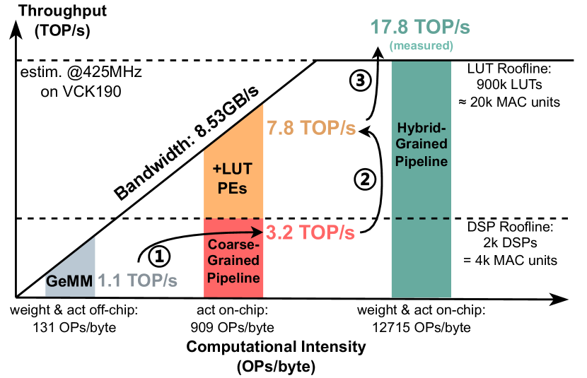
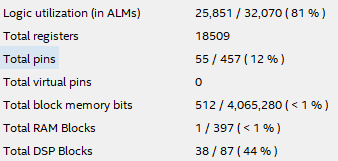

## **4.3 Трансформеры на ПЛИС — от нейросети до RTL** 

Имплементация трансформеров и, в частности, **LLM** на **FPGA** на момент **2026** года является областью исследований, где достаточно рано говорить об устоявшихся инструментах разработки. Большинство проектов представлено в виде **open-source** реализаций нейросетей разной сложности с помощью **HDL-** и **HLS-описания** или других генераторов HDL от университетских команд и энтузиастов. Рассказать о существующих проектах в этой области тем не менее стоит, поскольку трансформеры являются самым мощным инструментом в руках дата-сайентиста.
Безусловно список примеров неполный, поскольку новые решения появляются постоянно.

### 4.3.1 Трансформеры на ПЛИС

Не каждый трансформер предназначен для расчёта **LLM**, но любая современная  современная языковая модель построена именно на этой архитектуре. Этот раздел как раз о том, что не позволяет поднять LLM, а используется для анализа и обработки изображений и временных рядов.

#### 4.3.1.1 HG-PIPE - ускоритель на базе ПЛИС для моделей Vision Transformer (ViT)

[HG-PIPE](https://github.com/hguq/HG-PIPE) — это открытый проект команды Пекинского университета, представляющий собой **Vision Transformer** с гибридной конвейерной архитектурой на FPGA. Интерес к **ViT** связан с тем, что они постепенно вытесняют свёрточные сети в задачах классификации и обнаружения объектов, однако их вычислительная сложность и глобальные зависимости в механизме внимания делают развёртывание на краю сети нетривиальной задачей.

##### Модель и цель задачи

В качестве целевой рабочей нагрузки используется сеть **DeiT-Tiny**, обученная на **ImageNet** (224×224). Это компактный, но полноценный **ViT**: 12 слоёв, 192 канала эмбеддингов, 3 "головы" внимания, MLP с коэффициентом расширения 4.

##### Архитектура: конвейер c гибридной зернистостью

В [статье](https://arxiv.org/abs/2407.17879) авторы выделяют временные архитектуры (Temporal architectures) использующие "универсальные процессоры" для обработки слоёв по очереди  и конвейерные архитектуры (Pipelined architectures) с различной гранулярностью, в которых создаются процессоры для отдельных операторов. Первые страдают от необходимости частого доступа к памяти, вторые от наличия глобальной вычислительной зависимости и образования "пузырьков" (разрывов в данных) в конвейере.

<figure>
  
</figure>

Предложенная архитектура HG-PIPE имеет гибридную зернистость (hybrid-grained pipeline): крупноблочная (coarse-grained) обработка тензоров там, где это возможно, и мелкоблочная (fine-grained) с FIFO-буферами там, где требуется потоковая передача данных.

##### LUT-оптимизации и снижение потребления DSP

Для уменьшения потребления ресурсов в HG-PIPE исопльзовано квантование с малой разрядностью (**3-4** бит) и применяются аппроксимации для функций активации и прочих линейных и нелинейных операторов с помощью таблиц поиска (Look Up Table).

##### Производительность и результаты

На плате **Xilinx VCK190** (Versal VU9P) ускоритель работает на частоте **425 МГц** и достигает **7118** изображений в секунду при разрешении 224×224, что эквивалентно **17,8 ТОП/с**. Это в **2,81 раза быстрее**, чем GPU NVIDIA V100 на той же модели, и при этом существенно энергоэффективнее .
Ресурсоёмкость на **VCK190**: около **669 тыс. LUT**, **312 DSP** и **1006 блоков BRAM**.

#### 4.3.1.2 TinyTransformer4TS - трансформеры для анализа временных рядов

[TinyTransformer4TS](https://github.com/tianheng-ling/TinyTransformer4TS) — это открытый **фреймворк** от исследователей Университета прикладных наук Кобленца (Германия). Предлагает унифицированный **end-to-end пайплайн** для развёртывания трансформеров на **маломощных FPGA**: от обучения и квантования до автоматической генерации **VHDL** и битстрима.

##### Модель и цель задачи

Фреймворк ориентирован на компактную **encoder-only** архитектуру **Tiny Transformer** и поддерживает три ключевые задачи анализа временных рядов: прогнозирование на один шаг вперёд (one-step ahead forecasting), классификация и пороговое обнаружение аномалий.

#### Квантование и аппаратные оптимизации

TinyTransformer4TS при квантовании использует стратегию **Quantization-Aware Training (QAT)** вплоть до разрядностей **4 бит**. Модель остаётся целочисленной на всех этапах — от эмбеддингов и механизма внимания до MLP и выходного слоя.

Для подбора гиперпараметров (размерность эмбеддингов, число голов внимания, глубина сети, параметры квантования) применяется **Optuna** (библиотека python) в режиме **hardware-aware bi-objective** оптимизации.

#### Производительность и результаты

Фреймворк испытывался на двух скромных по ресурсам платформах: AMD Spartan-7 (XC7S15) и Lattice iCE40 (UP5K). Не все создаваемые архитектуры было возможно разместить на данных ПЛИС несмотря на оптимизацию, что описано в [статье](https://arxiv.org/abs/2505.17662). Технические характеристики ПЛИС и тактовые частоты дизайнов:

- **AMD Spartan-7 (XC7S15)**: 100 МГц, бюджет 8 000 LUT, 10 BRAM, 20 DSP
- **Lattice iCE40 (UP5K)**: 16 МГц, бюджет 5 280 LUT, 30 EBR, 8 DSP

### 4.3.2 LLM на ПЛИС

#### 4.3.2.1 TALOS-V2 - минимальный аппаратный трансформер на FPGA

[TALOS-V2](https://v2.talos.wtf/) — это студенческий проект, созданный на основе **microGPT** Андрея Карпатого. [microGPT](https://karpathy.github.io/2026/02/12/microgpt/) - это минималистичная реализация GPT (**4192** параметров) всего из **200** строк чистого Python. Таким образом весь проект это попытка создать минимальную по размеру синтезируемую архитектуру, которая будет при этом будет являться полноценной **LLM**.

##### Модель и цель задачи

Алгоритм **microGPT**, обученный на датасете имён (≈32 000 имён), предназначен для генерации новых правдоподобных имён. Модель посимвольно генерирует новые имена: она предсказывает следующий символ, подаёт его обратно на вход и повторяет процесс до тех пор, пока не сгенерирует токен окончания.

##### Арифметика с фиксированной точкой Q4.12

Вместо привычных чисел с плавающей точкой **TALOS-V2** использует формат **Q4.12** — 16-битные знаковые значения, где 4 бита отведены под целую часть (включая знак) и 12 бит — под дробную. Все веса модели заранее конвертируются в шестнадцатеричные файлы и загружаются в **ПЗУ**.

##### Производительность и результаты

Демонстрационный проект работает на учебной плате **DE1-SoC** с FPGA **Cyclone V**. Интересно, что при синтезе проекта в дизайне практически не использовалась блочная память ПЛИС для хранения весов, только логические ячейки (**ALM**). В любом случае количество использованных ресурсов для полноценного трансформера небольшое (ПЛИС не самая мощная и не полностью занята):

<figure>
  
</figure>

Плата **DE1-SoC** устойчиво выдаёт **более 50 000 токенов в секунду**, с зафиксированным пиком около **53 000 токенов/с**. Тактовая частота работы дизайна установлена равной **56,25 МГц**.

- Обучая нейронную сеть **microGPT** на других исходных данных можно сделать генераторы иных последовательностей, отличных от имён, например названий городов, английских слов и пр. После чего полученные веса нужно квантовать для **TALOS-V2**.

#### 4.3.2.2 HLSTransform - HLS-имплементация Llama 2 на FPGA

[HLSTransform](https://github.com/HLSTransform/submission) — это открытый проект, реализующий инференс модели **Llama 2** на **FPGA** посредством высокоуровневого синтеза (**HLS**). В основе лежит репозиторий [llama2.c](https://github.com/karpathy/llama2.c) также от Андрея Карпатого.  Цель проекта — доказать, что полноценный LLM-трансформер можно развернуть на **FPGA** без ручного написания **RTL**, получив при этом существенный выигрыш в энергоэффективности по сравнению с **CPU** и **GPU**.

##### Модель и цель задачи

Для эксперимента выбрана относительно компактная модель **Llama 2 110M**, обученная на наборе данных **TinyStories**: 12 слоёв, размерность эмбеддингов 768, 12 голов внимания (grouped query attention), максимальная длина контекста 1024 токена.

Дизайн разделён на host и kernel: хост, расположенный на процессорном ядре, управляет DMA-передачей данных, prompt- и токен-сэмплированием, а kernel — синтезируемый из **C++** в HDL — выполняет расчёт одного трансформерного слоя на FPGA.

##### Квантование и численная эффективность

Чтобы уместить модель в ограниченную блочную память **ПЛИС** и снизить нагрузку на **DSP-блоки**, все веса эмбеддингов, attention и MLP квантуются в 8-битные знаковые целые (Q8.0) по схеме симметричного квантования с масштабированием на секции. Накопление при матричных умножениях ведётся в **int32**, после чего результат реквантуется или преобразуется в float для softmax и функцию активации SwiGLU.

##### HLS-оптимизации

Ядро синтезируется из C++ при помощи Vitis HLS с тремя ключевыми pragma-оптимизациями:

- Loop pipelining — критические циклы (матричное умножение, RoPE) разбиваются на конвейерные стадии, что позволяет достичь initiation interval, близкого к 1, после заполнения конвейера.
- Loop unrolling — внутренние циклы (например, 768-элементная редукция в RMSNorm) разворачиваются с коэффициентом 8, увеличивая параллелизм за счёт использования дополнительных LUT/DSP.
- Array partitioning — весовые буферы разбиваются на независимые банки BRAM, что даёт до 4–8 параллельных чтений за такт.
- AXI4 burst-read / widening — глобальная память читается через 256-битную шину, что позволяет за один такт передавать 64 значения int8 и амортизировать задержки внешней памяти.

##### Производительность и результаты

Синтезированный дизайн работает на частоте **200 МГц** на плате **AWS F1** (Xilinx Virtex UltraScale+ VU9P). Зафиксированная скорость генерации — **57,11 токенов/с**. По сравнению с CPU Intel Xeon E5-2686 v4 это в **2,46 раза** быстрее, а по сравнению с GPU NVIDIA RTX 3090 — **53 %** от его скорости, несмотря на 4-кратное превосходство GPU по тактовой частоте.

Ключевое преимущество — энергоэффективность: на том же токене FPGA потребляет в **12,75 раз меньше энергии**, чем CPU, и в **8,25 раз меньше**, чем GPU.

Ресурсоёмкость на VU9P: примерно **30 % LUT**, **28 % DSP** и **35 МБ BRAM**(**15 %**).

Полный синтез проекта занимает порядка **12 часов**.

