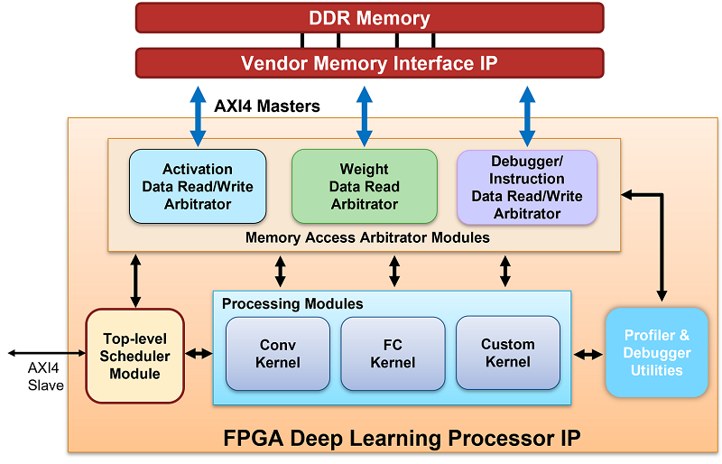

## Имплементация Edge AI на FPGA с помощью MATLAB

Данный подпроект демонстрирует типовой workflow работы с задачами Edge AI на базе инструментов MATLAB: обучение, квантизация и развертывание нейронной сети на FPGA.  
Все ключевые этапы — от обучения до деплоя на аппаратное обеспечение — реализованы в виде интерактивных MATLAB скриптов Live Script.

## Основные особенности

- **Полный цикл разработки**: от обучения нейросети до загрузки на FPGA.
- **Квантизация модели**: снижение ресурсов памяти и ускорение вывода с помощью Deep Network Quantizer.
- **Развертывание на FPGA**: автоматическая генерация HDL-кода и загрузка на платы Xilinx с помощью Deep Learning HDL Toolbox.
- **Удобные тестбенчи**: каждый этап оформлен как отдельный Live Script.

## Структура папки
```
matlab_workflow/
├── train_testbench.mlx # Обучение модели и оценка метрик
├── quantization.mlx # Квантизация модели и анализ производительности
├── deploy_testbench.mlx # Развертывание квантизированной модели на FPGA
```
## Требования

- **MATLAB** R2024a
    - Deep Learning HDL Toolbox
    - Deep Network Quantizer
- **Xilinx Vivado** 2018.3
- **Аппаратное обеспечение**: Плата FPGA Xilinx ZC-706

## Quick Start

1. **Обучение модели**  
   Откройте и запустите `train_testbench.mlx` для обучения нейронной сети и оценки основных метрик.

2. **Квантизация модели**  
   Запустите `quantization.mlx` для квантизации обученной модели и анализа производительности/ресурсов.

3. **Развертывание на FPGA**  
   Используйте `deploy_testbench.mlx` для генерации HDL-кода и загрузки квантованной сети на FPGA-плату (ZC-706).

## Принцип работы нейросетевого процессора MATLAB

В рамках развертывания нейронных сетей на FPGA MATLAB использует **Deep Learning Processor IP Core** — переносимое, универсальное IP-ядро, поддерживаемое Deep Learning HDL Toolbox. Данное IP-ядро компилируется из MATLAB и встраивается в проект на ПЛИС.

**Основные компоненты архитектуры:**
- **Внешняя память DDR** — для хранения входных данных, весов и выходных данных. Передача осуществляется по трем интерфейсам AXI4 Master.
- **Arbitrator modules** — контроллеры доступа к памяти для весов, активаций и профилировщика, обеспечивающие обмен между памятью и вычислительными модулями.
- **Convolution Kernel** — ядро для свёрточных слоёв, поддерживающее работу с тензорами и различными размерами слоёв.
- **Fully Connected Kernel** — ядро для полносвязных слоёв.
- **Custom Kernel** — блок для реализации и поддержки пользовательских слоёв (например, элементные операции, resize и др.).
- **Top-Level Scheduler Module** — центральный модуль управления, который планирует загрузку данных из DDR и последовательность вычислений для каждого слоя нейросети.
- **Profiler Utilities** — модуль профилировки, собирающий информацию о времени выполнения операций для анализа производительности.

### Архитектура нейропроцессора


