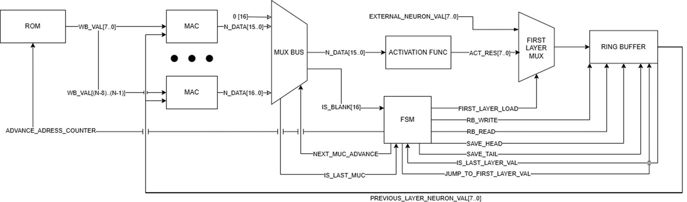

## Имплементация Edge AI на FPGA с помощью чистого HDL

Данный подпроект демонстрирует реализацию параметризируемого нейропроцессора на FPGA. Этот нейропроцессор служит универсальным блоком для вычисления полносвязных нейронных сетей.

## Основные особенности

- **Генератор файлов прошивки ROM**: Python-скрипт, преобразующий веса и смещения из Brevitas в специализированный формат для загрузки в ROM.
- **Квантизация аккумулированной суммы**: снижение потребления ресурсов памяти и ускорение вывода.
- **Полностью ручная HDL-архитектура**: нейропроцессор разработан с нуля без использования сторонних IP-ядер.
- **Комплексные тестбенчи**: система проверки на основе эталонных инференсов из Brevitas.

## Структура папки
```
pure_hdl_workflow/
├── NN_Arch2/             # VHDL-код проекта для Quartus
├── RomDataMaker/         # Python-скрипт для генерации ROM
├── NN_Testbench/         # Тестовое окружение для верификации
└── NPU_Architecture.png  # Схема архитектуры
```

## Quick Start

1. **Подготовка файлов ROM**  
  Откройте папку RomDataMaker и запустите main проект. В нем нужно указать все необходимые константы под вашу реализацию нейросети и запустить программу для генерации файлов.

2. **Настройка параметров VHDL**  
   Запустите проект Quartus из папки NN_Arch2 и откройте файл NN_pacakge. Здесь нужно задать пользовательские параметры констант под ваши требования к нейросети и размерности данных, а также указать прямой или косвенный путь к файлам прошивки ROM в соответствующих полях.

3. **Синтез проекта**  
   Запустите процесс синтеза в Quartus. После завершения синтеза необходимо проверить два ключевых аспекта: потребление ресурсов FPGA и выполнение временных ограничений. Если оба параметра удовлетворяют требованиям, можно приступать к настройке тестового окружения для вашей конкретной конфигурации нейропроцессора.

**Основные компоненты архитектуры нейропроцессора:**
- **Кольцевой буффер** — отвечает за хранение значений нейронов с предыдущего слоя и временное хранение результатов текущего слоя до вычисления активационных       
    функций. Работает по принципу циклической записи/чтения.
- **Блок активационой функции** — выполняет квантизацию результатов MAC-операций до заданной битности и вычисляет нелинейные функции активации (ReLU, sigmoid и   
    другие). Работает в паре с кольцевым буфером.
- **MAC блок** — главное вычислительное ядро, выполняет операции умножения весов на значения нейронов с последующим накоплением результатов. Каждый блок содержит 
    собственный аккумулятор для хранения промежуточных сумм и блок добавления смещений.
- **ROM network** —  распределенная память для хранения всех параметров сети: матриц весовых коэффициентов, векторов смещений и параметров квантизации. 
    Организована в виде отдельных банков памяти для каждого MAC блока.
- **FSM (Finite State Machine)** —  управляющий автомат, который координирует работу всех компонентов, управляет потоком данных и последовательностью операций. 
    Реализует основной алгоритм работы нейропроцессора.
- **Шина MAC блоков** —  коммуникационная система, которая обеспечивает передачу результатов вычислений от MAC блоков в блок активационной функции. Работает под 
    управлением FSM.
- **Мультиплексор внешних данных** — специальный интерфейс для загрузки входных данных первого слоя нейросети непосредственно в кольцевой буфер, минуя 
    вычислительные блоки.

### Архитектура нейропроцессора


