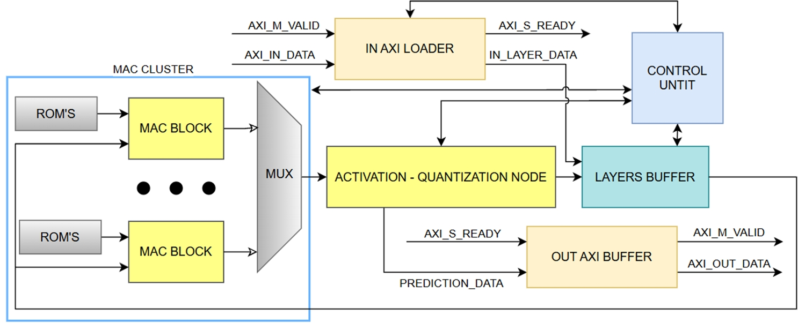

## Имплементация Edge AI на FPGA с помощью "чистого" HDL

Данный подпроект демонстрирует реализацию параметризируемого нейропроцессора на FPGA. Нейропроцессор предназначен для выполнения вычислений полносвязных нейронных сетей с использованием квантованных данных.

## Основные особенности

- **Параметризуемая архитектура**: настройка структуры нейронной сети, количества MAC-блоков и разрядности данных без изменения исходного кода вычислительных модулей.
- **Автоматическое вычисление производных параметров**: расчёт глубин памятей, размеров буферов и вспомогательных параметров архитектуры на основе пользовательской конфигурации.
- **Генератор файлов инициализации памяти**: Python-скрипт для автоматического формирования весов, смещений и параметров квантования обученной нейронной сети.
- **Поддержка квантованных нейронных сетей**: использование целочисленных вычислений и арифметики фиксированной точки для снижения требований к памяти и аппаратным ресурсам FPGA.
- **Масштабируемый вычислительный кластер**: возможность балансировки между производительностью и потреблением ресурсов за счёт изменения количества параллельных MAC-блоков.
- **Поддержка мульти-экзмеплярной конфигураций**: возможность размещения нескольких независимых экземпляров нейропроцессора в составе одного проекта.
- **Комплексная система верификации**: набор тестовых окружений для проверки отдельных модулей и сравнения результатов аппаратной реализации с программной моделью.
- **Разделение процесса обучения и аппаратной реализации**: изменение параметров нейронной сети выполняется без модификации RTL-кода архитектуры.

## Параметризация
Все параметры архитектуры задаются через файл `FCNPU_Package.vhd`.

Конфигурированию подлежат:
- количество экземпляров нейропроцессора;
- количество слоёв нейронной сети;
- размерность каждого слоя;
- количество MAC-блоков;
- разрядность нейронов;
- разрядность весов;
- разрядность смещений;
- параметры квантования;
- пути к файлам инициализации памяти.

После изменения конфигурации все производные параметры архитектуры вычисляются автоматически на этапе синтеза.

## Последовательность  реализации

```text
Training
    │
    ▼
Brevitas Model
    │
    ▼
NpuParamsGen
    │
    ├── Weights ROM
    ├── Bias ROM
    ├── MScale ROM
    └── ZScale ROM
    │
    ▼
FCNPU Package
    │
    ▼
RTL Synthesis
    │
    ▼
FPGA Bitstream
```

## Структура папки
```
pure_hdl_workflow/
├── RTL/             # VHDL-код проекта для Quartus
├── NpuParamsGen/         # Python-скрипт для генерации ROM
├── Test_Bench         # Тестовое окружение для верификации
└── NPU_Architecture.png  # Схема архитектуры
```

## Quick Start

1. **Подготовка файлов памяти**  
   Откройте папку `NpuParamsGen` и запустите основной проект. Укажите параметры обученной нейронной сети и выполните генерацию файлов инициализации памяти.

2. **Настройка конфигурации нейропроцессора**  
   Откройте файл `NPU_Package.vhd` и задайте параметры экземпляров, включая количество MAC-блоков, разрядность данных, количество слоёв нейронной сети и путть к файлам инициализации памяти.

3. **Синтез проекта**  
   Выполните синтез проекта в используемой САПР и проверьте соответствие полученной конфигурации требованиям по используемым ресурсам FPGA и временным ограничениям.


## Основные компоненты архитектуры нейропроцессора

- **FCNPU Package** — единая точка конфигурирования нейропроцессора. Содержит описание экземпляров системы, параметров нейронной сети, разрядностей данных и вспомогательные функции для автоматического вычисления производных параметров архитектуры.
- **Axi Uploader** — выполняет приём входных данных через интерфейс AXI-Stream и их загрузку во внутренний буфер нейропроцессора.
- **Control Unit** — управляющий модуль, координирующий работу всех компонентов архитектуры, выполнение вычислений, переключение между слоями сети и обмен данными между функциональными блоками.
- **MAC Cluster** — основное вычислительное ядро нейропроцессора, выполняющее операции умножения с накоплением. Количество параллельно работающих MAC-блоков задаётся параметрами конфигурации и определяет баланс между производительностью и используемыми аппаратными ресурсами.
- **Act-Quant Node** — выполняет применение функции активации ReLU и реквантизацию результатов вычислений с использованием параметров `m_scale` и `z_scale`, обеспечивая переход между слоями квантованной нейронной сети.
- **Layers Buffer** — буфер межслойных вычислений, используемый для хранения данных первого слоя и значений нейронов скрытых слоев.
- **Out Axi-Buffer** — выполняет буферизацию и передачу результатов вычислений через выходной интерфейс AXI-Stream.

### Архитектура нейропроцессора


